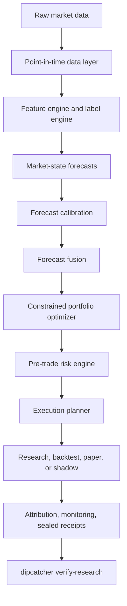

# dipcatcher

[](https://github.com/artificial-hedge/dipcatcher/actions/workflows/ci.yml)
[](https://github.com/artificial-hedge/dipcatcher/actions/workflows/fx1.yml)


**dipcatcher** is receipt-bound quant research on US equities and crypto for a
small Alpaca account. Research and simulated paper only.

The dip question, in `fx1.bench.dip` and
`receipts/dip_bench_crypto_1d_20260925.json`, is the probability that a
drawdown recovers within 1, 3, 6, or 12 months. That committed receipt scores
an in-sample climatology baseline on 11 historical crypto series. Disclaimer
from the file:

> Research/backtest evidence on historical data, not live performance. The climatology forecaster is an in-sample descriptive baseline; it is not a tradeable signal and authorizes nothing.

US names use the NYSE and NASDAQ common-stock universe, with public daily and
minute bars available through opt-in collectors (Stooq, and the Hugging Face
OHLCV-1m adapter). Crypto research uses public Binance series. Alpaca is an
offline quote-column preset for book panels. Fills in this tree go through
`SimulatedBroker`.

The Python distribution name is `fx-1`. Console scripts are `dipcatcher` and
`fx1`. Version `0.4.0` lives in `fx1.__version__`.

The coverage badge is the CI floor in `pyproject.toml` (`fail_under = 80`).
This repository does not publish coverage to a hosted service. CI runs on
Python 3.12 and 3.13; Ruff and mypy run in the lint job.

## What you have in this checkout

| Surface | What it is |
|---|---|
| `configs/research.yaml`, `configs/paper.yaml` | `data.source: synthetic`. The CLI prints `DATA_LABEL=SYNTHETIC`. These runs are labeled correctness tests. |
| `receipts/` | Committed research artifacts. Each file sets `research_only: true` and carries its own disclaimer. |
| `src/quant_fund` | The research pipeline: point-in-time data, forecasts, fusion, a constrained optimizer, a risk gate, and simulated paper. |
| `src/fx1` | Corpus, eval, and training-manifest code at `0.4.0`. No model weights are in the tree. |
| Live orders | Refused. Setting `runtime.allow_live: true` raises `allow_live is unsupported: no live broker adapter in this repository`. |

Research scores that the lab will headline are proper scores: pinball, CRPS,
PIT, QLIKE, Brier, ECE, Kupiec, and HMM likelihood.

## What makes it different

- **Sealed receipts.** Phase-1 benchmark and tournament files carry
  `receipt_sha256`, the SHA-256 of the other fields.
  `dipcatcher verify-research` recomputes it and exits nonzero on a mismatch
  (`docs/RECEIPT_VERIFICATION.md`). Paper promotion receipts use the same
  seal. Files under `receipts/` record the input and script hashes the result
  claims (`inputs_sha256`, `script_sha256`, `bar_files_sha256`, and related
  fields).
- **Fail-closed verification.** An invalid notebook, a missing metric, or a
  non-finite metric does not promote. SYNTHETIC evidence marked as live fails
  the gate in `quant_fund.validation.gates`. `dipcatcher doctor` exits nonzero
  until a data manifest and a valid research receipt are both present.
- **Published negative results.**
  `receipts/adaptive_mix_band_search_20asset_1d_20260922.json` records
  `selected_band: null` and `eligible: false` on every candidate.
  `receipts/basis_pair_candidate_20asset_1d_20260922.json` records
  `development_eligible: false`. A sealed blocked tournament stays a
  reviewable failure (`valid: true`, `state: "blocked"`) with no test receipt
  and no selected candidate (`docs/RECEIPT_VERIFICATION.md`).
- **qlib parity receipt.** `receipts/incumbent_bench_qlib.json` is one matched
  workload against qlib 0.9.7 on Binance daily bars (`BTCUSDT`, `ETHUSDT`,
  `SOLUSDT`), with `research_only: true` and `live_pnl_claim: false`. Copied
  from that file, `nav_max_rel_diff` is `1.0290734772388363e-07`. Disclaimer,
  copied verbatim: "Single matched workload vs qlib 0.9.x on real Binance
  daily bars. Correctness is NAV parity; latency is single-process wall time.
  Not a claim of superiority across all product dimensions."
- **Synthetic stays labeled.** Default research and paper configs set
  `data.source: synthetic`. The CLI prints `DATA_LABEL=SYNTHETIC` and the
  word `SYNTHETIC`. The CI smoke fails if that notebook's `data_source` is
  anything else.

## Architecture

Derived from [`docs/ARCHITECTURE.md`](docs/ARCHITECTURE.md). Dipcatcher
estimates a market state at a point-in-time decision clock, then allocates
under constraints and costs. The optimizer consumes that state. A forecast
does not bypass the risk gate.



The market state at decision time holds expected return, features, alpha,
residual, volatility, covariance, regime probabilities, tail, liquidity, and
uncertainty. Features used at time t must have `available_time` at or before
t. The default fill for a close signal on day t is the next available open.
`robinhood+` is a K-line challenger whose default `blend_weight` is 0 until
it beats ridge on a causal synthetic card. The architecture document also
names a live runtime mode; config load rejects it, as the table above says.

## Quick start

Python 3.12 or 3.13, and [uv](https://docs.astral.sh/uv/). From a clone:

```bash
make sync
uv run dipcatcher research --config configs/research.yaml
uv run dipcatcher verify-research
uv run dipcatcher doctor --config configs/research.yaml
```

`configs/research.yaml` is synthetic. `research` builds that panel, writes a
notebook under `data/metadata/research/`, and prints `DATA_LABEL=SYNTHETIC`.
`verify-research` checks `data/metadata/research/latest.json` and exits
nonzero when the notebook is invalid. `doctor` exits 0 only after the data
manifest and that receipt both check out; on a fresh tree, before `research`,
it exits 1.

Simulated paper, also synthetic, capped the way CI caps it:

```bash
uv run dipcatcher paper --config configs/paper.yaml --max-steps 2
```

Public collection is opt-in and is separate from ingest. It needs a network.

## Tests

```bash
make lint
make typecheck
make test
make fx1-gate
```

`make test` is the lab suite (`tests/unit`, `tests/property`,
`tests/regression`, `tests/end_to_end`). The fx-1 suite is `make fx1-test`.

## fx-1

`src/fx1` (version `0.4.0`) is code and a training plan for a quant-research
model. The declared base constant is `moonshotai/Kimi-K3`. This repository
does not contain a fine-tuned checkpoint, and local generation is
unimplemented.

What runs today:

- `fx1 corpus build` turns receipts into JSONL. Eligible lines keep a receipt
  hash. Ineligible receipts become negative examples. The build does not
  train a model.
- `fx1 eval` scores a backend on a fixed task bank (honesty, domain,
  general). `make fx1-eval` calls Moonshot's hosted Kimi K3 and needs
  `MOONSHOT_API_KEY`. That call grades the hosted base model.
- `fx1 train manifest` writes an immutable run manifest only when a corpus
  and an on-record base-model eval are both present. It does not launch a
  training job.
- `LocalFx1Backend` refuses a directory that lacks a model card cleared by
  the ship gate. `complete()` raises `NotImplementedError` until a distilled
  student exists (`src/fx1/serve/backends.py`).

```bash
uv run fx1 --version
uv run fx1 harness list
uv run fx1 corpus build --receipts-dir receipts --out data/fx1/corpus.jsonl
```

`data/fx1/` is gitignored. The ladder, ship gate, and hardware notes are in
`docs/FX1.md` and `docs/FX1_TRAINING.md`. They describe the plan. They are
not a record of a completed training run.

## API security

The FastAPI service (`dipcatcher api`, default host `127.0.0.1`):

- Config paths are allowlisted to the repo `configs/` directory.
- If `QUANT_API_KEY` is set, non-public routes require header `X-API-Key`;
  if unset, only loopback clients are accepted.
- Docker binds `127.0.0.1` by default; to listen on `0.0.0.0`, set
  `QUANT_API_KEY` and override the host.
- `POST /backtest` is deliberately bounded to 30 causal decision dates and at
  most 31 bar dates; run larger studies through the CLI.

## Documentation

| Doc | Content |
|---|---|
| `docs/ARCHITECTURE.md` | Pipeline, packages, runtime modes, point-in-time rules |
| `docs/RECEIPT_VERIFICATION.md` | Sealed phase-1 runs and blocked tournaments |
| `docs/RESEARCH_CENTRE.md` | Benches and research centre |
| `docs/VALIDATION.md` | Walk-forward, CPCV, multiple-testing, conformal gates |
| `docs/INSTITUTIONAL_READINESS.md` | Evidence-gated readiness conditions |
| `docs/OPERATIONS_RUNBOOK.md` | Operator procedures and incident handling |
| `docs/NORTHSET.md` | Order-book and candlestick slice |
| `docs/HF_OHLCV_1M.md` | Hugging Face US 1-minute OHLCV: license, schema, caveats |
| `docs/FX1.md` | fx-1 package: corpus, honesty contract, intended base model |
| `docs/FX1_TRAINING.md` | Compute ladder and ship gate (plan) |
| `docs/FX1_DATASOURCES.md` | Professional datasource routing and point-in-time rules |
| `docs/REPO_IMPROVEMENT_PLAN.md` | Evidence-chain sequence |
| `CODE_OF_CONDUCT.md` | Contributor Covenant 2.1 |
| `SECURITY.md` | Private vulnerability reports |
| `CHANGELOG.md` | Keep a Changelog, seeded from recent commits |
| `CITATION.cff` | Citation metadata |

*fx-1 and the dipcatcher harness produce research, backtest, or simulated
evidence only. Nothing here is investment advice or a promise of live profit.*
