# dipcatcher

[](https://github.com/artificial-hedge/dipcatcher/actions/workflows/ci.yml)
[](https://github.com/artificial-hedge/dipcatcher/actions/workflows/fx1.yml)
[](https://github.com/artificial-hedge/dipcatcher/actions/workflows/codeql.yml)


[](LICENSE)
[](LICENSE)
[](LICENSE)

> **All rights reserved.** dipcatcher and the fx-1 model line are proprietary,
> closed research software owned exclusively by **Advaith Vaithianathan**,
> founder of **Artificial Hedge**. This checkout is made visible for
> authorized review only. No one may fork, copy, mirror, redistribute, or
> reuse any part of this repository without prior written permission from the
> owner. Read [`LICENSE`](LICENSE) before you do anything else with this
> code. None of the material below is investment advice, and none of it is a
> record of live trading performance — see
> [Read This First](#read-this-first).

---

## Table of contents

1. [Overview](#overview)
2. [Read this first](#read-this-first)
3. [Why dipcatcher exists](#why-dipcatcher-exists)
4. [Visual tour](#visual-tour)
   - [Pipeline architecture](#pipeline-architecture)
   - [Data flow](#data-flow)
   - [Paper and shadow loop sequence](#paper-and-shadow-loop-sequence)
   - [Receipt lifecycle](#receipt-lifecycle)
   - [Module dependency graph](#module-dependency-graph)
   - [Repository composition](#repository-composition)
5. [Extended visual atlas](#extended-visual-atlas)
   - [System context](#system-context)
   - [Research run lifecycle](#research-run-lifecycle)
   - [Receipt and data-manifest relationships](#receipt-and-data-manifest-relationships)
   - [One gated run, stage order](#one-gated-run-stage-order)
   - [Acceptance history timeline](#acceptance-history-timeline)
   - [The harness at a glance](#the-harness-at-a-glance)
   - [Capability vs evidence](#capability-vs-evidence)
   - [Tracked-file census](#tracked-file-census)
   - [Python module census](#python-module-census)
   - [Receipt census](#receipt-census)
   - [Corpus flywheel](#corpus-flywheel)
   - [Turnover history, illustrative](#turnover-history-illustrative)
   - [A researcher's day](#a-researchers-day)
   - [Honesty gate decision tree](#honesty-gate-decision-tree)
   - [verify-research call sequence](#verify-research-call-sequence)
   - [Config inheritance](#config-inheritance)
   - [Config class anatomy](#config-class-anatomy)
   - [Receipt field map](#receipt-field-map)
   - [Documentation reading order](#documentation-reading-order)
   - [ASCII: the layered stack](#ascii-the-layered-stack)
   - [ASCII: sealing a receipt](#ascii-sealing-a-receipt)
6. [What you get in this checkout](#what-you-get-in-this-checkout)
7. [What makes it different](#what-makes-it-different)
8. [Repository layout](#repository-layout)
9. [Quick start](#quick-start)
10. [Configuration](#configuration)
11. [Command line reference](#command-line-reference)
12. [Data sources and point in time integrity](#data-sources-and-point-in-time-integrity)
13. [Research methodology](#research-methodology)
14. [Evidence and sealed receipts](#evidence-and-sealed-receipts)
15. [Deep dives](#deep-dives)
    - [Anatomy of a sealed receipt](#anatomy-of-a-sealed-receipt)
    - [Lifecycle of a single forecast](#lifecycle-of-a-single-forecast)
    - [Choosing a config](#choosing-a-config)
    - [Choosing a make target](#choosing-a-make-target)
    - [Proper-score field guide](#proper-score-field-guide)
    - [Honesty enforcement map](#honesty-enforcement-map)
    - [Failure-mode catalog](#failure-mode-catalog)
    - [The five live-evidence conditions as a gate diagram](#the-five-live-evidence-conditions-as-a-gate-diagram)
16. [Institutional readiness](#institutional-readiness)
17. [fx-1](#fx-1)
18. [Web explorer and tooling](#web-explorer-and-tooling)
19. [API and security](#api-and-security)
20. [Testing, CI, and supply chain](#testing-ci-and-supply-chain)
21. [Documentation index](#documentation-index)
22. [Repository health](#repository-health)
23. [Governance and ownership](#governance-and-ownership)
24. [Contributing](#contributing)
25. [Security policy](#security-policy)
26. [License](#license)
27. [Citation](#citation)
28. [Acknowledgements and third-party notices](#acknowledgements-and-third-party-notices)
29. [Appendix](#appendix)
    - [FAQ](#faq)
    - [Glossary](#glossary)
    - [Environment variables](#environment-variables)
    - [Receipts census](#receipts-census)
    - [Configs census](#configs-census)
    - [Make target atlas](#make-target-atlas)
    - [Terminal cheat-sheet](#terminal-cheat-sheet)
30. [Final disclaimer](#final-disclaimer)

---

## Overview

**dipcatcher** is receipt-bound quant research on US equities and crypto for a
small Alpaca account. It is research and simulated paper trading only — there
is no live broker connectivity anywhere in this tree, and nothing in this
document authorizes, promises, or implies otherwise.

The dip question, in `fx1.bench.dip` and
`receipts/legacy-unsealed/dip_bench_crypto_1d_20260925.json`, is the probability that a
drawdown recovers within 1, 3, 6, or 12 months. That committed receipt scores
an in-sample climatology baseline on 11 historical crypto series. Disclaimer
from the file:
The distribution name on PyPI-style metadata is `fx-1`; the two console
entry points installed by this project are `dipcatcher` (the research
harness, formerly and internally called "dipcatcher") and `fx1` (the
model-facing corpus/eval/training-manifest tooling). Both live in one
checkout, at version `0.4.0` (`fx1.__version__`), and both are governed by
the same receipt-and-verification discipline described throughout this
document.

Two words matter more than any other in this repository: **honest** and
**sealed**. Every research claim is expected to resolve to a committed,
hash-sealed receipt under [`receipts/`](receipts/) that a verifier can
recompute byte-for-byte; every headline metric is expected to be a proper
score (pinball loss, CRPS, PIT calibration, QLIKE, Brier, ECE, the Kupiec
test, HMM likelihood) rather than a P&L number. That is not a marketing
choice — it is enforced in code (`quant_fund.research.catalog.registry`,
mirrored by `fx1.honesty`) and re-validated by
[`tests/fx1/test_honesty_inheritance.py`](tests/fx1/test_honesty_inheritance.py)
so the two halves of the project cannot drift apart.

This README is intentionally long. It is meant to be read once end-to-end
and then used as a reference. Large, auto-generated, or exhaustively
enumerated sections are folded into `<details>` blocks so the document stays
navigable; nothing folded is hidden on purpose, it is just deep enough that
most readers will want to expand it only when they need it.

## Read this first

This section exists because the rest of the document contains diagrams,
tables, numbers, and receipts, and it is easy for numbers to be
misread as promises. They are not promises. Please hold the following in
mind for everything that follows:

- **This is research and simulated software.** Every figure in this README
  that looks like a trading result — win rates, recovery probabilities,
  latency numbers, NAV comparisons — comes from a committed receipt under
  [`receipts/`](receipts/) or [`docs/evidence/index.md`](docs/evidence/index.md),
  each of which is labeled `research_only: true` and, where relevant,
  `live_pnl_claim: false`. None of it is live trading performance, because
  there is no live trading in this repository.
- **Nothing here is investment advice.** Nothing in this repository, this
  README included, is an offer, solicitation, or recommendation to buy or
  sell any security, token, or derivative. Past backtested or simulated
  behavior is not indicative of future results, live or otherwise.
- **This code is proprietary, not open source.** The presence of a public
  GitHub URL does not grant a license to use, copy, modify, fork, or
  redistribute this repository. See [License](#license) and the full text at
  [`LICENSE`](LICENSE). If you are reading this and you are not the owner or
  someone the owner has authorized in writing, your permitted action is to
  read — nothing more.
- **Forbidden headline metrics are enforced, not just promised.**
  `FORBIDDEN_RESEARCH_METRIC_KEYS` in
  [`src/quant_fund/research/catalog/registry.py`](src/quant_fund/research/catalog/registry.py)
  — `sharpe`, `sortino`, `calmar`, `pnl`, `nav` — may never appear as a
  headline research key. `fx1.honesty.FORBIDDEN_HEADLINE_TOKENS` mirrors the
  same list for the model side, and a dedicated test
  (`tests/fx1/test_honesty_inheritance.py`) fails the build if the two lists
  drift apart. Where NAV appears below (for example in the qlib parity
  section), it is used strictly as a **numerical-agreement / correctness**
  check between two independently computed simulators, never as a return or
  performance figure.
- **Synthetic data is always labeled.** Default research and paper configs
  set `data.source: synthetic`; the CLI prints the literal string
  `DATA_LABEL=SYNTHETIC`, and a CI smoke test fails if that label silently
  changes. If a chart, table, or receipt below is built on synthetic data,
  it says so.
- **Read [`docs/INSTITUTIONAL_READINESS.md`](docs/INSTITUTIONAL_READINESS.md)
  for the unabridged version of this disclaimer.** It lists, control by
  control, exactly what is implemented, what is simulated, and what remains
  an open gap before any live claim could even be considered — including the
  five minimum evidence conditions reproduced in
  [Institutional readiness](#institutional-readiness) below.

## Why dipcatcher exists

Most public "quant" repositories on GitHub either (a) show a backtest with a
beautiful equity curve and no way to check whether it leaked the future into
the past, or (b) show a wall of code with no evidence trail connecting a
claim to a reproducible artifact. dipcatcher was built to refuse both
failure modes at once, using three linked ideas:

1. **Point-in-time discipline is a data-layer property, not a modeling
   afterthought.** Every feature has an `available_time`; a feature is
   invisible to a decision made before its data existed. This is enforced in
   `quant_fund.pit` and re-audited by a dedicated leakage-hunter scan
   (`make leakage-scan`), not merely assumed by convention.
2. **A result that cannot be independently recomputed is not a result.**
   Every phase-1 benchmark, tournament, and paper-promotion artifact carries
   `receipt_sha256` — the SHA-256 of its own other fields — plus
   `inputs_sha256`, `script_sha256`, and (where relevant) `bar_files_sha256`.
   `dipcatcher verify-research` / `verify-receipt` / `verify-all` recompute
   those hashes and refuse to pass a tampered or incomplete artifact. See
   [Receipt lifecycle](#receipt-lifecycle) for the full state machine.
3. **A negative result is still a result, and it stays in the tree.**
   Tournaments that fail their frozen slate are sealed as **verified
   blocked** — `valid: true`, `state: "blocked"` — rather than deleted or
   quietly rerun until something looks better. See
   [Evidence and sealed receipts](#evidence-and-sealed-receipts).

- **Sealed receipts.** Phase-1 benchmark and tournament files carry
  `receipt_sha256`, the SHA-256 of the other fields.
  `dipcatcher verify-research` recomputes it and exits nonzero on a mismatch
  (`docs/RECEIPT_VERIFICATION.md`). Paper promotion receipts use the same
  seal. Files under `receipts/` record the input and script hashes the result
  claims (`inputs_sha256`, `script_sha256`, `bar_files_sha256`, and related
  fields).
- **Fail-closed verification.** An invalid notebook, a missing metric, or a
  non-finite metric does not promote. SYNTHETIC evidence marked as live fails
  the gate in `quant_fund.validation.gates`. `dipcatcher doctor` exits nonzero
  until a data manifest and a valid research receipt are both present.
- **Published negative results.**
  `receipts/legacy-unsealed/adaptive_mix_band_search_20asset_1d_20260922.json` records
  `selected_band: null` and `eligible: false` on every candidate.
  `receipts/legacy-unsealed/basis_pair_candidate_20asset_1d_20260922.json` records
  `development_eligible: false`. A sealed blocked tournament stays a
  reviewable failure (`valid: true`, `state: "blocked"`) with no test receipt
  and no selected candidate (`docs/RECEIPT_VERIFICATION.md`).
- **qlib parity receipt.** `receipts/legacy-unsealed/incumbent_bench_qlib.json` is one matched
  workload against qlib 0.9.7 on Binance daily bars (`BTCUSDT`, `ETHUSDT`,
  `SOLUSDT`), with `research_only: true` and `live_pnl_claim: false`. Copied
  from that file, `nav_max_rel_diff` is `1.0290734772388363e-07`. Disclaimer,
  copied verbatim: "Single matched workload vs qlib 0.9.x on real Binance
  daily bars. Correctness is NAV parity; latency is single-process wall time.
  Not a claim of superiority across all product dimensions."
- **Synthetic stays labeled.** Default research and paper configs set
  `data.source: synthetic`. The CLI prints `DATA_LABEL=SYNTHETIC` and the
  word `SYNTHETIC`. The CI smoke fails if that notebook's `data_source` is
  anything else.
`fx-1` (the model line, [described below](#fx-1)) exists because the same
discipline that makes the research harness auditable also makes it a
uniquely well-labeled training corpus: every receipt that passes the ship
gate becomes a positive example, and every receipt that fails becomes a
negative one, so the model that eventually gets trained on this corpus
inherits the harness's honesty contract rather than learning to imitate
whatever looks impressive.

## Visual tour

Every diagram in this section is either generated directly from the source
tree by [`scripts/gen_arch_diagrams.py`](scripts/gen_arch_diagrams.py) (data
flow, paper/shadow sequence, module dependencies — checked for drift by the
`atlas` CI workflow against
[`docs/ARCHITECTURE_ATLAS.md`](docs/ARCHITECTURE_ATLAS.md)) or derived
directly from committed receipts and `git ls-files` (repository composition,
receipt lifecycle). Nothing here is a hand-drawn approximation.

### Pipeline architecture

Derived from [`docs/ARCHITECTURE.md`](docs/ARCHITECTURE.md). Dipcatcher
estimates a market state at a point-in-time decision clock, then allocates
under constraints and costs. The optimizer consumes that state; a forecast
never bypasses the risk gate.

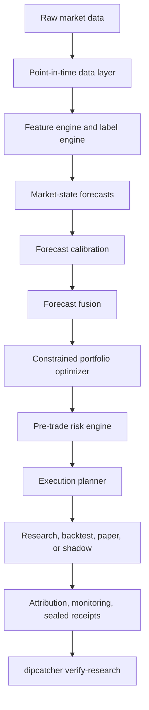
```mermaid
flowchart TD
  raw["Raw market data"] --> pit["Point-in-time data layer"]
  pit --> feat["Feature engine and label engine"]
  feat --> state["Market-state forecasts"]
  state --> cal["Forecast calibration"]
  cal --> fusion["Forecast fusion"]
  fusion --> opt["Constrained portfolio optimizer"]
  opt --> risk["Pre-trade risk engine"]
  risk --> plan["Execution planner"]
  plan --> sim["Research, backtest, paper, or shadow"]
  sim --> mon["Attribution, monitoring, sealed receipts"]
  mon --> verify["dipcatcher verify-research"]
```

The market state at decision time holds expected return, features, alpha,
residual, volatility, covariance, regime probabilities, tail, liquidity, and
uncertainty. Features used at time `t` must have `available_time` at or
before `t`. The default fill for a close signal on day `t` is the next
available open. `robinhood+` is a K-line challenger whose default
`blend_weight` is `0` until it beats ridge on a causal synthetic card. The
architecture document also names a live runtime mode; config load rejects
it, exactly as the [checkout table](#what-you-get-in-this-checkout) below
says.

### Data flow

This is the literal, generated content of
[`docs/architecture/data_flow.mmd`](docs/architecture/data_flow.mmd) —
regenerate it with `python scripts/gen_arch_diagrams.py` if the source
changes; the `atlas` workflow fails the build if this file and the tree
disagree.


```mermaid
flowchart LR
  subgraph cluster_pit["point-in-time data"]
    prov["make_provider()\nsynthetic | file | hf_ohlcv_1m | public sources"]
    ingest["ingest()\nbronze/silver parquet + data_manifest.json"]
    adj["adjust_prices() / apply_listing_actions()\ncorporate actions"]
    univ["build_membership_panel()\nPIT universe"]
  end
  subgraph cluster_gold["gold panel"]
    feats["build_features() / FEATURE_SET_VERSION\nstamped on the frame"]
    labs["build_labels()\nforward-looking, never features"]
    gold["build_gold() / panel()\nmembership re-validated on cached gold"]
  end
  subgraph cluster_model["forecast stack"]
    train["train_ranking()\npipeline/train/ranking.py → joblib artifacts"]
    fcst["forecast_asof() / MarketState\nCQR intervals"]
    fuse["fuse_signals()\ntransparent fusion"]
  end
  subgraph cluster_alloc["allocation + risk"]
    opt["optimize_mean_variance()\ninfeasible → diagnostics, no relaxation"]
    gate["check_order()\ndeterministic pre-trade risk gate"]
    cost["total_cost()\ncommission + spread + impact"]
  end
  subgraph cluster_sim["simulation (no live orders)"]
    bt["run_backtest()\nevent-driven, next-open fills"]
    pl["run_paper_loop()\nchampion + shadow slots"]
  end
  subgraph cluster_evid["evidence"]
    nb["run_research()\nsealed notebook + runs/<id>.json"]
    ver["verify_research_artifact()\nfail-closed recompute"]
    prom["validate_candidate()\nreceipt-bound promotion gates"]
  end
  prov --> ingest --> adj --> univ
  univ --> feats --> gold
  univ --> labs --> gold
  gold --> train --> fcst
  fcst --> fuse --> opt --> gate
  gate --> bt
  gate --> pl
  cost --> bt
  cost --> pl
  bt --> nb
  pl --> nb
  nb --> ver --> prom
```

### Paper and shadow loop sequence

The literal, generated content of
[`docs/architecture/paper_loop_sequence.mmd`](docs/architecture/paper_loop_sequence.mmd),
covering one decision tick of `run_paper_loop()` end to end — resume,
marking, weighting, risk-gating, filling, and sealing.

```mermaid
sequenceDiagram
  autonumber
  participant CLI as paper()
  participant Loop as run_paper_loop()
  participant Clock as ReplayClock / WallClock
  participant W as WeightFn weights panel
  participant CB as SimulatedBroker champion
  participant SB as SimulatedBroker shadow
  participant KS as KillSwitch
  participant RG as check_order() risk gate
  participant L as PaperLedger
  CLI->>Loop: run_paper_loop(bars, cfg, champion/shadow weights)
  opt resume
    Loop->>L: load_broker_state(run_id)
    L-->>Loop: prior champion/shadow state + cursors
    Loop->>Loop: verify resume_fingerprint over bar prefix
  end
  Loop->>L: set_meta(data_source, label=PAPER_SIMULATED)
  Loop->>Clock: ReplayClock(decision_dates)
  loop each decision date t
    Loop->>Clock: tick() -> t
    Loop->>Loop: exec_dt = next bar open (FillConvention.NEXT_OPEN)
    Loop->>CB: mark(pretrade marks: fresh opens + bounded carry)
    Loop->>SB: mark(pretrade marks)
    Loop->>W: champion_fn(t, cfg)
    W-->>Loop: target weights
    Loop->>W: shadow_fn(t, cfg) (optional)
    Loop->>Loop: L1 divergence champion vs shadow
    Loop->>CB: nav(pretrade_marks); break if <= 0
    Loop->>Loop: market_risk_overlay_asof(cfg, bars, t)
    Loop->>CB: target_to_orders(targets, marks)
    loop each order
      CB->>KS: assert_new_orders_allowed()
      KS--xCB: KillSwitchActive when state != ENABLED
      CB->>RG: check_order(nav, gross, net, participation, vol)
      RG--xCB: RiskGateRejected on breach (counted)
      CB->>CB: total_cost() then cash/shares update
      CB-->>Loop: OrderRecord (fill or reject_reason)
    end
    Loop->>L: record_orders(step_recs, exec_dt)
    Loop->>CB: mark(close marks) + exposures
    Loop->>L: record_snapshot / record_shadow_equity
    Loop->>L: flush()
    Loop->>L: save_broker_state(cursor published LAST)
  end
  Loop->>L: promotion_dry_run() -> write_promotion_dry_run
  Loop->>L: write_analytics_export + validate
  Loop-->>CLI: PaperLoopResult{research_only, live_pnl_claim: false, paths}
```

### Receipt lifecycle

Unlike the two diagrams above, this state machine is not machine-generated —
it is a diagram I derived by hand from the verifier rules described in
[`docs/RECEIPT_VERIFICATION.md`](docs/RECEIPT_VERIFICATION.md), to make the
"sealed / verified / blocked" vocabulary used throughout this README
concrete. Treat the prose in that document as authoritative if the two ever
disagree.

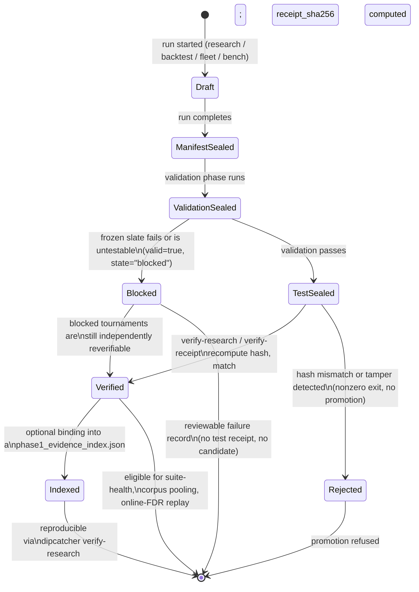
```mermaid
stateDiagram-v2
    [*] --> Draft: run started (research / backtest / fleet / bench)
    Draft --> ManifestSealed: run completes; receipt_sha256 computed
    ManifestSealed --> ValidationSealed: validation phase runs
    ValidationSealed --> Blocked: frozen slate fails or is untestable\n(valid=true, state="blocked")
    ValidationSealed --> TestSealed: validation passes
    TestSealed --> Verified: verify-research / verify-receipt\nrecompute hash, match
    TestSealed --> Rejected: hash mismatch or tamper detected\n(nonzero exit, no promotion)
    Blocked --> Verified: blocked tournaments are\nstill independently reverifiable
    Verified --> Indexed: optional binding into a\nphase1_evidence_index.json
    Blocked --> [*]: reviewable failure record\n(no test receipt, no candidate)
    Rejected --> [*]: promotion refused
    Indexed --> [*]: reproducible via\ndipcatcher verify-research <index>
    Verified --> [*]: eligible for suite-health,\ncorpus pooling, online-FDR replay
```

A **verified blocked** tournament (`valid: true`, `state: "blocked"`) is the
deliberate design choice at the center of this diagram: a candidate that
failed its frozen slate is not deleted, silently rerun, or hidden — it stays
in the tree as a reviewable, independently reverifiable failure, exactly
like [`adaptive_mix_band_search_20asset_1d_20260922.json`](receipts/legacy-unsealed/adaptive_mix_band_search_20asset_1d_20260922.json)
and [`basis_pair_candidate_20asset_1d_20260922.json`](receipts/legacy-unsealed/basis_pair_candidate_20asset_1d_20260922.json),
both cited again in [Evidence and sealed receipts](#evidence-and-sealed-receipts).

### Module dependency graph

The generated dependency graph collapses **881 internal Python modules**
(per `module_count` in
[`docs/architecture/manifest.json`](docs/architecture/manifest.json)) into
**63 top-level packages** (48 under `quant_fund`, 15 under `fx1`) connected
by **278 import edges**. It is large — that is the point of showing it
verbatim rather than summarizing it away. Expand it if you need to trace a
specific package boundary; otherwise the [pipeline architecture](#pipeline-architecture)
diagram above is the right altitude for most purposes.

<details>
<summary><strong>Expand the full generated module dependency graph (docs/architecture/module_deps.mmd, 351 lines)</strong></summary>


```mermaid
%% Generated by scripts/gen_arch_diagrams.py — do not edit by hand.
flowchart LR
  subgraph cluster_quant_fund["quant_fund (harness)"]
    quant_fund["quant_fund"]
    quant_fund_api["quant_fund.api"]
    quant_fund_audit["quant_fund.audit"]
    quant_fund_backtest["quant_fund.backtest"]
    quant_fund_calendars["quant_fund.calendars"]
    quant_fund_cli["quant_fund.cli"]
    quant_fund_compute["quant_fund.compute"]
    quant_fund_config["quant_fund.config"]
    quant_fund_data["quant_fund.data"]
    quant_fund_diffbacktest["quant_fund.diffbacktest"]
    quant_fund_execution["quant_fund.execution"]
    quant_fund_features["quant_fund.features"]
    quant_fund_formal["quant_fund.formal"]
    quant_fund_fusion["quant_fund.fusion"]
    quant_fund_hedge_lab["quant_fund.hedge_lab"]
    quant_fund_hmm["quant_fund.hmm"]
    quant_fund_labels["quant_fund.labels"]
    quant_fund_leakage["quant_fund.leakage"]
    quant_fund_lightspeed["quant_fund.lightspeed"]
    quant_fund_market_sim["quant_fund.market_sim"]
    quant_fund_mc_engine["quant_fund.mc_engine"]
    quant_fund_metrics["quant_fund.metrics"]
    quant_fund_microstructure["quant_fund.microstructure"]
    quant_fund_models["quant_fund.models"]
    quant_fund_monitoring["quant_fund.monitoring"]
    quant_fund_native["quant_fund.native"]
    quant_fund_northset["quant_fund.northset"]
    quant_fund_observe["quant_fund.observe"]
    quant_fund_paper["quant_fund.paper"]
    quant_fund_parity["quant_fund.parity"]
    quant_fund_pipeline["quant_fund.pipeline"]
    quant_fund_pit["quant_fund.pit"]
    quant_fund_portfolio["quant_fund.portfolio"]
    quant_fund_pretrade["quant_fund.pretrade"]
    quant_fund_proof["quant_fund.proof"]
    quant_fund_proofcore["quant_fund.proofcore"]
    quant_fund_public["quant_fund.public"]
    quant_fund_quant_models["quant_fund.quant_models"]
    quant_fund_reality["quant_fund.reality"]
    quant_fund_registry["quant_fund.registry"]
    quant_fund_reporting["quant_fund.reporting"]
    quant_fund_research["quant_fund.research"]
    quant_fund_risk["quant_fund.risk"]
    quant_fund_robustness["quant_fund.robustness"]
    quant_fund_schemas["quant_fund.schemas"]
    quant_fund_simtest["quant_fund.simtest"]
    quant_fund_stress["quant_fund.stress"]
    quant_fund_utils["quant_fund.utils"]
    quant_fund_validation["quant_fund.validation"]
  end
  subgraph cluster_fx1["fx1 (model project)"]
    fx1["fx1"]
    fx1_bench["fx1.bench"]
    fx1_cli["fx1.cli"]
    fx1_data["fx1.data"]
    fx1_doctor["fx1.doctor"]
    fx1_eval["fx1.eval"]
    fx1_forecast["fx1.forecast"]
    fx1_harness["fx1.harness"]
    fx1_honesty["fx1.honesty"]
    fx1_hypotheses["fx1.hypotheses"]
    fx1_modelcard["fx1.modelcard"]
    fx1_mrm["fx1.mrm"]
    fx1_reward["fx1.reward"]
    fx1_sbom["fx1.sbom"]
    fx1_serve["fx1.serve"]
    fx1_train["fx1.train"]
  end
  fx1_bench -->|1| fx1_honesty
  fx1_cli -->|1| fx1
  fx1_cli -->|2| fx1_bench
  fx1_cli -->|7| fx1_data
  fx1_cli -->|1| fx1_doctor
  fx1_cli -->|3| fx1_eval
  fx1_cli -->|2| fx1_forecast
  fx1_cli -->|1| fx1_harness
  fx1_cli -->|1| fx1_modelcard
  fx1_cli -->|1| fx1_mrm
  fx1_cli -->|1| fx1_sbom
  fx1_cli -->|1| fx1_serve
  fx1_cli -->|3| fx1_train
  fx1_data -->|3| fx1_honesty
  fx1_doctor -->|1| fx1
  fx1_doctor -->|1| fx1_data
  fx1_doctor -->|1| fx1_eval
  fx1_eval -->|1| fx1_data
  fx1_eval -->|1| fx1_harness
  fx1_eval -->|8| fx1_honesty
  fx1_eval -->|2| quant_fund_metrics
  fx1_eval -->|2| quant_fund_models
  fx1_forecast -->|1| quant_fund_config
  fx1_forecast -->|3| quant_fund_data
  fx1_forecast -->|3| quant_fund_metrics
  fx1_forecast -->|4| quant_fund_schemas
  fx1_forecast -->|2| quant_fund_utils
  fx1_forecast -->|1| quant_fund_validation
  fx1_hypotheses -->|1| fx1_honesty
  fx1_mrm -->|1| fx1_modelcard
  fx1_reward -->|1| fx1_honesty
  fx1_serve -->|1| fx1_honesty
  fx1_serve -->|1| fx1_modelcard
  fx1_train -->|1| fx1_data
  fx1_train -->|5| fx1_eval
  quant_fund -->|1| fx1
  quant_fund -->|1| quant_fund_public
  quant_fund_api -->|2| quant_fund
  quant_fund_api -->|1| quant_fund_backtest
  quant_fund_api -->|2| quant_fund_config
  quant_fund_api -->|1| quant_fund_data
  quant_fund_api -->|1| quant_fund_metrics
  quant_fund_api -->|2| quant_fund_models
  quant_fund_api -->|3| quant_fund_pipeline
  quant_fund_api -->|1| quant_fund_portfolio
  quant_fund_api -->|3| quant_fund_research
  quant_fund_api -->|2| quant_fund_schemas
  quant_fund_api -->|1| quant_fund_utils
  quant_fund_audit -->|2| quant_fund_research
  quant_fund_audit -->|3| quant_fund_utils
  quant_fund_backtest -->|8| quant_fund_config
  quant_fund_backtest -->|8| quant_fund_execution
  quant_fund_backtest -->|6| quant_fund_metrics
  quant_fund_backtest -->|1| quant_fund_microstructure
  quant_fund_backtest -->|5| quant_fund_monitoring
  quant_fund_backtest -->|1| quant_fund_northset
  quant_fund_backtest -->|3| quant_fund_pipeline
  quant_fund_backtest -->|5| quant_fund_portfolio
  quant_fund_backtest -->|1| quant_fund_research
  quant_fund_backtest -->|2| quant_fund_risk
  quant_fund_backtest -->|8| quant_fund_schemas
  quant_fund_backtest -->|1| quant_fund_utils
  quant_fund_cli -->|2| quant_fund_audit
  quant_fund_cli -->|3| quant_fund_backtest
  quant_fund_cli -->|3| quant_fund_config
  quant_fund_cli -->|11| quant_fund_data
  quant_fund_cli -->|3| quant_fund_features
  quant_fund_cli -->|1| quant_fund_hmm
  quant_fund_cli -->|1| quant_fund_leakage
  quant_fund_cli -->|1| quant_fund_lightspeed
  quant_fund_cli -->|7| quant_fund_microstructure
  quant_fund_cli -->|1| quant_fund_monitoring
  quant_fund_cli -->|3| quant_fund_northset
  quant_fund_cli -->|1| quant_fund_observe
  quant_fund_cli -->|6| quant_fund_paper
  quant_fund_cli -->|12| quant_fund_pipeline
  quant_fund_cli -->|1| quant_fund_pit
  quant_fund_cli -->|1| quant_fund_proof
  quant_fund_cli -->|2| quant_fund_proofcore
  quant_fund_cli -->|1| quant_fund_quant_models
  quant_fund_cli -->|1| quant_fund_reality
  quant_fund_cli -->|3| quant_fund_reporting
  quant_fund_cli -->|26| quant_fund_research
  quant_fund_cli -->|1| quant_fund_schemas
  quant_fund_cli -->|1| quant_fund_stress
  quant_fund_cli -->|9| quant_fund_utils
  quant_fund_cli -->|1| quant_fund_validation
  quant_fund_config -->|1| quant_fund_models
  quant_fund_config -->|1| quant_fund_utils
  quant_fund_data -->|4| quant_fund_config
  quant_fund_data -->|2| quant_fund_microstructure
  quant_fund_data -->|1| quant_fund_proofcore
  quant_fund_data -->|14| quant_fund_schemas
  quant_fund_data -->|12| quant_fund_utils
  quant_fund_diffbacktest -->|1| quant_fund_metrics
  quant_fund_execution -->|2| quant_fund_config
  quant_fund_execution -->|1| quant_fund_monitoring
  quant_fund_execution -->|1| quant_fund_portfolio
  quant_fund_execution -->|2| quant_fund_schemas
  quant_fund_features -->|1| quant_fund_config
  quant_fund_features -->|2| quant_fund_data
  quant_fund_features -->|1| quant_fund_schemas
  quant_fund_features -->|1| quant_fund_utils
  quant_fund_formal -->|1| quant_fund_execution
  quant_fund_formal -->|1| quant_fund_schemas
  quant_fund_fusion -->|1| quant_fund_config
  quant_fund_hedge_lab -->|1| quant_fund_backtest
  quant_fund_hedge_lab -->|5| quant_fund_config
  quant_fund_hedge_lab -->|2| quant_fund_data
  quant_fund_hedge_lab -->|9| quant_fund_lightspeed
  quant_fund_hedge_lab -->|8| quant_fund_metrics
  quant_fund_hedge_lab -->|12| quant_fund_models
  quant_fund_hedge_lab -->|10| quant_fund_pipeline
  quant_fund_hedge_lab -->|1| quant_fund_quant_models
  quant_fund_hedge_lab -->|1| quant_fund_reality
  quant_fund_hedge_lab -->|6| quant_fund_research
  quant_fund_hedge_lab -->|5| quant_fund_risk
  quant_fund_hedge_lab -->|6| quant_fund_utils
  quant_fund_hedge_lab -->|1| quant_fund_validation
  quant_fund_labels -->|1| quant_fund_config
  quant_fund_labels -->|1| quant_fund_data
  quant_fund_labels -->|1| quant_fund_schemas
  quant_fund_labels -->|1| quant_fund_utils
  quant_fund_leakage -->|1| quant_fund_config
  quant_fund_leakage -->|1| quant_fund_pit
  quant_fund_leakage -->|3| quant_fund_proofcore
  quant_fund_leakage -->|1| quant_fund_research
  quant_fund_leakage -->|1| quant_fund_schemas
  quant_fund_leakage -->|1| quant_fund_utils
  quant_fund_lightspeed -->|3| quant_fund_hedge_lab
  quant_fund_lightspeed -->|1| quant_fund_models
  quant_fund_market_sim -->|1| quant_fund_backtest
  quant_fund_market_sim -->|2| quant_fund_config
  quant_fund_market_sim -->|1| quant_fund_lightspeed
  quant_fund_market_sim -->|3| quant_fund_metrics
  quant_fund_market_sim -->|1| quant_fund_research
  quant_fund_market_sim -->|1| quant_fund_utils
  quant_fund_mc_engine -->|1| quant_fund_metrics
  quant_fund_mc_engine -->|1| quant_fund_utils
  quant_fund_metrics -->|1| quant_fund_models
  quant_fund_metrics -->|1| quant_fund_portfolio
  quant_fund_metrics -->|17| quant_fund_utils
  quant_fund_metrics -->|1| quant_fund_validation
  quant_fund_microstructure -->|1| quant_fund_labels
  quant_fund_microstructure -->|1| quant_fund_metrics
  quant_fund_microstructure -->|1| quant_fund_models
  quant_fund_microstructure -->|3| quant_fund_northset
  quant_fund_microstructure -->|3| quant_fund_schemas
  quant_fund_microstructure -->|1| quant_fund_utils
  quant_fund_models -->|1| quant_fund_compute
  quant_fund_models -->|3| quant_fund_config
  quant_fund_models -->|1| quant_fund_mc_engine
  quant_fund_models -->|46| quant_fund_metrics
  quant_fund_models -->|3| quant_fund_pipeline
  quant_fund_models -->|2| quant_fund_research
  quant_fund_models -->|2| quant_fund_schemas
  quant_fund_models -->|1| quant_fund_stress
  quant_fund_models -->|17| quant_fund_utils
  quant_fund_monitoring -->|2| quant_fund_config
  quant_fund_monitoring -->|1| quant_fund_models
  quant_fund_monitoring -->|1| quant_fund_schemas
  quant_fund_native -->|1| quant_fund_features
  quant_fund_native -->|1| quant_fund_hedge_lab
  quant_fund_native -->|1| quant_fund_lightspeed
  quant_fund_native -->|1| quant_fund_metrics
  quant_fund_northset -->|2| quant_fund_config
  quant_fund_northset -->|7| quant_fund_metrics
  quant_fund_northset -->|4| quant_fund_microstructure
  quant_fund_northset -->|1| quant_fund_research
  quant_fund_northset -->|1| quant_fund_utils
  quant_fund_paper -->|1| quant_fund_backtest
  quant_fund_paper -->|3| quant_fund_config
  quant_fund_paper -->|1| quant_fund_data
  quant_fund_paper -->|4| quant_fund_execution
  quant_fund_paper -->|3| quant_fund_metrics
  quant_fund_paper -->|2| quant_fund_monitoring
  quant_fund_paper -->|1| quant_fund_pipeline
  quant_fund_paper -->|2| quant_fund_portfolio
  quant_fund_paper -->|4| quant_fund_research
  quant_fund_paper -->|1| quant_fund_schemas
  quant_fund_paper -->|7| quant_fund_utils
  quant_fund_parity -->|4| quant_fund_config
  quant_fund_parity -->|2| quant_fund_execution
  quant_fund_parity -->|1| quant_fund_schemas
  quant_fund_parity -->|1| quant_fund_utils
  quant_fund_pipeline -->|1| quant_fund
  quant_fund_pipeline -->|17| quant_fund_config
  quant_fund_pipeline -->|8| quant_fund_data
  quant_fund_pipeline -->|2| quant_fund_features
  quant_fund_pipeline -->|2| quant_fund_fusion
  quant_fund_pipeline -->|1| quant_fund_labels
  quant_fund_pipeline -->|2| quant_fund_lightspeed
  quant_fund_pipeline -->|15| quant_fund_metrics
  quant_fund_pipeline -->|72| quant_fund_models
  quant_fund_pipeline -->|4| quant_fund_portfolio
  quant_fund_pipeline -->|5| quant_fund_registry
  quant_fund_pipeline -->|2| quant_fund_reporting
  quant_fund_pipeline -->|2| quant_fund_research
  quant_fund_pipeline -->|14| quant_fund_schemas
  quant_fund_pipeline -->|17| quant_fund_utils
  quant_fund_pipeline -->|4| quant_fund_validation
  quant_fund_pit -->|1| quant_fund_data
  quant_fund_pit -->|6| quant_fund_proofcore
  quant_fund_pit -->|2| quant_fund_schemas
  quant_fund_portfolio -->|2| quant_fund_config
  quant_fund_portfolio -->|3| quant_fund_metrics
  quant_fund_portfolio -->|2| quant_fund_models
  quant_fund_portfolio -->|4| quant_fund_schemas
  quant_fund_pretrade -->|1| quant_fund_execution
  quant_fund_pretrade -->|1| quant_fund_schemas
  quant_fund_pretrade -->|1| quant_fund_utils
  quant_fund_proof -->|1| quant_fund
  quant_fund_proof -->|1| quant_fund_config
  quant_fund_proof -->|1| quant_fund_leakage
  quant_fund_proof -->|1| quant_fund_metrics
  quant_fund_proof -->|9| quant_fund_proofcore
  quant_fund_proof -->|1| quant_fund_utils
  quant_fund_proofcore -->|1| quant_fund_utils
  quant_fund_public -->|1| quant_fund_backtest
  quant_fund_public -->|2| quant_fund_config
  quant_fund_public -->|1| quant_fund_data
  quant_fund_public -->|2| quant_fund_research
  quant_fund_public -->|1| quant_fund_risk
  quant_fund_reality -->|6| quant_fund_metrics
  quant_fund_reality -->|6| quant_fund_proofcore
  quant_fund_reality -->|1| quant_fund_utils
  quant_fund_registry -->|1| quant_fund_config
  quant_fund_registry -->|2| quant_fund_utils
  quant_fund_reporting -->|5| quant_fund_metrics
  quant_fund_reporting -->|1| quant_fund_native
  quant_fund_reporting -->|1| quant_fund_portfolio
  quant_fund_reporting -->|1| quant_fund_stress
  quant_fund_reporting -->|2| quant_fund_utils
  quant_fund_research -->|1| quant_fund
  quant_fund_research -->|6| quant_fund_audit
  quant_fund_research -->|5| quant_fund_backtest
  quant_fund_research -->|14| quant_fund_config
  quant_fund_research -->|3| quant_fund_data
  quant_fund_research -->|4| quant_fund_execution
  quant_fund_research -->|1| quant_fund_hedge_lab
  quant_fund_research -->|81| quant_fund_metrics
  quant_fund_research -->|5| quant_fund_microstructure
  quant_fund_research -->|94| quant_fund_models
  quant_fund_research -->|6| quant_fund_northset
  quant_fund_research -->|13| quant_fund_pipeline
  quant_fund_research -->|6| quant_fund_portfolio
  quant_fund_research -->|2| quant_fund_proof
  quant_fund_research -->|4| quant_fund_proofcore
  quant_fund_research -->|1| quant_fund_quant_models
  quant_fund_research -->|3| quant_fund_reality
  quant_fund_research -->|1| quant_fund_reporting
  quant_fund_research -->|1| quant_fund_robustness
  quant_fund_research -->|1| quant_fund_schemas
  quant_fund_research -->|68| quant_fund_utils
  quant_fund_research -->|11| quant_fund_validation
  quant_fund_risk -->|6| quant_fund_metrics
  quant_fund_risk -->|2| quant_fund_models
  quant_fund_risk -->|2| quant_fund_utils
  quant_fund_robustness -->|1| quant_fund_leakage
  quant_fund_robustness -->|1| quant_fund_research
  quant_fund_robustness -->|1| quant_fund_utils
  quant_fund_simtest -->|1| quant_fund_backtest
  quant_fund_simtest -->|2| quant_fund_config
  quant_fund_simtest -->|1| quant_fund_execution
  quant_fund_simtest -->|2| quant_fund_paper
  quant_fund_simtest -->|1| quant_fund_schemas
  quant_fund_simtest -->|3| quant_fund_utils
  quant_fund_stress -->|1| quant_fund_data
  quant_fund_stress -->|7| quant_fund_metrics
  quant_fund_stress -->|2| quant_fund_models
  quant_fund_stress -->|1| quant_fund_research
  quant_fund_stress -->|2| quant_fund_utils
  quant_fund_utils -->|1| quant_fund_native
  quant_fund_validation -->|2| quant_fund_config
  quant_fund_validation -->|6| quant_fund_metrics
  quant_fund_validation -->|1| quant_fund_registry
  quant_fund_validation -->|1| quant_fund_research
  quant_fund_validation -->|2| quant_fund_utils
  classDef ghost stroke-dasharray: 5 5,color:#888
  %% ghost nodes are lazily referenced packages absent from this tree
```

</details>

### Repository composition

Counted directly from `git ls-files` at commit `c2d360b` (2026-09-30),
excluding dotfiles and dotdirectories: **3,012** tracked, non-hidden files.

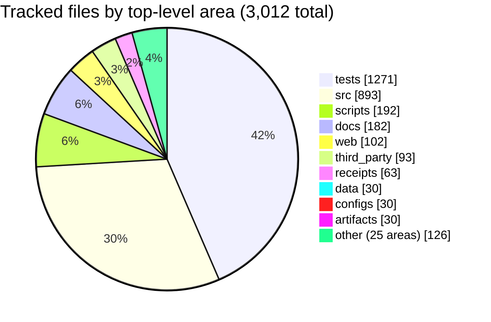
```mermaid
pie showData
    title Tracked files by top-level area (3,012 total)
    "tests" : 1271
    "src" : 893
    "scripts" : 192
    "docs" : 182
    "web" : 102
    "third_party" : 93
    "receipts" : 63
    "data" : 30
    "configs" : 30
    "artifacts" : 30
    "other (25 areas)" : 126
```

`tests/` alone (1,271 files) is larger than the entire `src/` tree (893
files) — a ratio that is itself a small piece of evidence for how seriously
this repository takes verification over volume of production code. The
"other" wedge folds together 25 smaller top-level areas, the largest of
which are `verifier/` (24 files — acceptance-history receipts for the
harness's own turnover to fx-1), `replay/` (20), `research/` (18), `rust/`
(10, the optional `quant_core` native extension), `quality/` (7, ratchet
baselines for mypy/audit), `examples/` (7), `deploy/` (7, observability
stack config), `clients/` (5, a generated TypeScript API client), and
`spec/` (3, a TLA+ formal specification) — see
[Repository layout](#repository-layout) for what each of these is.

## Extended visual atlas

The [Visual tour](#visual-tour) above covers the six load-bearing diagrams.
This atlas goes wider: every diagram type below is a **map of structure,
ordering, or enforcement — never a performance claim**. Where a number
appears, it is a count taken from `git ls-files` or from a committed
receipt, labeled with the commit it was counted at (`e00ab310c`,
2026-09-30). Diagrams marked *illustrative* show ordering or shape, not
measured timing or measured satisfaction.

### System context

The whole lab in one picture. The load-bearing edge is the one that does
**not** exist: nothing in this tree talks to a broker.

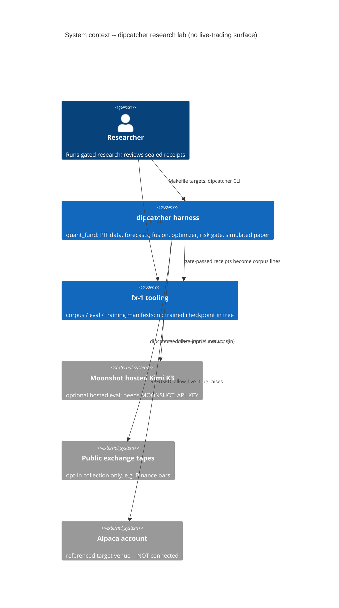
```mermaid
C4Context
  title System context -- dipcatcher research lab (no live-trading surface)
  Person(researcher, "Researcher", "Runs gated research; reviews sealed receipts")
  System(harness, "dipcatcher harness", "quant_fund: PIT data, forecasts, fusion, optimizer, risk gate, simulated paper")
  System(fx1, "fx-1 tooling", "corpus / eval / training manifests; no trained checkpoint in tree")
  System_Ext(moonshot, "Moonshot hosted Kimi K3", "optional hosted eval; needs MOONSHOT_API_KEY")
  System_Ext(tapes, "Public exchange tapes", "opt-in collection only, e.g. Binance bars")
  System_Ext(broker, "Alpaca account", "referenced target venue -- NOT connected")
  Rel(researcher, harness, "Makefile targets, dipcatcher CLI")
  Rel(researcher, fx1, "fx1 CLI")
  Rel(harness, fx1, "gate-passed receipts become corpus lines")
  Rel(fx1, moonshot, "hosted base-model eval (opt-in)")
  Rel(harness, tapes, "dipcatcher collect (opt-in, network)")
  Rel(harness, broker, "REFUSED: allow_live=true raises")
```

### Research run lifecycle

Every research run is a state machine whose terminal states are all
reviewable. A failed run is sealed as a failure, never deleted and never
silently rerun until it looks better.

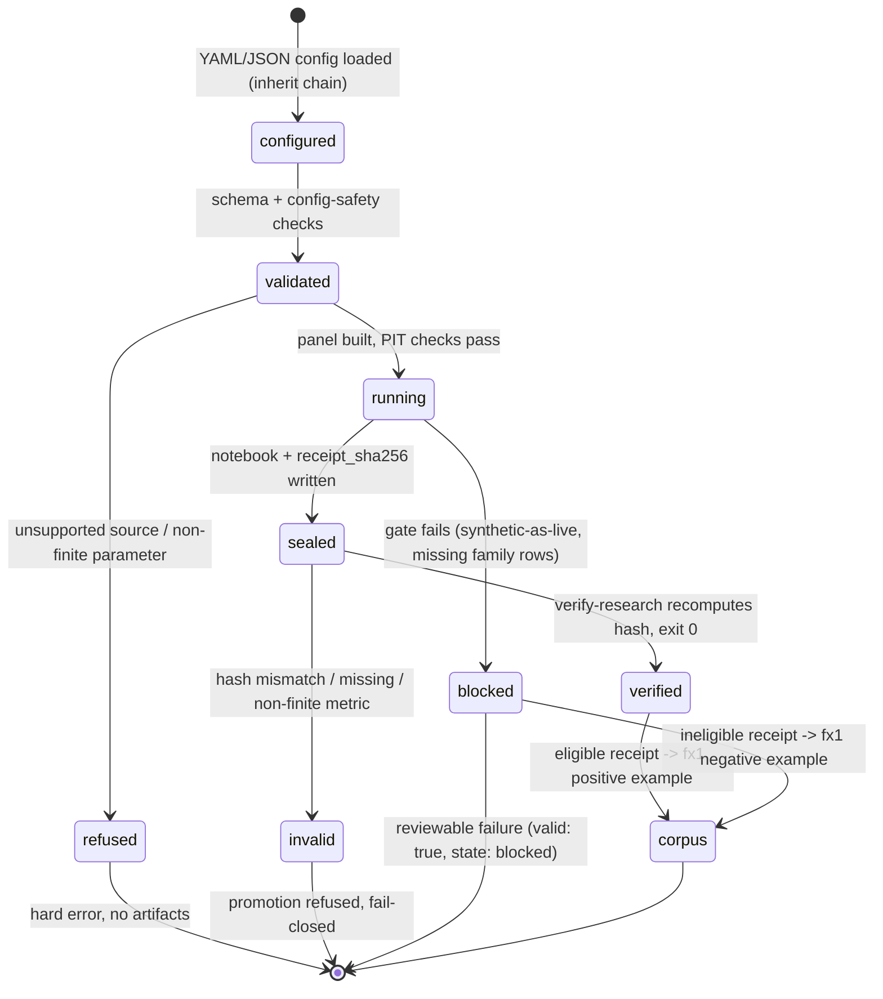
```mermaid
stateDiagram-v2
  [*] --> configured: YAML/JSON config loaded (inherit chain)
  configured --> validated: schema + config-safety checks
  validated --> refused: unsupported source / non-finite parameter
  refused --> [*]: hard error, no artifacts
  validated --> running: panel built, PIT checks pass
  running --> sealed: notebook + receipt_sha256 written
  running --> blocked: gate fails (synthetic-as-live, missing family rows)
  sealed --> verified: verify-research recomputes hash, exit 0
  sealed --> invalid: hash mismatch / missing / non-finite metric
  invalid --> [*]: promotion refused, fail-closed
  blocked --> [*]: reviewable failure (valid: true, state: blocked)
  verified --> corpus: eligible receipt -> fx1 positive example
  blocked --> corpus: ineligible receipt -> fx1 negative example
  corpus --> [*]
```

### Receipt and data-manifest relationships

How the evidence objects relate. Every arrow is a hash: nothing references
anything it cannot recompute.

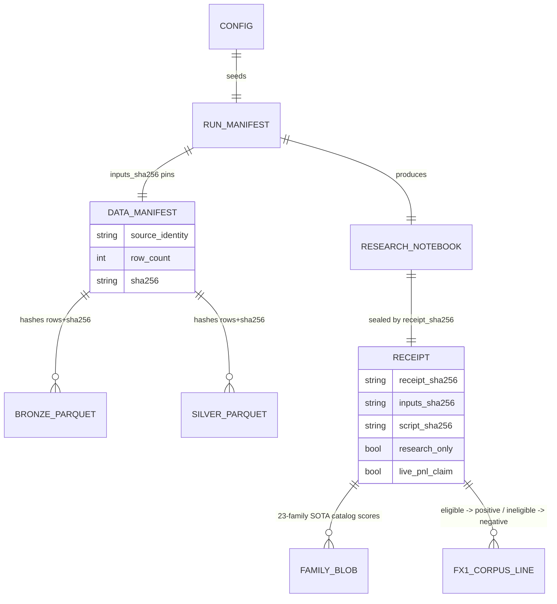
```mermaid
erDiagram
  CONFIG ||--|| RUN_MANIFEST : seeds
  DATA_MANIFEST ||--o{ BRONZE_PARQUET : "hashes rows+sha256"
  DATA_MANIFEST ||--o{ SILVER_PARQUET : "hashes rows+sha256"
  RUN_MANIFEST ||--|| DATA_MANIFEST : "inputs_sha256 pins"
  RUN_MANIFEST ||--|| RESEARCH_NOTEBOOK : produces
  RESEARCH_NOTEBOOK ||--|| RECEIPT : "sealed by receipt_sha256"
  RECEIPT ||--o{ FAMILY_BLOB : "23-family SOTA catalog scores"
  RECEIPT ||--o{ FX1_CORPUS_LINE : "eligible -> positive / ineligible -> negative"
  RECEIPT {
    string receipt_sha256
    string inputs_sha256
    string script_sha256
    bool research_only
    bool live_pnl_claim
  }
  DATA_MANIFEST {
    string source_identity
    int row_count
    string sha256
  }
```

### One gated run, stage order

The stages of a single gated research run, in order. Durations are unit
intervals — this shows *ordering and dependencies*, not measured wall time.


```mermaid
gantt
  title One gated research run (stage order, not to scale)
  dateFormat X
  axisFormat %s
  section Data
  Ingest + manifest :0, 1
  PIT checks + leakage scan :1, 2
  section Forecast
  Base forecasters :2, 4
  Fusion :4, 5
  section Decision
  Constrained optimizer :5, 6
  Risk gate :6, 7
  section Evidence
  Scorecard (proper scores only) :7, 9
  Seal + verify receipt :9, 10
```

### Acceptance history timeline

The harness's own acceptance ledger ([`verifier/`](verifier/), v1 through
v8, 24 files), condensed. Each version is a committed, reviewable
checkpoint of what the lab accepted about itself — see
[Repository health](#repository-health).

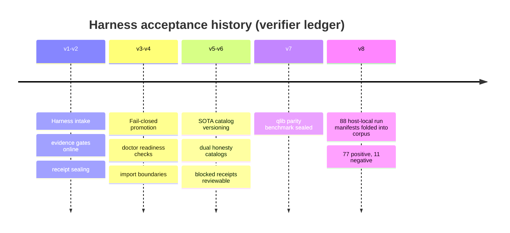
```mermaid
timeline
  title Harness acceptance history (verifier ledger)
  v1-v2 : Harness intake : evidence gates online : receipt sealing
  v3-v4 : Fail-closed promotion : doctor readiness checks : import boundaries
  v5-v6 : SOTA catalog versioning : dual honesty catalogs : blocked receipts reviewable
  v7 : qlib parity benchmark sealed
  v8 : 88 host-local run manifests folded into corpus : 77 positive, 11 negative
```

### The harness at a glance

The 47 top-level subpackages under `src/quant_fund`, grouped by job. This
is a reading aid, not an import graph — the enforced import boundaries
live in [`configs/arch_boundaries.toml`](configs/arch_boundaries.toml) and
are checked by the `arch-guards` workflow.

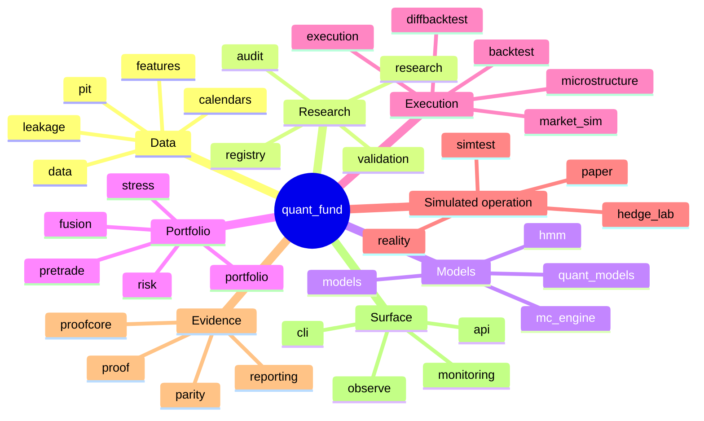
```mermaid
mindmap
  root((quant_fund))
    Data
      data
      pit
      leakage
      calendars
      features
    Research
      research
      validation
      registry
      audit
    Models
      models
      quant_models
      hmm
      mc_engine
    Portfolio
      portfolio
      fusion
      risk
      stress
      pretrade
    Execution
      execution
      backtest
      diffbacktest
      market_sim
      microstructure
    Simulated operation
      paper
      hedge_lab
      reality
      simtest
    Evidence
      proofcore
      proof
      reporting
      parity
    Surface
      cli
      api
      observe
      monitoring
```

### Capability vs evidence

An *illustrative* placement of major surfaces on two axes: how strong the
committed evidence is, and how deployment-shaped the surface is. The upper
right is where a live claim would have to live — nothing sits there.

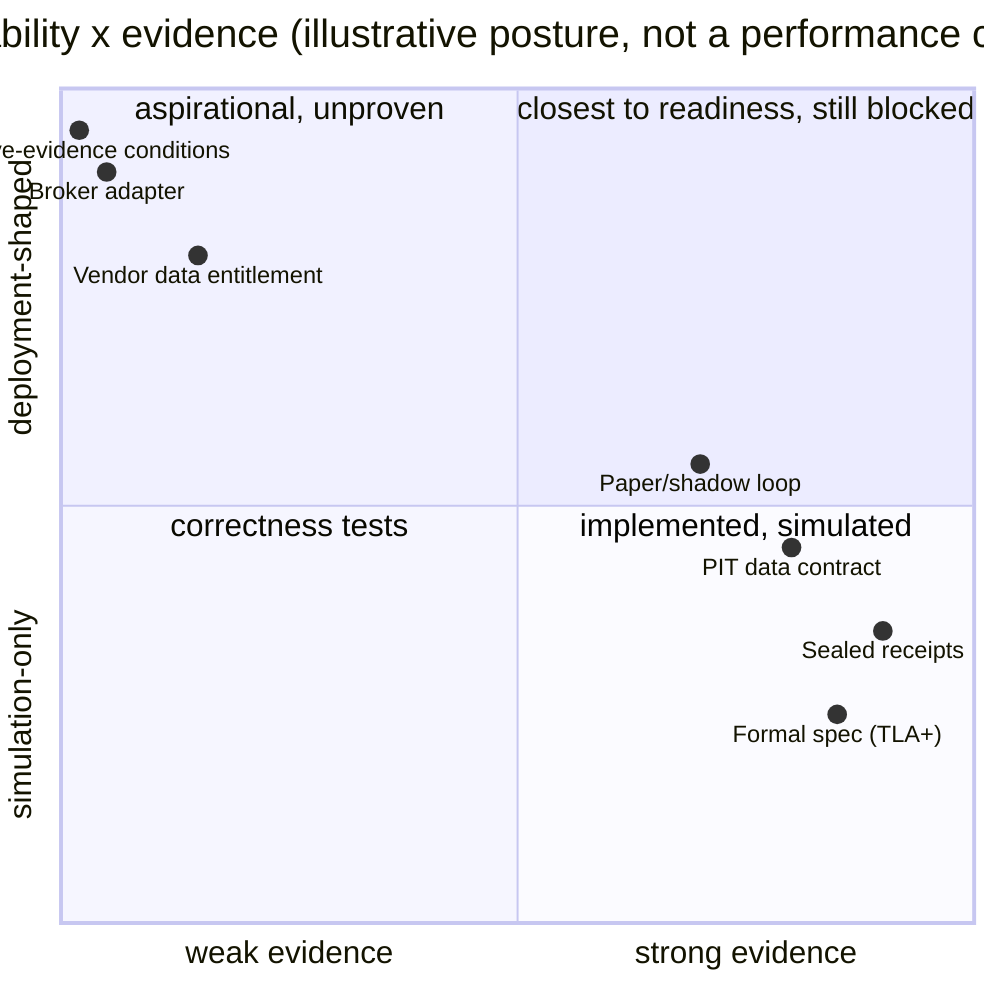
```mermaid
quadrantChart
  title Capability x evidence (illustrative posture, not a performance claim)
  x-axis weak evidence --> strong evidence
  y-axis simulation-only --> deployment-shaped
  quadrant-1 closest to readiness, still blocked
  quadrant-2 aspirational, unproven
  quadrant-3 correctness tests
  quadrant-4 implemented, simulated
  "Sealed receipts": [0.9, 0.35]
  "PIT data contract": [0.8, 0.45]
  "Paper/shadow loop": [0.7, 0.55]
  "Formal spec (TLA+)": [0.85, 0.25]
  "Vendor data entitlement": [0.15, 0.8]
  "Broker adapter": [0.05, 0.9]
  "Five live-evidence conditions": [0.02, 0.95]
```

### Tracked-file census

Counted from `git ls-files` at `e00ab310c` (3,016 tracked, non-hidden
files). The bar chart makes the same point the pie chart in
[Repository composition](#repository-composition) makes: this is a
verification-heavy repository.

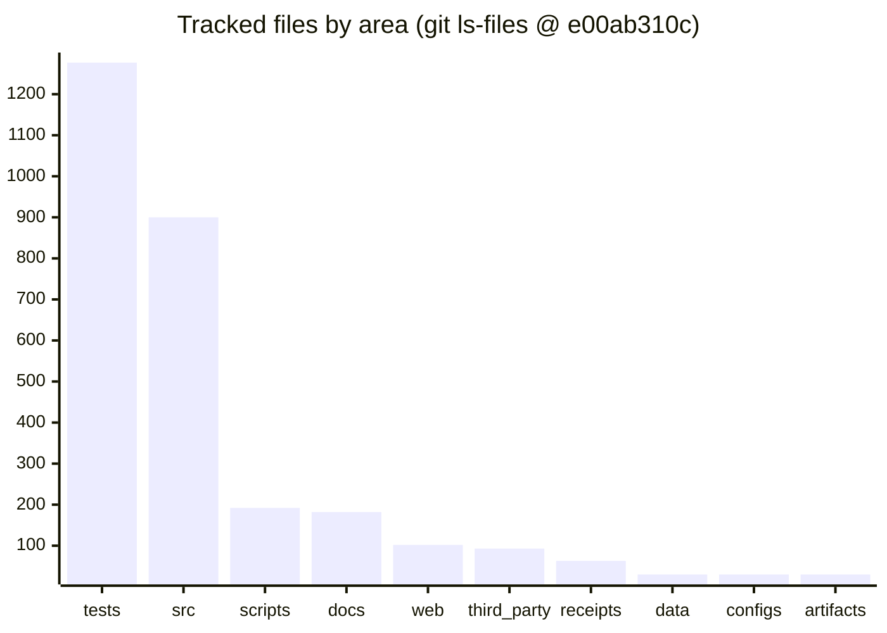
```mermaid
xychart-beta
  title "Tracked files by area (git ls-files @ e00ab310c)"
  x-axis [tests, src, scripts, docs, web, third_party, receipts, data, configs, artifacts]
  bar [1277, 900, 192, 182, 102, 93, 63, 30, 30, 30]
```

### Python module census

Python files only, same commit: the harness's 821 modules, the fx-1 lane's
61, and 1,174 `test_*.py` files standing over both.

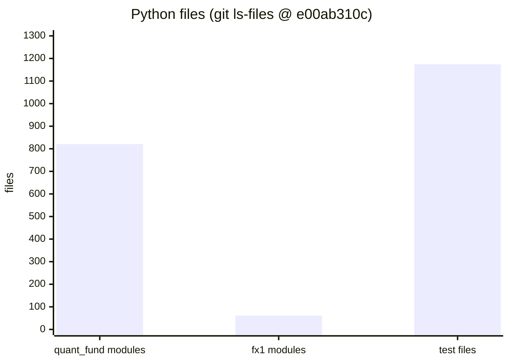
```mermaid
xychart-beta
  title "Python files (git ls-files @ e00ab310c)"
  x-axis ["quant_fund modules", "fx1 modules", "test files"]
  y-axis "files" 0 --> 1300
  bar [821, 61, 1174]
```

### Receipt census

63 committed JSON artifacts under [`receipts/`](receipts/): 55 sealed
receipts at the top level, 7 legacy-unsealed receipts kept for history,
plus one README (full listing in the [Appendix](#receipts-census)).

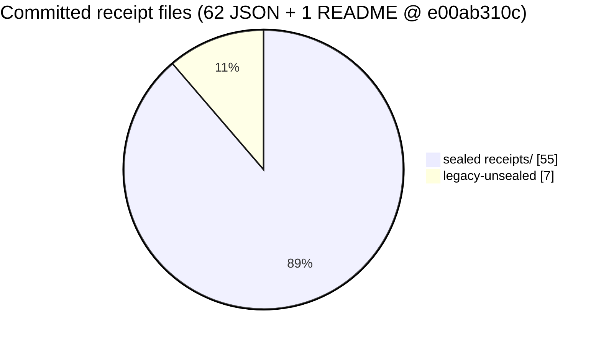
```mermaid
pie showData
  title Committed receipt files (62 JSON + 1 README @ e00ab310c)
  "sealed receipts/" : 55
  "legacy-unsealed" : 7
```

### Corpus flywheel

Receipts are fx-1's training data. Eligible receipts become positive
examples; fail-closed refusals become negative examples. Counts from the
[fx-1](#fx-1) section: 5 eligible seed receipts, plus 88 host-local
research-run manifests yielding 77 positive (SYNTHETIC-labeled, simulated
data, never market evidence) and 11 negative lines.

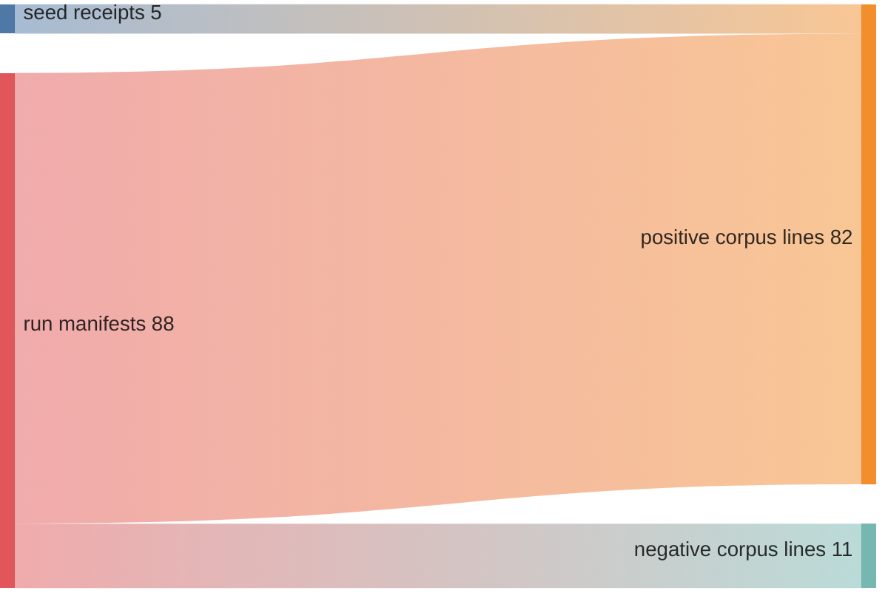
```mermaid
sankey-beta
  seed receipts,positive corpus lines,5
  run manifests,positive corpus lines,77
  run manifests,negative corpus lines,11
```

### Turnover history, illustrative

Commits land directly on `main` for fx-1 lanes (see `AGENTS.md`); the
branch below is an *illustrative* sketch of the harness's turnover into
the fx-1 lab, not a branch-by-branch history.

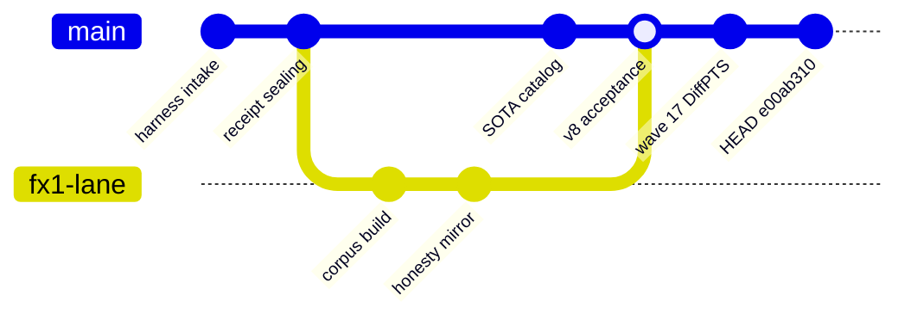
```mermaid
gitGraph
  commit id: "harness intake"
  commit id: "receipt sealing"
  branch fx1-lane
  commit id: "corpus build"
  commit id: "honesty mirror"
  checkout main
  commit id: "SOTA catalog"
  merge fx1-lane id: "v8 acceptance"
  commit id: "wave 17 DiffPTS"
  commit id: "HEAD e00ab310"
```

### A researcher's day

Illustrative satisfaction scores (1-5) for a typical gated day — the shape
of the workflow, not a measurement.

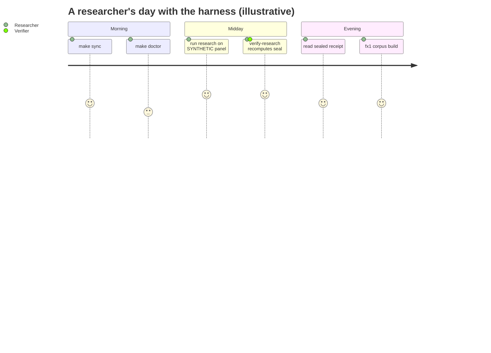
```mermaid
journey
  title A researcher's day with the harness (illustrative)
  section Morning
    make sync: 4: Researcher
    make doctor: 3: Researcher
  section Midday
    run research on SYNTHETIC panel: 5: Researcher
    verify-research recomputes seal: 5: Researcher, Verifier
  section Evening
    read sealed receipt: 4: Researcher
    fx1 corpus build: 4: Researcher
```

### Honesty gate decision tree

What happens to any candidate result before it can be headlined. Every
"no" edge is fail-closed and leaves a reviewable artifact behind.

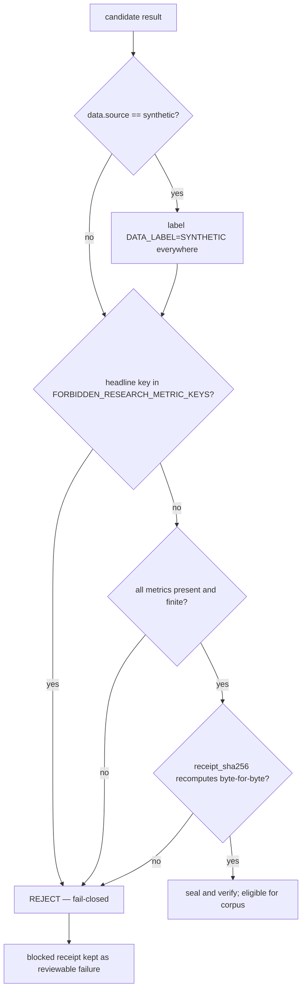
```mermaid
flowchart TD
  A["candidate result"] --> B{"data.source == synthetic?"}
  B -->|"yes"| C["label DATA_LABEL=SYNTHETIC everywhere"]
  B -->|"no"| D{"headline key in FORBIDDEN_RESEARCH_METRIC_KEYS?"}
  C --> D
  D -->|"yes"| E["REJECT — fail-closed"]
  D -->|"no"| F{"all metrics present and finite?"}
  F -->|"no"| E
  F -->|"yes"| G{"receipt_sha256 recomputes byte-for-byte?"}
  G -->|"no"| E
  G -->|"yes"| H["seal and verify; eligible for corpus"]
  E --> I["blocked receipt kept as reviewable failure"]
```

### verify-research call sequence

The authoritative check. The web explorer's panels are informational;
this is the one that exits nonzero.

```mermaid
sequenceDiagram
  autonumber
  participant U as User
  participant CLI as dipcatcher verify-research
  participant FS as receipts/
  participant V as verifier
  U->>CLI: verify-research [path]
  CLI->>FS: load notebook + receipt fields
  CLI->>V: recompute receipt_sha256 over other fields
  V-->>CLI: match / mismatch
  alt hash matches and metrics finite
    CLI-->>U: exit 0 — valid
  else mismatch, missing, or non-finite
    CLI-->>U: exit nonzero — fail-closed
  end
```

### Config inheritance

Every scenario file inherits from `base.yaml` and overrides only what it
changes. Frozen protocol files are a separate kind of object entirely —
loaded via `SotaProtocol`, never as `AppConfig`, and never edited after a
receipt cites their `protocol_sha256`.

```mermaid
flowchart TD
  base["base.yaml — runtime.mode: research, allow_live: false"]
  base --> research["research.yaml"]
  base --> paper["paper.yaml"]
  base --> backtest["backtest.yaml"]
  base --> demo["demo.yaml / demo_minute.yaml"]
  base --> production["production.yaml — historical name, research-strict"]
  paper --> simlive["sim_live.yaml"]
  frozen["sota_protocol*.yaml — frozen scoring contracts"] -.->|"SotaProtocol, not AppConfig"| research
```

### Config class anatomy

A sketch of the config object model; the authoritative definitions live in
`src/quant_fund/config` and `src/fx1/train`.

```mermaid
classDiagram
  class AppConfig {
    +RuntimeConfig runtime
    +DataConfig data
    +validate() bool
  }
  class RuntimeConfig {
    +str mode
    +bool allow_live
  }
  class DataConfig {
    +str source
  }
  class SotaProtocol {
    +str protocol_sha256
  }
  class TrainConfig {
    +str stage
    +int min_nodes_final_k3
  }
  AppConfig *-- RuntimeConfig
  AppConfig *-- DataConfig
  note for SotaProtocol "Frozen contract; not an AppConfig."
  note for TrainConfig "FINAL_K3 requires at least 2 nodes, enforced in code."
```

### Receipt field map

A conceptual bit-map of what a sealed receipt carries. This is a teaching
diagram — the authoritative format is the JSON itself plus
[`docs/RECEIPT_VERIFICATION.md`](docs/RECEIPT_VERIFICATION.md).

```mermaid
packet-beta
  title Receipt field map (conceptual)
  0-15: "receipt_sha256"
  16-31: "inputs_sha256"
  32-47: "script_sha256"
  48-55: "research_only = true"
  56-63: "live_pnl_claim = false"
```

### Documentation reading order

111 top-level documents under [`docs/`](docs/) is a lot. This is the order
the lab itself would hand a new reader; the full map is in
[Documentation index](#documentation-index).

```mermaid
flowchart LR
  readme["README.md"] --> first["Read this first"]
  first --> arch["docs/ARCHITECTURE.md"]
  arch --> contracts["docs/DATA_CONTRACTS.md"]
  contracts --> rcpt["docs/RECEIPT_VERIFICATION.md"]
  rcpt --> ready["docs/INSTITUTIONAL_READINESS.md"]
  ready --> fx1doc["docs/FX1.md + FX1_TRAINING.md"]
  rcpt --> runbook["docs/OPERATIONS_RUNBOOK.md"]
```

### ASCII: the layered stack

For viewers without mermaid — the same architecture, in plain text:

```text
+---------------------------------------------------------------+
|                         ENTRY POINTS                          |
|    dipcatcher CLI (66 actions)      fx1 CLI (22 actions)      |
+------------------------------+--------------------------------+
|                      RESEARCH HARNESS                         |
|   ingest -> PIT panel -> forecast -> fusion -> optimizer      |
|        -> risk gate -> scorecard (proper scores only)         |
+------------------------------+--------------------------------+
|                     SIMULATED EXECUTION                       |
|  backtest (next-open fills)    paper/shadow loop (no broker)  |
+------------------------------+--------------------------------+
|                        EVIDENCE LAYER                         |
|  receipts/ (hash-sealed)   verifier/ (v1..v8)   web/ (RO UI)  |
+------------------------------+--------------------------------+
|                       MODEL LANE (fx-1)                       |
|  corpus <- receipts    eval (task bank)    train manifests    |
+---------------------------------------------------------------+
|              REFUSED BY CONSTRUCTION: live orders             |
+---------------------------------------------------------------+
```

### ASCII: sealing a receipt

```text
  notebook fields (everything except receipt_sha256)
            |
            v
   canonical serialization
            |
            v
        SHA-256  ---------------->  receipt_sha256 field
            |                            |
            v                            v
     written to receipts/*.json          |
            |                            |
            +------ verify-research -----+
                    recomputes
                       |
          +------------+------------+
          |                         |
        match                   mismatch
          |                         |
       exit 0                exit nonzero, promotion
        valid                refused (fail-closed)
```

## What you get in this checkout

| Surface | What it is |
|---|---|
| `configs/research.yaml`, `configs/paper.yaml` | `data.source: synthetic`. The CLI prints `DATA_LABEL=SYNTHETIC`. These runs are labeled correctness tests, not market evidence. |
| `receipts/` | Committed research artifacts. Each file sets `research_only: true` and carries its own disclaimer string. |
| `src/quant_fund` | The research pipeline: point-in-time data, forecasts, fusion, a constrained optimizer, a risk gate, and simulated paper (893 files, 48 top-level subpackages). |
| `src/fx1` | Corpus, eval, and training-manifest code at `0.4.0`. No model weights are in the tree. |
| `web/` | A read-only explorer UI over sealed receipts and evidence (102 files) — see [Web explorer and tooling](#web-explorer-and-tooling). |
| `clients/typescript` | A generated TypeScript client (`openapi.json`, `client.ts`, `schema.d.ts`) for the FastAPI service's OpenAPI schema. |
| `verifier/` | The repository's own acceptance-history ledger for its turnover into the fx-1 harness (`v1`…`v8`, 24 files) — see [Repository health](#repository-health). |
| **Live orders** | **Refused.** Setting `runtime.allow_live: true` raises `allow_live is unsupported: no live broker adapter in this repository`. |

Research scores that the lab will headline are proper scores: pinball,
CRPS, PIT, QLIKE, Brier, ECE, Kupiec, and HMM likelihood — never Sharpe,
Sortino, Calmar, P&L, or NAV as a standalone result (see
[Read this first](#read-this-first)).

## What makes it different

- **Sealed receipts.** Phase-1 benchmark and tournament files carry
  `receipt_sha256`, the SHA-256 of the other fields.
  `dipcatcher verify-research` recomputes it and exits nonzero on a mismatch
  ([`docs/RECEIPT_VERIFICATION.md`](docs/RECEIPT_VERIFICATION.md)). Paper
  promotion receipts use the same seal. Files under `receipts/` record the
  input and script hashes the result claims (`inputs_sha256`,
  `script_sha256`, `bar_files_sha256`, and related fields).
- **Fail-closed verification.** An invalid notebook, a missing metric, or a
  non-finite metric does not promote. SYNTHETIC evidence marked as live
  fails the gate in `quant_fund.validation.gates`. `dipcatcher doctor` exits
  nonzero until a data manifest and a valid research receipt are both
  present.
- **Published negative results.**
  [`adaptive_mix_band_search_20asset_1d_20260922.json`](receipts/legacy-unsealed/adaptive_mix_band_search_20asset_1d_20260922.json)
  records `selected_band: null` and `eligible: false` on every candidate.
  [`basis_pair_candidate_20asset_1d_20260922.json`](receipts/legacy-unsealed/basis_pair_candidate_20asset_1d_20260922.json)
  records `development_eligible: false`. A sealed blocked tournament stays a
  reviewable failure (`valid: true`, `state: "blocked"`) with no test
  receipt and no selected candidate
  ([`docs/RECEIPT_VERIFICATION.md`](docs/RECEIPT_VERIFICATION.md)).
- **A parity receipt against an external incumbent.**
  [`incumbent_bench_qlib.json`](receipts/legacy-unsealed/incumbent_bench_qlib.json)
  is one matched workload against Microsoft's
  [`qlib`](https://github.com/microsoft/qlib) `0.9.7` on real Binance daily
  bars (`BTCUSDT`, `ETHUSDT`, `SOLUSDT`), with `research_only: true` and
  `live_pnl_claim: false`. Full numbers, including all five repetitions and
  the four documented semantic differences between the two engines, are in
  [Evidence and sealed receipts](#evidence-and-sealed-receipts).
- **Synthetic stays labeled.** Default research and paper configs set
  `data.source: synthetic`. The CLI prints `DATA_LABEL=SYNTHETIC` and the
  word `SYNTHETIC`. The CI smoke test fails if that notebook's
  `data_source` is anything else.
- **Formal verification, not just unit tests.** A TLA+ specification under
  [`spec/tla`](spec/tla) model-checks the order lifecycle with TLC, backed
  by Z3 and stateful property tests (`make formal`,
  [`docs/FORMAL_VERIFICATION.md`](docs/FORMAL_VERIFICATION.md)).

## Repository layout

File counts below are exact, from `git ls-files` at commit `c2d360b`;
directories not shown here hold a single tracked file each (governance docs,
lockfiles, and root configuration — 25 of them, folded into the "other"
wedge of the [repository composition](#repository-composition) chart above).

```text
dipcatcher/
├── src/
│   ├── quant_fund/  # 823 files -- the research harness (see Visual tour)
│   └── fx1/         # 70 files -- corpus, eval, training-manifest tooling
├── tests/           # 1,271 files -- 1,168 test_*.py across 9 lanes + fixtures
├── docs/            # 182 tracked files -- 111 top-level .md + 10 subdirs
├── scripts/         # 192 utility, generator, and CI-support scripts
├── web/             # 102 files -- read-only receipt/evidence explorer UI
├── third_party/     # 93 files -- vendored Kronos, MIT-licensed (see Acknowledgements)
├── receipts/        # 63 committed, hash-sealed research artifacts
├── configs/         # 30 YAML/JSON run presets (research, paper, backtest, ...)
├── data/            # 30 tracked files; generated data/* subtrees are gitignored
├── artifacts/       # 30 committed artifacts (equity parquets, champion JSON)
├── verifier/        # 24 files -- acceptance-history ledger (v1..v8)
├── replay/          # 20 files -- deterministic replay + visualization tooling
├── research/        # 18 files -- reality-filter trial ledgers
├── rust/            # 10 files -- optional quant_core native extension (maturin)
├── quality/         # 7 files -- mypy/audit ratchet baselines
├── examples/        # 7 files -- runnable, offline examples gallery
├── deploy/          # 7 files -- observability stack config (otel, prometheus, slo)
├── clients/         # 5 files -- generated TypeScript API client
├── spec/            # 3 files -- TLA+ formal specification (order lifecycle)
├── notebooks/       # placeholder (.gitkeep) -- reserved for interactive analysis
├── reports/         # generated markdown reports (e.g. cost calibration)
├── LICENSE          # proprietary, all-rights-reserved
├── README.md        # this file
├── Makefile         # every gate and workflow below is a Makefile entry
├── pyproject.toml   # package + tool config; version from fx1.__version__
└── CITATION.cff     # citation metadata
```

## Quick start

Python 3.12 or 3.13, and [uv](https://docs.astral.sh/uv/). From a clone:

```bash
make sync
uv run dipcatcher research --config configs/research.yaml
uv run dipcatcher verify-research
uv run dipcatcher doctor --config configs/research.yaml
```

`configs/research.yaml` is synthetic. `research` builds that panel, writes a
notebook under `data/metadata/research/`, and prints `DATA_LABEL=SYNTHETIC`.
`verify-research` checks `data/metadata/research/latest.json` and exits
nonzero when the notebook is invalid. `doctor` exits `0` only after the data
manifest and that receipt both check out; on a fresh tree, before
`research`, it exits `1`.

Simulated paper, also synthetic, capped the way CI caps it:

```bash
uv run dipcatcher paper --config configs/paper.yaml --max-steps 2
```

A labeled-SYNTHETIC offline demo dataset, if you want bars without any
network access at all:

```bash
make demo-data
uv run dipcatcher research --config configs/demo.yaml
```

Public collection is opt-in and is separate from ingest. It needs a
network:

```bash
uv run dipcatcher collect --help
```

## Configuration

Every run reads one YAML (or, for frozen protocols and tournaments, JSON)
file under [`configs/`](configs/). Configs use an `inherit:` chain rooted at
`base.yaml`, so a scenario file only overrides what it changes. Comments
below are taken directly from each file's own header.

| Config | Purpose (verbatim from the file's own header comment) |
|---|---|
| `base.yaml` | Root config: `runtime.mode: research`, `runtime.allow_live: false`, universe and defaults every other file inherits. |
| `research.yaml` | `runtime.mode: research`; the default synthetic research run used throughout [Quick start](#quick-start). |
| `paper.yaml` | `runtime.mode: paper`, `allow_live: false`; drives `run_paper_loop()` (see [paper and shadow loop sequence](#paper-and-shadow-loop-sequence)). |
| `backtest.yaml` | `runtime.mode: backtest`; event-driven, next-open fills, explicit cost model. |
| `production.yaml` | *"NOT a live broker / production trading profile."* Historical name kept for path stability; research-strict. |
| `demo.yaml` / `demo_minute.yaml` | Offline demo configs reading `make demo-data` output; labeled `source="synthetic"`, correctness testing only. |
| `pretrade_risk.yaml` | Pre-trade risk snapshot; shadow evaluation only; the HMAC key is supplied at load time, never stored in the file. |
| `sim_live.yaml` | Inherits `paper.yaml`; real collected Binance bars through the paper loop with quantile-signal strategies — still simulated fills, no live claim. |
| `hedge_lab.yaml` / `hedge_lab_wide.yaml` | Paper/backtest **analytics** catalog where Sharpe/Sortino/Calmar are deliberately scoped — *"live here, not in research family blobs"* — per the dual-catalog rule in [Institutional readiness](#institutional-readiness). Session-close tape, not SIP; not a live P&L claim. |
| `stress_research.yaml` | Research-only factor book for the stress-report smoke; weights are scenario exposures, not a live allocation. |
| `sota_g1.yaml`, `sota_file.yaml`, `sota_file_uk.yaml` | SYNTHETIC or public-file-tape cards for the SOTA protocol lane; engine-correctness only, not promotion. |
| `sota_protocol.yaml`, `sota_protocol_v2.yaml`, `sota_protocol_v2_lanes.yaml` | Frozen scoring contracts — *"do not edit after a receipt cites `protocol_sha256`."* Not `AppConfig` objects; loaded via `SotaProtocol`. |
| `net_tournament.json`, `cost_aware_tournament.json` | Frozen tournament slates: a benchmark plus named trial candidates, each with a family and lookback. |
| `real_benchmark_us_wide.json` | Points at a hash-pinned dataset (`dataset_sha256`) and its `source_url` on this repository, for a reproducible real-data benchmark run. |
| `forward_shadow.example.json` | Example strategy definition for the forward-shadow record ([`docs/FORWARD_SHADOW_RECORD.md`](docs/FORWARD_SHADOW_RECORD.md)). |
| `fx1_harness.example.yaml` | Smoke config for the fx-1 inference harness; forecaster is *dummy-zero, a reference baseline — not fx-1*. |
| `fx1_run.example.json` | Example immutable run manifest (`run_name`, `stage`, `base_model: moonshotai/Kimi-K3`) for the fx-1 training ladder. |
| `arch_boundaries.toml` | Import-layer boundaries for `quant_fund` (+ `fx1` coupling rules), enforced by `scripts/check_import_boundaries.py` and the `arch-guards` workflow. |

## Command line reference

Both CLIs are [Typer](https://typer.tiangolo.com/) applications. The
commands used in [Quick start](#quick-start) cover the common path; the
tables below are the complete, source-derived reference for everything
else. Every description is either quoted from the command's own Python
docstring or, where a command has no docstring, written to match the
generated diagrams in [Visual tour](#visual-tour).

**The ten commands you are most likely to reach for:**

| Command | What it does |
|---|---|
| `uv run dipcatcher research --config <cfg>` | Builds a panel, runs the research pipeline, writes a sealed notebook. |
| `uv run dipcatcher verify-research [path]` | Recomputes a notebook or run directory's receipt hash; fails closed. |
| `uv run dipcatcher doctor --config <cfg>` | Environment/data/receipt readiness check; exit code is the answer. |
| `uv run dipcatcher paper --config <cfg> --max-steps N` | Runs the simulated champion/shadow paper loop for N steps. |
| `uv run dipcatcher backtest --config <cfg>` | Event-driven backtest with next-open fills. |
| `uv run dipcatcher ingest --config <cfg>` | Point-in-time ingest into bronze/silver parquet plus a data manifest. |
| `uv run dipcatcher collect <source>` | Opt-in public data collection (needs network). |
| `uv run dipcatcher api` | Starts the FastAPI research service (loopback by default). |
| `uv run fx1 corpus build --receipts-dir receipts --out <path>` | Builds the fx-1 SFT corpus from gate-passed receipts. |
| `uv run fx1 doctor` | fx-1 readiness status (presence flags only, never secret values). |

<details>
<summary><strong>Expand the full command-line reference — 66 dipcatcher actions + 22 fx1 actions, 88 total</strong></summary>

#### `dipcatcher` command reference

50 top-level commands plus 13 nested command groups — **66** distinct CLI actions in total, defined across 15 files under [`src/quant_fund/cli/`](src/quant_fund/cli/). The tables below are grouped by source file and quote each command's own docstring; run `uv run dipcatcher --help` (or `--help` on any subcommand) for the authoritative, always-current listing.

**Data, ingest, and point-in-time layer** (`data_cmds.py`)

| Command | Group | Description |
|---|---|---|
| `doctor` | top-level | Harness environment check: exits nonzero until a data manifest and a valid research receipt both exist. |
| `ingest` | top-level | Point-in-time ingest: writes bronze/silver parquet plus `data_manifest.json`. |
| `collect` | top-level | Explicit opt-in public-source collection (may use the network). |
| `promote-bars` | top-level | Publish a collected source frame as `bars.parquet` for `source: parquet`. |
| `build-features` | top-level | `build_features()`: stamps `FEATURE_SET_VERSION` onto the frame. |
| `build-labels` | top-level | `build_labels()`: forward-looking targets, never treated as features. |
| `membership-coverage` | top-level | Report point-in-time index-membership price coverage. |

**Forecast, optimize, backtest** (`forecast_cmds.py`)

| Command | Group | Description |
|---|---|---|
| `validate` | top-level | Fail-closed research / promotion gates (see docs/VALIDATION.md). |
| `forecast` | top-level | `forecast_asof()`: produces a `MarketState` with CQR intervals. |
| `kronos-forecast` | top-level | Research-only Kronos candle-path forecasts (requires train.kronos.enabled). |
| `optimize` | top-level | `optimize_mean_variance()`: constrained optimizer; infeasible returns diagnostics, never a relaxed solution. |
| `backtest` | top-level | `run_backtest()`: event-driven, next-open fills. |

**Simulation and operations (paper, shadow, API)** (`ops_cmds.py`)

| Command | Group | Description |
|---|---|---|
| `api` | top-level | Serves the FastAPI research service (see API and security). |
| `paper` | top-level | Phase 17 paper / shadow loop with simulated broker (no live fills). |
| `monitor` | top-level | Ops snapshot over the latest paper run: limits, staleness, kill state. |
| `sim-live` | top-level | Simulated-live PnL: proven quantile forecasters trade the paper loop on real bars. |

**Reporting and verification** (`report_cmds.py`)

| Command | Group | Description |
|---|---|---|
| `verify-research` | top-level | Verify a notebook, completed Phase-1 run directory, or evidence index. |
| `lab` | top-level | Legacy compatibility alias for `dipcatcher research`. |
| `report` | top-level | Renders a report from a completed research or backtest run directory. |
| `tearsheet` | top-level | Institutional tearsheet: summary stats, drawdowns, period table, costs, attribution. |
| `regime-performance` | top-level | Split strategy performance by vol terciles, benchmark DD state, and H.15 rates. |

**Research benches, tournaments, and anytime-valid audits** (`research_cmds.py`)

| Command | Group | Description |
|---|---|---|
| `research` | top-level | Run Dipcatcher's proprietary research benches and write a labeled notebook. |
| `execution-sensitivity` | top-level | Latency/impact grid for one strategy. Execution diagnostic, not a live P&L claim. |
| `verify-identities` | top-level | Prove catalog/northset microstructure identities on SYNTHETIC draws. |
| `fleet` | top-level | Run the SYNTHETIC distribution-challenger fleet and write a receipt. |
| `calibration-eval` | top-level | Run the SYNTHETIC distribution-fleet calibration lane and write a receipt. |
| `verify-receipt` | top-level | Verify a sealed receipt: structure plus hash consistency. |
| `verify-all` | top-level | Chain-of-custody audit over the whole receipts directory. |
| `vol-bench` | top-level | Run the SYNTHETIC volatility bench and write a sealed receipt. |
| `rankic` | top-level | Cross-sectional rank-IC bench on SYNTHETIC planted-signal panels (P3.4). |
| `capacity` | top-level | P5.6 participation-capacity bench on SYNTHETIC books (dev-only). |
| `pairs` | top-level | Stat-arb pairs screen + PIT signal eval on a SYNTHETIC planted panel. |
| `race` | top-level | Sequential fleet elimination race on SYNTHETIC shards. |
| `lane-power` | top-level | Sequential power bench — measured alarm rate/time per monitor lane. |
| `suite-health` | top-level | Re-verify every receipt in a directory + pool evidence → sealed summary. |
| `mcs` | top-level | Sequential model confidence set over per-origin proper losses. |
| `serial-watch` | top-level | Anytime-valid PIT serial-independence audit; sealed receipt per stream. |
| `cost-calibration` | top-level | Flat vs OHLC-calibrated cost trials (dev-only SYNTHETIC diagnostic). |
| `verdict` | top-level | Fleet tournament → composite honest verdict → sealed receipt. |
| `fleet-monitor` | top-level | Fleet tournament → every anytime-valid monitor lane → sealed receipt. |
| `corpus` | top-level | Pool every committed receipt's claims into one BH-FDR family. |
| `online-fdr` | top-level | Replay committed receipts through Foster–Stine alpha-investing. |
| `lattice` | top-level | Cross-receipt consistency lattice over a receipts directory. |

**Audit ledger** (`audit_cmds.py`)

| Command | Group | Description |
|---|---|---|
| `verify-ledger` | top-level | Verify a hash-chained audit ledger and its signed Merkle roots. |
| `audit-record` | top-level | Append a research receipt or simulated paper rows to the audit ledger. |
| `audit-trace` | top-level | Trace one published number to its receipt digest, code hashes, and ledger entry. |

**Order book and candlestick (Northset)** (`book_cmds.py`)

| Command | Group | Description |
|---|---|---|
| `session-book` | top-level | Write multi-snapshot session L2 parquet (SYNTHETIC) + optional daily agg. |
| `vendor-book-map` | top-level | Offline dry-run of vendor quote columns → Northset book panel. |
| `book-panel` | top-level | Write a vendor-shaped L2 book panel parquet (SYNTHETIC by default). |
| `northset` | top-level | Run Northset — order-book and candlestick research inside Dipcatcher. |

**Microstructure diagnostics** (`micro_cmds.py`)

| Command | Group | Description |
|---|---|---|
| `candle-book` | top-level | Fused candlestick + order-book research bench (optional family). |
| `kyle-ofi` | top-level | Kyle λ / OFI→Δmid research diagnostics (date-level IC + HAC). |

**Data lake lineage (`lake` / `lineage` groups)** (`lake_cmds.py`)

| Command | Group | Description |
|---|---|---|
| `show` | lineage_app | Print the lineage DAG for a derived dataset. |
| `verify` | lineage_app | Recompute file and code hashes and report drift. |
| `import` | lake_app | Import files byte-for-byte and print the snapshot id. |
| `quality` | lake_app | Write a machine-readable quality report to stdout. |

**Model training (`train` group)** (`train_cmds.py`)

| Command | Group | Description |
|---|---|---|
| `ranking` | train_app | *(no docstring in source)* |
| `distribution` | train_app | *(no docstring in source)* |
| `calibration` | train_app | *(no docstring in source)* |
| `volatility` | train_app | *(no docstring in source)* |
| `alpha` | train_app | *(no docstring in source)* |
| `covariance` | train_app | *(no docstring in source)* |
| `regime` | train_app | *(no docstring in source)* |
| `tail` | train_app | *(no docstring in source)* |
| `reinforcement` | train_app | Train a research-only contextual RL policy on the causal gold panel. |
| `liquidity` | train_app | *(no docstring in source)* |

#### `fx1` command reference

18 top-level commands plus 4 nested command groups (`corpus`, `train`, `harness`, `sources`) — **22** distinct CLI actions, all in [`src/fx1/cli.py`](src/fx1/cli.py).

| Command | Group | Description |
|---|---|---|
| `build` | corpus_app | Build the fx-1 SFT corpus from gate-passed dipcatcher receipts. |
| `build-full` | corpus_app | Full corpus: receipts + notebooks + ledgers, all provenance-hashed. |
| `manifest` | train_app | Validates the run contract (eval-before-train, provenance, cost) and writes an immutable training manifest. |
| `list` | harness_app | List the lab commands fx-1 may invoke through the harness. |
| `run` | harness_app | Run a registered dipcatcher harness command (fail-closed registry). |
| `eval` | top-level | Run the built-in eval task bank against an fx-1 backend. |
| `capability-eval` | top-level | Capability battery: time-series reasoning, probability calibration, tool-use, retrieval-with-citation, external-benchmark adapters, options reasoning — all on seeded SYNTHETIC banks. |
| `ext-bench-eval` | top-level | External-benchmark-format adapters (MT-Bench / FinanceBench / FinToolBench-style); default banks are sealed SYNTHETIC gates, not market evidence. |
| `options-reasoning-eval` | top-level | Sealed SYNTHETIC options-reasoning battery (LiveOption-inspired); gold answers come from the repo's own pricing modules. |
| `modelcard` | top-level | Validate an fx-1 model card and report ship-gate status. |
| `redteam` | top-level | Run the adversarial red-team suite against an fx-1 backend. |
| `dpo` | top-level | Build contract-derived DPO preference pairs. |
| `curriculum` | top-level | Order the corpus contracts -> interpretation -> loops -> refusal. |
| `maskedaEval` | top-level | Masked/unmasked twin evaluation plus memory-gap ship metric (offline structural check). |
| `contamination-audit` | top-level | Run the publishable contamination audit over the corpus vs eval bank. |
| `sign` | top-level | Sign an fx-1 release (attestation ladder tier 1). |
| `attestation` | top-level | Report which attestation tiers a checkpoint satisfies. |
| `sbom` | top-level | Generate a hash-pinned SBOM from the locked dependency set. |
| `mrm` | top-level | Compile the five-activity model-risk dossier (SR 26-2 era). |
| `dipbench` | top-level | Dip Quality Score bench: SYNTHETIC smoke without `--data-dir`; full receipt over real historical bars with `--data-dir`. |
| `list` | sources_app | List every registered datasource with its live availability probe. |
| `probe` | sources_app | Probe availability (script + credentials) without leaking secrets. |
| `describe` | sources_app | Print the source's own capability docs (straight from its CLI). |
| `fetch` | sources_app | Fetch from one datasource. Failure is reported, never patched over. |
| `route` | sources_app | Show the routing plan for a question (classified need + probed candidates). |
| `scenarios` | sources_app | List finance-fetch scenario coverage (statements, consensus, peers…). |
| `ingest-source` | corpus_app | Fetch → gate → append to corpus → chain into the ledger. |
| `infer` | top-level | Run batch or walk-forward inference and write a forecast parquet. |
| `backtest` | top-level | Score forecasts and a placeholder signal map. |
| `doctor` | top-level | fx-1 readiness status (presence flags only — never secret values). |

</details>

## Data sources and point in time integrity

Dipcatcher separates **what a source is** from **what it is allowed to
claim**, and it does this in two distinct places: the research harness's own
public collectors, and fx-1's much broader professional-datasource router
used only for corpus construction. They are not the same subsystem, and
this README will not conflate them.

### Harness data sources (`quant_fund`)

From [`docs/DATA_SOURCE_LABELS.md`](docs/DATA_SOURCE_LABELS.md): configured
sources are explicit — `synthetic` uses the labeled simulator; `file` and
`parquet` use the local CSV/Parquet adapter; unknown source identifiers are
**rejected at configuration time**, never silently routed to a fallback.

| Label | Meaning |
|---|---|
| `SYNTHETIC` | Planted-factor / simulator panel. Recovering IC, coverage, or bandit regret is an **engine correctness** test — never a production promotion input. |
| `public` / `file` | Features built from a configured non-synthetic adapter (parquet, Stooq session-close tape, etc.). Scores stay scientific (proper rules), not a live-P&L claim. Session-close `available_time` is **not** a SIP vintage. |
| `public sources` | Registered open/public feeds collected explicitly via `dipcatcher collect` — Binance klines, FRED/ALFRED, US Treasury, CFTC COT, FINRA short volume, World Bank, BEA, GDELT, SEC EDGAR, NASDAQ ITCH sample, FI-2010, and the Hugging Face `hf_ohlcv_1m` adapter. Point-in-time stamped (`event_time` / `available_time` / `ingested_time`, `source`, `revision_id`) with a per-collection JSON receipt (SHA-256, row counts, provenance). Still research evidence, never a live-P&L claim. |

US names use the NYSE and NASDAQ common-stock universe, with public daily
and minute bars available through those opt-in collectors. Crypto research
uses public Binance series. Alpaca is an **offline quote-column preset** for
book panels, not a live brokerage connection anywhere in this repository.

The collect → promote → ingest path for bar-capable sources:

```bash
dipcatcher collect --config configs/sota_file.yaml --source yahoo \
  --param names=AAPL:AAPL,MSFT:MSFT --param start=2026-08-01
dipcatcher promote-bars --config configs/sota_file.yaml --source yahoo
dipcatcher ingest --config configs/sota_file.yaml
```

`promote-bars` publishes the collected frame as `bars.parquet`, enforces the
bars contract the provider enforces at read time, refuses to overwrite
without `--force`, and writes a `bar_promotion.v1` receipt chaining the
source parquet and collect-receipt SHA-256s to the published file.

Fail-closed rules that hold regardless of source: SYNTHETIC evidence cannot
receive a champion or live alias; `dipcatcher validate --claim-live` on
SYNTHETIC evidence fails (`ok=false`); a missing causal weight panel **and**
missing walk-forward/notebook evidence together fail validation.

### fx-1's professional datasource router

A separate, much larger surface exists purely to build the fx-1 training
corpus: [`docs/FX1_DATASOURCES.md`](docs/FX1_DATASOURCES.md) documents **18
professional finance sources** wired behind one honest interface — Wind
(万得), iFinD (同花顺), Gildata (恒生聚源), S&P CapIQ, SEC EDGAR, Yahoo
Finance, 东方财富妙想, 财联社 (CLS), 财新数据, Binance, IMF, World Bank,
IGO/FRED, 新华财经, a `finance-research` aggregator, 天眼查, a
`finance-fetch` router, and 进门投研 (Finenter, MCP-only). Design invariants,
quoted from the source document:

1. **No fabrication, ever.** Adapters execute the plugins' own bundled CLI
   scripts via subprocess; a failure returns `FetchResult(ok=False)` with
   the real error, never placeholder data.
2. **Credentials are environment-only** and never appear on argv, in logs,
   or in prompts.
3. **Point-in-time discipline.** Sources with `requires_as_of=true` cannot
   enter the training corpus without an explicit `as_of` observation date —
   the leakage guard refuses the ingest (exit `1`) and records the
   exclusion in the ledger.
4. **Live-claim quarantine.** Payloads asserting live trading performance
   become *negative* training examples that teach refusal, never positives.
5. **Tamper-evident provenance.** Every ingested payload is hash-chained:
   payload hash → ingest-code hash → example hash.
6. **Honest degradation.** Routing walks candidates in authority order;
   every skip or failure is recorded with its reason. MCP-only sources
   report `MCP_REQUIRED` rather than pretending offline capability.

```bash
fx1 sources list                      # all 18 sources + live probe status
fx1 sources probe [name]              # availability JSON (no secret values)
fx1 sources describe <name>           # the source's own capability docs
fx1 sources route --question "..."    # classified need + probed candidates
fx1 sources fetch <name> --api X --params-json '{...}' --as-of YYYY-MM-DD
fx1 sources scenarios                 # finance-fetch scenario coverage
fx1 corpus ingest-source <name> --api X --as-of ... \
    --ledger-path data/fx1/corpus_ledger.jsonl --out data/fx1/corpus.jsonl
```

The document also records a dated live-verification note (2026-09-25): a
real Binance 24-hour BTCUSDT ticker fetch (payload hash prefix `bc31361c…`,
2.1 seconds) and a CLS telegraph ingest that chained into the ledger
(`chain_valid: true`) — both are one-time, timestamped smoke checks, not a
standing SLA. Boundaries are stated honestly in the same document: adapters
are only as available as the host (missing script → `no_script`, missing
credentials → `no_credentials`, MCP-only → `mcp_required`), and true
point-in-time *vendor* snapshots for revisable fundamentals remain a
data-procurement gap that the `as_of` gate enforces discipline around but
cannot manufacture on its own.

## Research methodology

[`docs/RESEARCH_CENTRE.md`](docs/RESEARCH_CENTRE.md) opens with a sentence
worth repeating verbatim, because it is the thesis of the entire repository:

> Dipcatcher is Artificial Hedge's **proprietary research lab**. It measures
> forecast quality with proper scoring rules. It does not exist to
> manufacture Sharpe ratios.

`dipcatcher research` scores every one of the families below with a proper
scoring rule or a calibration/coverage test — never with backtested P&L. The
canonical verifier requires a versioned **23-family core catalog**
([`docs/INSTITUTIONAL_READINESS.md`](docs/INSTITUTIONAL_READINESS.md)); the
table here (24 rows) additionally includes the optional `robinhood+` K-line
challenger family. Notation has been lightly adapted from the source
document's LaTeX for plain-Markdown rendering — treat
[`docs/RESEARCH_CENTRE.md`](docs/RESEARCH_CENTRE.md) as authoritative for
exact mathematical notation.

| Family | Scientific scores |
|---|---|
| Ranking | Date-level IC / RankIC, HAC t, decile monotonicity. Public-feature challengers: `rff`, `rff_ridgeless`, `sdf_ridge`, `sdf_en`, `ipca`, `ipca_alpha`, `rp_pca`, `fnw`, `gx3pass`, `ds_lasso`, `fm`, `fm_ridge`, `pcr`, `pls`, `tprf`, `gbrt`, `pp`, `combo`, `combo_ic`, `alasso`, `classic` (ADR-026/027/028/029/030). Sign-flip mirror books (ADR-032) are paper diagnostics: costs do not flip. Champion remains public ridge until a non-SYNTHETIC card wins. Pairwise DM is on −IC, not Sharpe. |
| Alpha | Holdout MSE vs historical mean, Pearson IC |
| Volatility | QLIKE, Diebold–Mariano |
| Distribution | Pinball, CRPS, interval coverage, crossing, PIT KS (raw Gaussian + vol-scaled Gaussian / Student-t / standardized empirical residuals); 1d and 5d scored as separate keys |
| Regime | HMM AIC/BIC, holdout average log-likelihood |
| Tail | Historical VaR/ES; headline Kupiec is vol-scaled; unscaled kept as diagnostic |
| Drawdown | Brier, log-loss, ECE vs base rate |
| Liquidity | Amihud correlation, Almgren–Chriss vs TWAP shortfall |
| Reinforcement | LinUCB top-k on **public** features; regret vs planted oracle; advantage vs uniform |
| Conformal | Operational CQR/ACI/Mondrian wrap scaled (t) bands; `cqr_raw`/`aci_raw` show misspecification repair; \|Y\| slice is not an X-validity claim |
| E-values | Anytime-valid miss e-process on ACI sets (Ville); coverage, (Eₙ), ever-cross |
| Jackknife+ | Leave-one-out conformal coverage and width; finite-sample floor (1 − 2α) (bound check, not a Kupiec null) |
| CRC | CRC on scaled (t) VaR bounds (same wrappee as two-sided); homoskedastic Gaussian is diagnostic |
| Weighted conformal | Likelihood-ratio split CQR coverage and width vs exchangeable CQR |
| Interval risk | Equal-weight (1/n) per date, then interval caps; bind_wide vs bind_tight (no P&L) |
| Quantile bandit | Quantile Thompson on **public** features; regret vs residual oracle |
| CV+ / JAW | Date-folded CV+; minmax floor (1 − α), plus/JAW floor (1 − 2α) |
| Localized conformal | RBF-weighted CQR on PIT-safe volatility; coverage and width |
| Conformal rank sets | Date-grouped top-k set size, FDR, and oracle hit; no P&L |
| Online CRC | Sequential monotone-loss risk control by date; no cross-sectional time stacking |
| Portfolio conformal | One CQR set per date for the scalar book return (wᵀ r) |
| Northset | OHLC / book / session identities; candle geometry + CLV; Parkinson / Garman–Klass / Rogers–Satchell / Yang–Zhang / overnight-split QLIKE; Kyle λ, Roll, Corwin–Schultz, Abdi–Ranaldo, Amihud, OFI, VPIN; liquidity sweeps; date-level ICs; BNS jumps |
| CPCV audit | Combinatorial purged/embargoed date folds; integrity only, no return claim |
| robinhood+ (optional) | Kronos-derived K-line path IC on split-adjusted OHLCV; hierarchical tokens + autoregression; not a live claim |

**What is explicitly not a lab headline:** Sharpe, PSR, DSR, CSCV-PBO, and
simulated P&L stay out of the research notebook by design. Those belong to
optional execution backtests and the separate `analytics_export` /
`hedge_lab*` diagnostics catalog, never to the scientific benches above (see
the dual-catalog rule in [Institutional readiness](#institutional-readiness)).

BH-FDR pooling respects hypothesis-family boundaries rather than treating
every p-value as fungible: **calibration** families (fail-to-reject is
success) are never pooled with **discovery** families (reject is a finding),
and bound checks such as the Jackknife+ coverage floor are their own third
category. The full 49-hypothesis breakdown is in
[`docs/RESEARCH_CENTRE.md`](docs/RESEARCH_CENTRE.md#hypothesis-families).

Beyond the family catalog, three more layers of methodology apply to every
research run:

| Layer | What it checks | Reference |
|---|---|---|
| Validation integrity | Walk-forward, purge/embargo, CPCV audit, HAC/Diebold-Mariano, multiple-testing and conformal-family gates; anytime-valid e-BH/e-LORD/e-SAFFRON online FDR; rank confidence sequences; a frozen post-submission-only betting referee for agent-proposed factors | [`docs/VALIDATION.md`](docs/VALIDATION.md) |
| Stress testing | Research stress catalog, scenario replay, reverse stress, VaR/ES backtests | [`docs/STRESS.md`](docs/STRESS.md) |
| Robustness | Strategy robustness certificates, adversarial attacks, and a receipt stamp (`extensions_schema_version: 1`) | [`docs/ROBUSTNESS.md`](docs/ROBUSTNESS.md) |

## Evidence and sealed receipts

Every number in this section is copied from a committed, hash-sealed
receipt under [`receipts/`](receipts/). Regenerate the rendered evidence
index with `make evidence`
([`docs/evidence/index.md`](docs/evidence/index.md)); recompute any single
receipt's seal with `uv run dipcatcher verify-receipt <path>`.

### Dip-recovery bench

[`receipts/legacy-unsealed/dip_bench_crypto_1d_20260925.json`](receipts/legacy-unsealed/dip_bench_crypto_1d_20260925.json)
(schema `fx1.dip_bench/v1`, generated 2026-09-25, `research_only: true`,
`n_events: 176`, drawdown threshold `10%`) scores an **in-sample
climatology baseline** — not a tradeable signal — on 11 historical crypto
series: given that a 10% drawdown has occurred, what fraction of those 176
events had recovered by each horizon?

```text
1m  (21 trading days)   ███████████░░░░░░░░░░░░░░░░░░░░░░░░░░░░░░░░░░░░░░░ 21.59%
3m  (63 trading days)   ██████████████████████████░░░░░░░░░░░░░░░░░░░░░░░░ 51.14%
6m  (126 trading days)  ████████████████████████████░░░░░░░░░░░░░░░░░░░░░░ 55.11%
12m (252 trading days)  █████████████████████████████████████░░░░░░░░░░░░░ 74.43%
```

Disclaimer, copied verbatim from the receipt:

> Research/backtest evidence on historical data, not live performance. The
> climatology forecaster is an in-sample descriptive baseline; it is not a
> tradeable signal and authorizes nothing.

`fx1 dipbench` runs the same bench — a SYNTHETIC smoke without
`--data-dir`, or a full receipt over real historical bars with it.

### qlib parity receipt

[`receipts/legacy-unsealed/incumbent_bench_qlib.json`](receipts/legacy-unsealed/incumbent_bench_qlib.json)
(schema `incumbent_bench.v1`, `research_only: true`, `live_pnl_claim: false`)
is one matched workload against Microsoft
[`qlib`](https://github.com/microsoft/qlib) `0.9.7`, replaying identical
orders through both engines: a causal SMA-20 gate strategy, equal-weight
0.9/3 per gated name, on real Binance daily bars for `BTCUSDT`, `ETHUSDT`,
and `SOLUSDT` (999 bars/asset, 997 common trading dates), starting from
$1,000,000 notional, 10 bps commission, decision close `t` → execution open
`t+1`.

**Correctness (NAV agreement between the two independent implementations —
not a return or performance figure):**

| Metric | Value |
|---|---|
| Final NAV, dipcatcher | $1,500,764.66 |
| Final NAV, qlib 0.9.7 | $1,498,592.66 |
| Max absolute NAV difference | $0.18 (on ~$1.5M) |
| Max relative NAV difference | `1.0290734772388363e-07` |
| Common trading dates | 997 |
| Fills (dipcatcher) | 1,587 |
| Order days (qlib) | 670 |

**Wall-clock latency, five repetitions each (milliseconds, single process):**

| Rep | dipcatcher | qlib 0.9.7 |
|---|---|---|
| 1 | 105.75 | 9,469.53 |
| 2 | 101.36 | 10,510.51 |
| 3 | 97.17 | 18,078.94 |
| 4 | 99.12 | 16,197.97 |
| 5 | 103.04 | 10,579.35 |
| **Median** | **101.36** | **10,579.35** |

The median ratio is **≈104.4×** for this one workload, on this one machine
(`darwin`, Python `3.12.13`), for a single-process, in-memory replay — not a
general claim about either engine's architecture, and not evidence of
anything about live execution latency.

Disclaimer, copied verbatim from the receipt:

> Single matched workload vs qlib 0.9.x on real Binance daily bars.
> Correctness is NAV parity; latency is single-process wall time. Not a
> claim of superiority across all product dimensions.

<details>
<summary><strong>Four documented semantic differences between the two engines</strong> (also copied verbatim from the receipt)</summary>

1. qlib quotes are float32 (`.bin` format); dipcatcher uses float64 parquet
   prices. Residual NAV divergence is f32 price quantization (~1e-7
   relative, ~$0.18 worst day on ~$1.5M).
2. qlib order generation sells down before buys within a step and clips buy
   amounts to cash+cost; dipcatcher rejects a whole order that would
   overdraw. The workload keeps a 0.9 weight-sum buffer so neither policy
   binds.
3. qlib's default order generators renormalize weights to sum to 1 and floor
   amounts to integer units; a custom `OrderGenerator` (`MatchedOrderGen`)
   applies dipcatcher's exact sizing, `target_units = w * NAV / open`.
4. `limit_threshold=None` does **not** disable qlib's price-limit halt: it
   falls back to `C.limit_threshold` (0.095 for `region=cn`) and silently
   drops orders on >9.5% daily moves. `limit_threshold=1e9` disables it.
   Without this fix, NAV diverged ~14% on this workload.

</details>

### Published negative results

A failed candidate is sealed, not deleted. Two examples, both cited earlier
in [What makes it different](#what-makes-it-different) and diagrammed in
[Receipt lifecycle](#receipt-lifecycle):

- [`adaptive_mix_band_search_20asset_1d_20260922.json`](receipts/legacy-unsealed/adaptive_mix_band_search_20asset_1d_20260922.json) —
  `selected_band: null` and `eligible: false` on every candidate band.
- [`basis_pair_candidate_20asset_1d_20260922.json`](receipts/legacy-unsealed/basis_pair_candidate_20asset_1d_20260922.json) —
  `development_eligible: false`.

Both stay `valid: true`, `state: "blocked"` under
[`docs/RECEIPT_VERIFICATION.md`](docs/RECEIPT_VERIFICATION.md)'s rules: a
reviewable failure record, with no test receipt and no selected candidate —
never silently rerun until something looks better.

### Research 100

[100 source-linked research references](docs/RESEARCH100_CATALOG.md) map to
executable components and tests. [Usage and evidence](docs/RESEARCH100.md)
cover new cost-aware allocation, risk-constrained Kelly, causal volatility
management, and serial-adjusted evaluation. Existing components and new
work are explicitly distinguished; **no claim of 100 reproduced studies or
demonstrated market-performance uplift is made.**

## Deep dives

Long-form, reference-grade walk-throughs of the objects this repository is
built around. Everything here restates enforcement that lives in code —
where prose and code could ever disagree, the code and the sealed receipts
win.

### Anatomy of a sealed receipt

A receipt is a JSON document whose seal field, `receipt_sha256`, is the
SHA-256 of the canonical serialization of every other field. Schematic
sketch — field names vary by receipt family, and the committed files under
[`receipts/`](receipts/) are authoritative:

```json
{
  "schema": "dipcatcher.research.notebook/v1",
  "research_only": true,
  "live_pnl_claim": false,
  "git_revision": "<commit the run was produced at>",
  "dirty_worktree": false,
  "inputs_sha256": "<sha256 over config + dataset inputs>",
  "script_sha256": "<sha256 over the producing code path>",
  "metrics": {
    "pinball": "<quantile loss>",
    "crps": "<distributional score>",
    "pit": "<calibration histogram data>"
  },
  "receipt_sha256": "<sha256 over all fields above>"
}
```

Headline keys `sharpe`, `sortino`, `calmar`, `pnl`, and `nav` are rejected
by the research catalog *before* a notebook can be sealed, so a `metrics`
blob like the above is not a convention — it is the only shape the code
will emit.

| Field family | What it binds | Verified by |
|---|---|---|
| identity | schema version, run name, producing stage | schema validation at load |
| provenance | git revision, dirty-worktree flag, runtime, package versions | fields recomputed on re-verify |
| inputs | config hash, dataset content hash, bar-file hashes | `inputs_sha256`, `bar_files_sha256` |
| scores | proper scores only | `FORBIDDEN_RESEARCH_METRIC_KEYS` at the catalog |
| posture | `research_only: true`, `live_pnl_claim: false` | validation gates, fail-closed |
| seal | `receipt_sha256` over all other fields | `dipcatcher verify-research` |

### Lifecycle of a single forecast

From raw bars to sealed evidence, one forecast passes through eight stages.
No stage is skippable: a stage that cannot produce its evidence stops the
run.

```mermaid
flowchart LR
  bars["PIT bars"] --> feats["features"]
  feats --> fc["base forecasters"]
  fc --> fuse["fusion"]
  fuse --> opt["constrained optimizer"]
  opt --> gate["risk gate"]
  gate --> score["proper-score evaluation"]
  score --> seal["sealed receipt"]
```

| # | Stage | Home package | Refuses when |
|---|---|---|---|
| 1 | point-in-time panel | `data`, `pit` | late aggregates, duplicate keys, OHLCV violations |
| 2 | feature build | `features` | lookahead (leakage scan), non-stationary synthetic persistence |
| 3 | base forecasts | `models`, `quant_models`, `hmm` | non-finite outputs |
| 4 | fusion | `fusion` | missing forecaster evidence |
| 5 | optimization | `portfolio` | infeasible constraints; PSD repair is deterministic eigenvalue clipping |
| 6 | risk gate | `risk`, `pretrade` | breached limits; HMAC key supplied at load time, never stored |
| 7 | scoring | `research`, `validation` | missing/non-finite metrics; empty panel blob fails scorecard honesty |
| 8 | sealing | `receipts/` tooling | any of the above; seal recomputed by `verify-research` |

### Choosing a config

All configs live under [`configs/`](configs/) and inherit from
`base.yaml`; the full per-file table is in [Configuration](#configuration)
and the census is in the [Appendix](#configs-census).

```mermaid
flowchart TD
  S["I want to..."] --> A["run the default gated research pipeline"] --> AR["configs/research.yaml — SYNTHETIC"]
  S --> B["run the simulated paper loop"] --> BR["configs/paper.yaml — simulated fills"]
  S --> C["run an event-driven backtest"] --> CR["configs/backtest.yaml — next-open fills"]
  S --> D["run fully offline"] --> DR["make demo-data, then configs/demo.yaml"]
  S --> E["check environment readiness"] --> ER["dipcatcher doctor --config <cfg>"]
  S --> F["freeze a scoring protocol"] --> FR["configs/sota_protocol.yaml — never edit after cited"]
  S --> G["go live"] --> GR["refused: allow_live raises; see the five conditions"]
```

### Choosing a make target

Every workflow is a make target; the full reference table is in
[Testing, CI, and supply chain](#testing-ci-and-supply-chain) and the
lane-grouped graph is in the [Appendix](#make-target-atlas).

```mermaid
flowchart TD
  S["I need to..."] --> L["check style"] --> L2["make lint"]
  S --> T["check types"] --> T2["make typecheck"]
  S --> P["run the PR test gate"] --> P2["make test"]
  S --> F["run everything, including slow"] --> F2["make test-full"]
  S --> X["run the fx-1 lane"] --> X2["make fx1-gate"]
  S --> R["re-verify committed receipts"] --> R2["make receipts-reverify"]
  S --> M["model-check the order lifecycle"] --> M2["make formal"]
  S --> D["get a labeled offline dataset"] --> D2["make demo-data"]
  S --> C["check CI parity"] --> C2["make ci"]
```

### Proper-score field guide

The lab headlines proper scores and calibration tests, never risk-adjusted
return ratios. Definitions below use `y` for the realized outcome, `F` for
the predictive CDF, `q` for a predictive quantile at level `tau`, `p` for
an event probability, and `o` for a 0/1 outcome.

```text
pinball (quantile) loss, level tau:
    L_tau(y, q) = (y - q) * (tau - 1{y < q})

CRPS, predictive CDF F, outcome y:
    CRPS(F, y) = integral_z ( F(z) - 1{z >= y} )^2 dz

PIT value:
    u = F(y)      over many cases, u ~ Uniform(0, 1) if calibrated

QLIKE, volatility proxy x^2, forecast h:
    QLIKE = log(h) + x^2 / h

Brier score, probability p, outcome o in {0, 1}:
    BS = (p - o)^2

ECE, bins B_m:
    ECE = sum_m ( |B_m| / n ) * | acc(B_m) - conf(B_m) |

Kupiec unconditional coverage, x exceptions in N trials at rate p:
    LR = -2 * ln( (1-p)^(N-x) p^x / ( (1 - x/N)^(N-x) (x/N)^x ) )

HMM log-likelihood, forward normalizers c_t:
    ll = sum_t log(c_t)
```

Why these and not Sharpe: a proper scoring rule is minimized in
expectation by reporting the true predictive distribution, so a forecaster
cannot game the headline by being lucky, overfit, or selectively honest.
Sharpe-style ratios measure a *trading outcome* — which this repository
has none of, because there is no live trading.

### Honesty enforcement map

The honesty contract is a set of code points, not a policy page. Each row
names the enforcement point, its mirror on the other side of the
harness/model boundary, and the check that keeps them honest.

| Rule | Enforced in | Mirrored in | Checked by |
|---|---|---|---|
| forbidden headline keys | `quant_fund.research.catalog.registry.FORBIDDEN_RESEARCH_METRIC_KEYS` | `fx1.honesty.FORBIDDEN_HEADLINE_TOKENS` | `tests/fx1/test_honesty_inheritance.py` |
| SYNTHETIC labeling | CLI prints `DATA_LABEL=SYNTHETIC` | notebook `data_source` field | CI smoke test |
| no live trading | `runtime.allow_live: true` raises | `docs/INSTITUTIONAL_READINESS.md` five conditions | validation gates, fail-closed |
| receipt integrity | `dipcatcher verify-research` | committed `receipts/` tree | `make receipts-reverify` |
| analytics honesty | `validate_analytics_export` fails closed on `live_pnl_claim=true` | `hedge_lab*.yaml` scope comments | test suite + CI |
| sealed failures kept | blocked receipts stay `valid: true`, `state: "blocked"` | `docs/RECEIPT_VERIFICATION.md` | receipt verifier rules |

### Failure-mode catalog

Common ways a run can go wrong, and the gate that refuses it. None of
these fail silently.

| Symptom | Likely cause | Gate that catches it |
|---|---|---|
| run dies before sealing | unsupported data source or non-finite parameter | config-safety validation |
| notebook fails verification | edited or corrupted receipt | `verify-research` hash recompute |
| missing SOTA family rows | catalog drift | versioned 23-family catalog requirement |
| empty panel blob | DGP mixing | panel-or-skip honesty rule |
| NAV divergence vs incumbent | qlib `limit_threshold` fallback | documented semantic differences in parity receipt |
| hindsight leaks in evaluation | vintage cheating | `validation/vintage_eval.py` (VINTAGE-TS) |
| promotion of synthetic evidence | mislabeled source | fail-closed promotion gate |
| readiness endpoint red | missing manifest or invalid receipt | `/ready` fail-closed |
| agent-proposed factor judged by its proposer | referee capture | `validation/agent_referee.py` frozen betting referee |
| import layering drift | boundary violation | `scripts/check_import_boundaries.py` + arch-guards workflow |

### The five live-evidence conditions as a gate diagram

The five conditions from [Institutional readiness](#institutional-readiness)
as what they actually are: a single AND gate whose output today is
BLOCKED.

```mermaid
flowchart TD
  c1["1. licensed PIT data source with release + ingestion timestamps"] --> AND{"ALL FIVE present?"}
  c2["2. broker adapter with authenticated order/fill reconciliation"] --> AND
  c3["3. non-synthetic holdout + deployment-shaped forward/shadow record"] --> AND
  c4["4. venue cost/liquidity/borrow/financing/failure-mode measurements"] --> AND
  c5["5. signed promotion receipt, immutable verifier, explicit live authorization"] --> AND
  AND -->|"0 of 5 present today"| BLOCKED["BLOCKED — research, backtest, and simulated-paper evidence only"]
```

## Institutional readiness

Reproduced verbatim from
[`docs/INSTITUTIONAL_READINESS.md`](docs/INSTITUTIONAL_READINESS.md), which
opens with the same evidence-gating principle repeated throughout this
README:

> Dipcatcher is Artificial Hedge's research lab. This matrix is
> deliberately evidence-gated: a capability is not marked ready because a
> module exists or a synthetic fixture passes.

| Control area | Current state | Evidence / gate |
|---|---|---|
| Point-in-time data contract | Implemented for file adapters; revision-aware on the evaluation side | PIT timestamp validation, duplicate-key checks, OHLCV checks, manifest hash verification, and decision-time filtering for late cross-sectional/market aggregates. Wave 15 adds `validation/vintage_eval.py` (VINTAGE-TS): validity-interval reconstruction, delayed-label filtering, and hindsight-contamination audits over SYNTHETIC revision regimes — the *evaluation* layer now detects vintage cheating even though true as-of vintages on the public tape remain a procurement gap. |
| Configuration safety | Implemented | Unsupported data sources, non-finite simulator parameters, and non-stationary synthetic persistence fail validation |
| Data lineage | Implemented | `dipcatcher doctor` requires source identity, four canonical artifacts, SHA-256s, nonnegative row counts, and data-root containment |
| Research reproducibility | Implemented | Immutable receipt binds Git revision, dirty-worktree hash, config, dataset content, runtime, package versions, and benchmark catalog version |
| SOTA scientific benches | Implemented as research diagnostics on the lab panel | Canonical verifier requires the versioned 23-family catalog; fixture-only toys are `dgp=fixture` and excluded from panel Kupiec H-rows; panel-or-skip (empty blob) fails scorecard honesty rather than silently mixing DGPs |
| Validation integrity | Implemented | Walk-forward, purge/embargo, CPCV audit, HAC/DM, multiple-testing and conformal family gates. Waves 12–16 add the anytime-valid layer: e-BH/e-LORD/e-SAFFRON online FDR, minimax-optimal conformal e-detectors, rank confidence sequences (anytime-valid ranker ordering), replicable conformal (auditable calibration thresholds), and `validation/agent_referee.py` — a frozen post-submission-only betting referee so agent-proposed factors are judged at every stopping time by a procedure the proposer cannot touch. |
| Numerical risk controls | Implemented | Covariance inputs are finite and square; PSD repair is deterministic eigenvalue clipping with finite-output guarantees |
| Execution research | Implemented as simulation | Next-open fills, costs, participation, Almgren–Chriss/TWAP comparisons, and tamper-evident backtest artifacts |
| Paper / shadow operation | Implemented as simulation | Crash-resumable simulated broker; resume appends prior orders/equity/shadow-equity/positions/cash rows and fill receipts; deterministic target/exposure ordering; kill switch, champion/shadow dry-run, no live capital |
| Promotion | Fail-closed | Synthetic evidence, missing metrics, non-finite metrics, and invalid receipts cannot promote |
| CI reproducibility | Implemented | Frozen `uv.lock`, lock consistency check, full tests, type/lint checks, canonical receipt verification |
| CI token scope | Implemented | Workflow `GITHUB_TOKEN` is restricted to repository contents read access; no job in CI requires write access |
| Package distribution | Implemented | CI builds wheel and source distribution, installs the wheel without the checkout installed, and runs the installed `dipcatcher --help` entry point |
| API security boundary | Implemented for local/service operation | API-key authentication, loopback fail-closed default, constant-time key comparison, secure response headers, artifact-root containment, 64 KiB streamed request-body cap, and strict request schemas |
| Dependency and code security | Implemented as CI gates | Locked dependency `pip-audit` report, medium/high Bandit gate, and retained machine-readable audit artifact |
| Container operations | CI-gated | Non-root runtime user, loopback default, healthcheck, immutable dependency sync, host-local optional MLflow binding; CI builds the image and waits for its healthcheck |
| Vendor market data | Adapter interface implemented; prospective feed unavailable | A fail-closed licensed-vendor HTTP adapter skeleton checks release and ingest timestamps, but no entitlement or qualifying externally timestamped complete-universe next-open feed is configured. The paired paper prototype fails closed without that evidence; the local retrospective snapshot does not qualify. |
| Live broker connectivity | Not implemented | No live orders, broker credentials, or live P&L claims are supported |
| Live readiness | Blocked by missing external evidence | Requires authorized vendor data, broker adapter, operational controls, and independently verified holdout/forward evidence |

### Dual honesty catalogs

Two different surfaces exist and must never be conflated:

1. **Research scorecard / family blobs** — `FORBIDDEN_RESEARCH_METRIC_KEYS`
   rejects `sharpe`/`sortino`/`calmar`/`pnl`/`nav` key tokens in lab
   headlines.
2. **Paper/backtest `analytics_export`** — may nest equity `nav_*` and
   stress `*_pnl` diagnostics under `ANALYTICS_SCHEMA_KEYS`; its honesty
   gate is `live_pnl_claim=false` via `validate_analytics_export`
   (fail-closed on `true`).

`/ready` is fail-closed when `data_manifest` or the immutable research
receipt is missing or invalid. A green readiness response proves data
provenance and research-artifact integrity for the configured research
runtime — nothing more.

### Minimum evidence before any live claim

All five of the following must be present and independently reviewable
before this repository would even consider a live claim — quoted verbatim:

1. A licensed, point-in-time data source with release and ingestion
   timestamps.
2. A broker adapter with authenticated order and fill reconciliation.
3. A non-synthetic holdout and deployment-shaped forward/shadow record.
4. Cost, liquidity, borrow, financing, and failure-mode measurements from
   the target venue.
5. A signed promotion receipt whose immutable verifier passes and whose
   live authorization is explicit.

**None of these five conditions exist in this repository today.** Until
they do, dipcatcher outputs are research, backtest, or simulated
paper/shadow evidence only — see [Read this first](#read-this-first).

## fx-1

`src/fx1` (version `0.4.0`) is code and a training plan for a quant-research
model. The declared base constant, `fx1.BASE_MODEL`, is
`"moonshotai/Kimi-K3"`. **This repository does not contain a fine-tuned
checkpoint**, local generation is unimplemented, and — quoted directly from
[`docs/FX1_TRAINING.md`](docs/FX1_TRAINING.md) — "no training run has been
launched from it."

### Training ladder and pipeline

```mermaid
flowchart LR
  subgraph ladder["Training ladder -- a plan, not a launched run"]
    direction LR
    proxy["PROXY\nsmall open model or\nquantized K3 serving build\n(hundreds of USD/run)"] --> finalk3["FINAL_K3\nLoRA/QLoRA on full K3 base\nrental multi-node cluster\n(five to six figures USD)"]
    finalk3 --> distill["DISTILL\nK3-LoRA teacher distilled into\na smaller servable fx-1 student"]
  end
  subgraph pipeline["Six-stage gated pipeline (fx1.train.pipeline)"]
    direction LR
    data["data"] --> quality["quality"] --> eval_base["eval_base"] --> train["train"] --> eval_candidate["eval_candidate"] --> card["card"]
  end
```

Hardware reality, from the same document: the K3 checkpoint is roughly
1.4 TB in MXFP4 (≈5.6 TB dequantized BF16), serving needs roughly 64
accelerators, and a `FINAL_K3` run needs at least two nodes — enforced in
`TrainConfig`, not just written down. "v0.x never full-fine-tunes."

A stage that cannot produce its evidence stops the pipeline — there are no
skip flags. Highlights: a frozen split manifest and eval-contamination
removal (`fx1.data.quality`); base-model eval results hashed into the run
before training is even allowed to start; immutable training receipts
(git revision, dirty-worktree flag, config/corpus/split/eval hashes, seed,
environment fingerprint) re-checked by `verify_training_receipt`; a
statistical ship gate (`fx1.eval.compare`) requiring a paired-bootstrap
confidence interval on pass-rate deltas plus McNemar's test, where the
domain-improvement interval must exclude zero; generated (never hand-edited)
multi-node ZeRO-3 cluster configs; and a DPO preference stage
(`fx1.train.dpo`) that makes honesty a native behavior rather than a
post-hoc filter.

### What runs today

- `fx1 corpus build` turns receipts into JSONL. Eligible lines keep a
  receipt hash. Ineligible receipts become negative examples. The build
  does **not** train a model. Current seed-corpus status: 5 receipts
  loaded (5 eligible), plus — since v8 — 88 host-local research-run
  manifests (`data/metadata/research/runs/*.json`) yielding 77 positive
  (SYNTHETIC-labeled, simulated-data evidence, never market evidence) and
  11 negative (fail-closed refusal) examples. The lab's research output
  *is* fx-1's training-data flywheel: every new gate-passed receipt grows
  the corpus automatically.
- `fx1 eval` scores a backend on a fixed task bank (honesty, domain,
  general). `make fx1-eval` calls Moonshot's hosted Kimi K3 and needs
  `MOONSHOT_API_KEY`. That call grades the hosted **base** model, not any
  fine-tuned artifact.
- `fx1 train manifest` writes an immutable run manifest only when a corpus
  and an on-record base-model eval are both present. It does **not**
  launch a training job.
- `LocalFx1Backend` refuses a directory that lacks a model card cleared by
  the ship gate. `complete()` raises `NotImplementedError` until a
  distilled student exists (`src/fx1/serve/backends.py`).
- The **honesty contract inherits across the harness/model boundary by
  construction, not by convention**:
  `fx1.honesty.FORBIDDEN_HEADLINE_TOKENS` mirrors
  `quant_fund.research.catalog.registry.FORBIDDEN_RESEARCH_METRIC_KEYS`
  token-for-token, and
  [`tests/fx1/test_honesty_inheritance.py`](tests/fx1/test_honesty_inheritance.py)
  fails the build the moment the two lists disagree.

```bash
uv run fx1 --version
uv run fx1 harness list
uv run fx1 corpus build --receipts-dir receipts --out data/fx1/corpus.jsonl
```

`data/fx1/` is gitignored. The ladder, ship gate, and hardware notes are in
[`docs/FX1.md`](docs/FX1.md) and [`docs/FX1_TRAINING.md`](docs/FX1_TRAINING.md).
They describe the plan. They are **not** a record of a completed training
run. Versioning follows its own semantic-versioning contract — see
[`docs/FX1_API_STABILITY.md`](docs/FX1_API_STABILITY.md) — with
`fx1.__version__` as the canonical source that `pyproject.toml` reads via a
Hatch dynamic-version hook.

The base model, `moonshotai/Kimi-K3`, is Moonshot AI's own weights under
Moonshot's own license; nothing in this repository, including its
proprietary [LICENSE](#license), extends any right to those weights. See
[Acknowledgements and third-party notices](#acknowledgements-and-third-party-notices).

## Web explorer and tooling

[`web/`](web/) (102 tracked files) is a read-only, fully static TypeScript
app (React + Vite) for browsing the lab's committed research evidence:
strategy stat blobs, simulated equity curves and drawdowns, per-segment
("regime") stats, and the sealed receipts' verification-relevant fields.
There is **no backend** — `dist/` can be served from any static host, and
`web/scripts/export_fixtures.py` regenerates its committed JSON fixtures
from `receipts/*.json` and the committed carry-equity parquets verbatim.

| Surface | Source (committed, read-only) |
|---|---|
| Strategy list + per-segment stats | `artifacts/carry_champion*.json`, `receipts/legacy-unsealed/adaptive_mix_*.json` |
| Equity + drawdown charts | `artifacts/carry_equity*.parquet` → `fixtures/equity/*.json` |
| Receipt list + verification panel | `receipts/*.json` copied verbatim → `fixtures/receipts/` |
| Digest resolution | Export-time scan mapping embedded `sha256` fields to committed files |

Its honesty posture matches everything else in this document: it renders
fields **as stored**, labels everything `research_only` / simulated, never
asserts a performance claim, and does not re-run verification — the
authoritative, fail-closed check is always `dipcatcher verify-research`.
Its "client-side checks" panel is informational only.

```bash
cd web
npm ci                 # locked deps; node >= 20
npm run dev            # vite dev server
npm run build          # tsc --noEmit + vite build -> dist/ (static)
npm run preview        # serve dist/ locally
```

A generated TypeScript client for the FastAPI service lives separately in
[`clients/typescript`](clients/typescript) (`openapi.json`, `client.ts`,
`schema.d.ts`) and is unrelated to the receipt-browser above.

## API and security

The FastAPI service (`dipcatcher api`, default host `127.0.0.1`):

- Config paths are allowlisted to the repository's `configs/` directory —
  the containment check resolves `_CONFIGS_DIR` before any comparison.
- If `QUANT_API_KEY` is set, non-public routes require header `X-API-Key`,
  compared in **constant time**; if unset, only loopback clients are
  accepted.
- Docker binds `127.0.0.1` by default; to listen on `0.0.0.0`, set
  `QUANT_API_KEY` and override the host explicitly.
- Request bodies are capped at a streamed **64 KiB**, and request schemas
  are strict.
- `POST /backtest` is deliberately bounded to 30 causal decision dates and
  at most 31 bar dates; run larger studies through the CLI instead.
- `/ready` is fail-closed when `data_manifest` or the immutable research
  receipt is missing or invalid (see
  [Institutional readiness](#institutional-readiness)).
- Responses carry secure headers; the container runs as a non-root user
  with a healthcheck, and CI builds the image and waits on that
  healthcheck before passing.

Beyond the API surface, repository-wide security posture is CI-gated, not
aspirational: a locked-dependency `pip-audit` report (`make audit`), a
medium/high [Bandit](https://bandit.readthedocs.io/) static-analysis gate
(`make security`), [CodeQL](https://codeql.github.com/) on every push and
pull request, [OpenSSF Scorecard](https://securityscorecards.dev/) on a
weekly schedule and on branch-protection-rule changes, and a dedicated
secret-scanning workflow (`secret-scan.yml`) on every push and pull
request. See [Security policy](#security-policy) for how to report a
vulnerability.

## Testing, CI, and supply chain

### Test suite

```bash
make lint
make typecheck
make test
make fx1-gate
```

`make test` is the lab suite's PR gate (`tests/unit`, `tests/property`,
`tests/regression`, `tests/end_to_end`; not network, not slow; run under
`pytest-xdist`). `make test-full` adds the slow lane. The fx-1 suite is
separate: `make fx1-test`. `tests/fx1` is deliberately excluded from the
default pytest testpaths so the two suites never silently merge.

**1,168** tracked `test_*.py` files across nine lanes:

```mermaid
pie showData
    title Test files by lane (1,168 total)
    "unit" : 1071
    "property" : 38
    "fx1" : 31
    "regression" : 17
    "formal" : 4
    "perf" : 3
    "end_to_end" : 2
    "native" : 1
    "examples" : 1
```

`tests/unit` alone (1,071 files) outnumbers every file in `src/` (893).
`tests/property` (38 files) runs [Hypothesis](https://hypothesis.readthedocs.io/)-based
property tests, with an extended nightly lane
(`property-nightly.yml`) beyond the PR-sized `adversarial-properties.yml`.
`tests/formal` (4 files) backs the TLA+ / Z3 formal-verification gate
(`make formal`). Coverage is gated at **81%** in `pyproject.toml`
(`fail_under = 81`); this repository does not publish coverage to a hosted
service, so the number you can trust is the CI floor itself, not a
third-party badge.

### `make` targets

<details>
<summary><strong>Expand all self-documented Makefile targets</strong></summary>

| Target | Description (from the Makefile's own `##` comment) |
|---|---|
| `make help` | Show targets |
| `make sync` | Install the locked environment (all groups and extras) |
| `make test` | PR-gate lab tests (not network, not slow; xdist) |
| `make test-full` | Full offline lab suite, including slow tests |
| `make parity-smoke` | SYNTHETIC backtest/shadow parity smoke (simulated broker only) |
| `make coverage` | PR-gate tests + coverage (threshold in pyproject) |
| `make lint` | Ruff check + format check on src/ and tests/ |
| `make fmt` | Auto-fix lint + format |
| `make typecheck` | mypy on the harness (public modules are strict; see pyproject) |
| `make diffbacktest` | Differentiable backtest (optional JAX extra, CPU) |
| `make security` | Bandit static security analysis on src/ |
| `make audit-obs` | Audit ledger and observability tests |
| `make audit` | Locked-deps vulnerability audit (pip-audit) |
| `make doctor` | Harness environment check |
| `make demo-data` | Generate labeled-SYNTHETIC offline demo dataset into data/demo/ |
| `make native` | Build optional quant_core (Rust + maturin). NumPy stays the fallback. |
| `make evidence` | Regenerate docs/evidence/index.md from sealed receipts |
| `make ci` | Local mirror of the CI gate (lint typecheck coverage) |
| `make formal` | TLC order-lifecycle check + Z3/conformance/stateful tests |
| `make mc-engine-smoke` | Monte Carlo engine tests (not slow) and a tiny CLI run |
| `make pretrade-bench` | Pre-trade hot-path latency gate (p50 < 5us, p99 < 20us) |
| `make stress-smoke` | Fast stress-engine tests and the catalog report CLI |
| `make examples` | Offline examples gallery: ruff, mypy, subprocess runner |
| `make docs` | Build the documentation site (strict) |
| `make docs-serve` | Serve the documentation site locally |
| `make simtest` | Bounded deterministic-simulation tests and swarm (CI size) |
| `make simtest-large` | Large seeded swarm (workflow_dispatch size; not the PR default) |
| `make perf-record` | Record a local perf baseline over the scoring/inference hot paths |
| `make perf-check` | Compare current timings against the stored local baseline (1.5x gate) |
| `make fx1-test` | fx-1 test suite |
| `make fx1-lint` | fx-1 lint |
| `make fx1-corpus` | Build fx-1 SFT corpus from harness receipts + lab research runs |
| `make fx1-corpus-full` | Full corpus: receipts + research runs + notebooks + ledgers |
| `make fx1-eval` | Run eval task bank (requires MOONSHOT_API_KEY for hosted_k3) |
| `make fx1-gate` | Full fx-1 CI gate locally: lint + types + tests + honesty + corpus smoke |
| `make proofcore-test` | PROOFCORE W5 tests: contracts, provenance DB, CI helpers, layering gate |
| `make proofcore-coverage` | Per-package coverage floors (A3 #2): pit/proof/reality/proofcore 90, leakage 85 |
| `make proof-integrity` | Current proof signer/recorder integrity checks |
| `make proof-verify` | Bundle hash, sidecar, signature, and metric verification tests; replay remains closed |
| `make leakage-scan` | Leakage hunter — WARN MODE this wave (adjudicated: advisory only) |
| `make reality-gate` | Reality-filter gate: score trials; absent DB or empty export skips |
| `make receipts-reverify` | Fail-closed audit; schema-specific committed receipt verifiers pending |
| `make evidence-audit` | CI gate: re-verify every committed receipt; fail on any unverifiable non-legacy artifact |
| `make lattice-check` | CI gate: cross-receipt consistency lattice; fails on 'inconsistent' verdicts |
| `make market-sim-test` | Matching engine and agent-market tests |

Total: **45** self-documented targets — run `make help` for the live list.
</details>

### Continuous integration

**19** workflow files under [`.github/workflows/`](.github/workflows/).
CI runs the PR-gate test matrix on Python **3.12 and 3.13**; the separate
`matrix.yml` extends that to **3.14** and to macOS/Windows runners on a
schedule and on `workflow_dispatch`.

| Workflow file | Declared name | Trigger | What it gates |
|---|---|---|---|
| `ci.yml` | CI | push to main, PR to main (+ legacy branch), schedule | Lint, typecheck, sharded test matrix (Python 3.12/3.13), coverage, wheel/sdist build+install smoke. |
| `.github/workflows/fx1.yml` | fx1 | push to main / fx-1/**, PR | fx-1 lint, types, tests, honesty inheritance, corpus-contract smoke. |
| `codeql.yml` | CodeQL | push to main, PR, schedule | Static security analysis (CodeQL). |
| `scorecard.yml` | Scorecard | branch_protection_rule change, weekly schedule, push to main | OpenSSF Scorecard supply-chain posture. |
| `secret-scan.yml` | Secret scan | push to main, PR | Repository secret scanning. |
| `dependency-review.yml` | Dependency review | PR only | Reviews dependency changes introduced by a PR. |
| `docs.yml` | docs | push to main, PR | Builds the MkDocs site in strict mode. |
| `atlas.yml` | atlas | push to main, PR | Regenerates and diff-checks the architecture diagrams and atlas doc. |
| `arch_guards.yml` | arch-guards | push to main, PR, manual | Enforces import-layer boundaries (`configs/arch_boundaries.toml`). |
| `release.yml` | Release | push of tag `v*.*.*` | Release build/publish pipeline. |
| `matrix.yml` | Platform Matrix | PR/push to main, manual | Extended OS x Python matrix: ubuntu/macos/windows x 3.12/3.13/3.14. |
| `perf-baseline.yml` | Perf baseline gate | push to main, weekly schedule, PR | Compares hot-path timings against the stored baseline (1.5x gate). |
| `proofcore.yml` | proofcore | push to main, PR | PROOFCORE contracts, provenance DB, layering gate. |
| `property-nightly.yml` | Adversarial properties (nightly) | daily schedule, manual | Nightly extended Hypothesis property run. |
| `adversarial-properties.yml` | Adversarial properties | push to main, PR | Adversarial property-based tests (PR-sized). |
| `simtest.yml` | Deterministic simulation | PR to main, manual (seed input) | Bounded deterministic-simulation swarm. |
| `replay_viz.yml` | replay-viz | push to main, path-filtered (replay/**) | Replay/visualization tooling checks. |
| `web_explorer.yml` | Web Explorer | push to main, path-filtered (web/**) | Builds and tests the static receipt-explorer app. |
| `reproduce_sota.yml` | Reproduce SOTA | PR, path-filtered (scripts/sota_eval_*.py) | Reproduces SOTA-lane evaluation scripts on change. |

**19** workflow files under [`.github/workflows/`](.github/workflows/).

### Supply chain

- **Locked dependencies.** `uv.lock` is authoritative; CI and `make sync`
  both run `uv sync --frozen`, so an unresolved or drifted lock file fails
  the build rather than silently re-resolving.
- **Vulnerability scanning.** `make audit` runs `pip-audit` against the
  locked dependency set; `make security` runs Bandit at the medium/high
  gate.
- **Static analysis.** CodeQL runs on every push and pull request, plus a
  schedule.
- **Supply-chain scorecard.** [OpenSSF Scorecard](https://securityscorecards.dev/)
  runs weekly and on branch-protection-rule changes.
- **SBOM.** `fx1 sbom` generates a hash-pinned software bill of materials
  from the locked dependency set.
- **Package build smoke.** CI builds both the wheel and the source
  distribution, installs the wheel **without** the checkout present, and
  runs the installed `dipcatcher --help` entry point — the same check this
  README's own packaging changes were validated against (see
  [Governance and ownership](#governance-and-ownership)).
- **Attestation ladder.** `fx1 sign` and `fx1 attestation` implement a
  tiered release-signing scheme for model checkpoints.

## Documentation index

[`docs/`](docs/) holds **182** tracked files, **111** of them top-level
`.md` documents. The table below links **104** of them — every top-level
doc except seven that headline a forbidden metric (Sharpe, Sortino,
Calmar, P&L, or NAV-as-return) in their own title or body, mirroring the
`exclude_docs` list that `mkdocs.yml` itself already applies to the built
documentation site. They are not deleted, hidden, or hard to find — they
are simply not indexed here, for the same reason this README does not
headline those metrics. The seven are named in the footnote below the
table.

| Doc | Doc | Doc |
|---|---|---|
| [`ALLOCATION_PACK.md`](docs/ALLOCATION_PACK.md) | [`ARCHITECTURE.md`](docs/ARCHITECTURE.md) | [`ARCHITECTURE_ATLAS.md`](docs/ARCHITECTURE_ATLAS.md) |
| [`ARCHITECTURE_GUARDS.md`](docs/ARCHITECTURE_GUARDS.md) | [`archive.md`](docs/archive.md) | [`AUDIT_FRONTIER.md`](docs/AUDIT_FRONTIER.md) |
| [`AUDIT_FX1.md`](docs/AUDIT_FX1.md) | [`AUDIT_FX1_EVALHARNESS.md`](docs/AUDIT_FX1_EVALHARNESS.md) | [`AUDIT_LEDGER.md`](docs/AUDIT_LEDGER.md) |
| [`AUDIT_MARKET_SIM.md`](docs/AUDIT_MARKET_SIM.md) | [`AUDIT_MODELS.md`](docs/AUDIT_MODELS.md) | [`AUDIT_MUTATION.md`](docs/AUDIT_MUTATION.md) |
| [`AUDIT_NORTHSET.md`](docs/AUDIT_NORTHSET.md) | [`AUDIT_OBSERVABILITY.md`](docs/AUDIT_OBSERVABILITY.md) | [`AUDIT_P610_DEPS.md`](docs/AUDIT_P610_DEPS.md) |
| [`AUDIT_P61_MONEY.md`](docs/AUDIT_P61_MONEY.md) | [`AUDIT_P62_STATS.md`](docs/AUDIT_P62_STATS.md) | [`AUDIT_P62B_VALIDATION.md`](docs/AUDIT_P62B_VALIDATION.md) |
| [`AUDIT_P63_DATA.md`](docs/AUDIT_P63_DATA.md) | [`AUDIT_P64_DIST.md`](docs/AUDIT_P64_DIST.md) | [`AUDIT_P64B_FORECAST.md`](docs/AUDIT_P64B_FORECAST.md) |
| [`AUDIT_P65_MICRO.md`](docs/AUDIT_P65_MICRO.md) | [`AUDIT_P66_INFRA.md`](docs/AUDIT_P66_INFRA.md) | [`AUDIT_P69_TESTS.md`](docs/AUDIT_P69_TESTS.md) |
| [`AUDIT_PIT_VAULT.md`](docs/AUDIT_PIT_VAULT.md) | [`AUDIT_PRETRADE.md`](docs/AUDIT_PRETRADE.md) | [`AUDIT_RESEARCH.md`](docs/AUDIT_RESEARCH.md) |
| [`BACKTEST_LIVE_PARITY.md`](docs/BACKTEST_LIVE_PARITY.md) | [`BACKTEST_OVERFITTING.md`](docs/BACKTEST_OVERFITTING.md) | [`BENCHMARK_FAMILY_LIFECYCLE.md`](docs/BENCHMARK_FAMILY_LIFECYCLE.md) |
| [`CALENDARS.md`](docs/CALENDARS.md) | [`CANDLE_ORDER_BOOK.md`](docs/CANDLE_ORDER_BOOK.md) | [`CAUSAL_CAPACITY.md`](docs/CAUSAL_CAPACITY.md) |
| [`COST_AWARE_CONSTRUCTION.md`](docs/COST_AWARE_CONSTRUCTION.md) | [`DATA_CONTRACTS.md`](docs/DATA_CONTRACTS.md) | [`DATA_LAKE.md`](docs/DATA_LAKE.md) |
| [`DATA_QUALITY.md`](docs/DATA_QUALITY.md) | [`DATA_SOURCE_LABELS.md`](docs/DATA_SOURCE_LABELS.md) | [`DEMO_DATA.md`](docs/DEMO_DATA.md) |
| [`DETERMINISTIC_SIMULATION.md`](docs/DETERMINISTIC_SIMULATION.md) | [`DIFFBACKTEST.md`](docs/DIFFBACKTEST.md) | [`EVAL_REPORT_SOTA.md`](docs/EVAL_REPORT_SOTA.md) |
| [`examples.md`](docs/examples.md) | [`EXPLAINABILITY.md`](docs/EXPLAINABILITY.md) | [`FAST_REPLAY_P42.md`](docs/FAST_REPLAY_P42.md) |
| [`FORMAL_VERIFICATION.md`](docs/FORMAL_VERIFICATION.md) | [`FORWARD_SHADOW_POWER.md`](docs/FORWARD_SHADOW_POWER.md) | [`FORWARD_SHADOW_RECORD.md`](docs/FORWARD_SHADOW_RECORD.md) |
| [`FX1.md`](docs/FX1.md) | [`FX1_API_STABILITY.md`](docs/FX1_API_STABILITY.md) | [`FX1_ARCHITECTURE.md`](docs/FX1_ARCHITECTURE.md) |
| [`FX1_DATA.md`](docs/FX1_DATA.md) | [`FX1_DATASOURCES.md`](docs/FX1_DATASOURCES.md) | [`fx1_harness.md`](docs/fx1_harness.md) |
| [`FX1_TRAINING.md`](docs/FX1_TRAINING.md) | [`GARCH_BENCHMARK.md`](docs/GARCH_BENCHMARK.md) | [`getting-started.md`](docs/getting-started.md) |
| [`HF_OHLCV_1M.md`](docs/HF_OHLCV_1M.md) | [`IMPLEMENTATION_PLAN.md`](docs/IMPLEMENTATION_PLAN.md) | [`index.md`](docs/index.md) |
| [`INSTITUTIONAL_READINESS.md`](docs/INSTITUTIONAL_READINESS.md) | [`MARKET_SIM.md`](docs/MARKET_SIM.md) | [`MATH_SPEC.md`](docs/MATH_SPEC.md) |
| [`MC_ENGINE.md`](docs/MC_ENGINE.md) | [`MEGAPLAN_SOTA.md`](docs/MEGAPLAN_SOTA.md) | [`ML_RL_CAPABILITIES.md`](docs/ML_RL_CAPABILITIES.md) |
| [`MODEL_CARDS.md`](docs/MODEL_CARDS.md) | [`NET_RETURN_TOURNAMENT.md`](docs/NET_RETURN_TOURNAMENT.md) | [`NORTHSET.md`](docs/NORTHSET.md) |
| [`OPERATIONS_RUNBOOK.md`](docs/OPERATIONS_RUNBOOK.md) | [`P4_3_FAST_PATH_ARGUMENT.md`](docs/P4_3_FAST_PATH_ARGUMENT.md) | [`PAPER_SHADOW.md`](docs/PAPER_SHADOW.md) |
| [`PERF.md`](docs/PERF.md) | [`PERF_SWEEP.md`](docs/PERF_SWEEP.md) | [`PLATFORM_MATRIX.md`](docs/PLATFORM_MATRIX.md) |
| [`PRETRADE_RISK.md`](docs/PRETRADE_RISK.md) | [`PROSPECTIVE_SOTA.md`](docs/PROSPECTIVE_SOTA.md) | [`RANKER_PROBABILITY_EXPERIMENT.md`](docs/RANKER_PROBABILITY_EXPERIMENT.md) |
| [`REAL_DATA_BENCHMARK.md`](docs/REAL_DATA_BENCHMARK.md) | [`REALITY_PREREGISTRATION.md`](docs/REALITY_PREREGISTRATION.md) | [`REALITY_PREREGISTRATION_SURVIVORSHIP.md`](docs/REALITY_PREREGISTRATION_SURVIVORSHIP.md) |
| [`REALITY_TRIAL_2026.md`](docs/REALITY_TRIAL_2026.md) | [`REALITY_TRIAL_SURVIVORSHIP_2026.md`](docs/REALITY_TRIAL_SURVIVORSHIP_2026.md) | [`RECEIPT_SEALING.md`](docs/RECEIPT_SEALING.md) |
| [`RECEIPT_V2.md`](docs/RECEIPT_V2.md) | [`RECEIPT_VERIFICATION.md`](docs/RECEIPT_VERIFICATION.md) | [`REPLAY_VIZ.md`](docs/REPLAY_VIZ.md) |
| [`REPO_IMPROVEMENT_PLAN.md`](docs/REPO_IMPROVEMENT_PLAN.md) | [`RESEARCH100.md`](docs/RESEARCH100.md) | [`RESEARCH100_CATALOG.md`](docs/RESEARCH100_CATALOG.md) |
| [`RESEARCH_API.md`](docs/RESEARCH_API.md) | [`RESEARCH_CENTRE.md`](docs/RESEARCH_CENTRE.md) | [`RESEARCH_REFERENCES.md`](docs/RESEARCH_REFERENCES.md) |
| [`ROBUSTNESS.md`](docs/ROBUSTNESS.md) | [`RUN_COMPARE.md`](docs/RUN_COMPARE.md) | [`SECURITY_EVIDENCE.md`](docs/SECURITY_EVIDENCE.md) |
| [`SEQUENTIAL_INFERENCE.md`](docs/SEQUENTIAL_INFERENCE.md) | [`SOTA_CANON_ROADMAP_2026_09.md`](docs/SOTA_CANON_ROADMAP_2026_09.md) | [`SOTA_WAVE13_BACKLOG.md`](docs/SOTA_WAVE13_BACKLOG.md) |
| [`STAT_ARB.md`](docs/STAT_ARB.md) | [`STRESS.md`](docs/STRESS.md) | [`TOP10_EXECUTION_PLAN.md`](docs/TOP10_EXECUTION_PLAN.md) |
| [`VALIDATION.md`](docs/VALIDATION.md) | [`WEB_EXPLORER.md`](docs/WEB_EXPLORER.md) |  |

<sub>Excluded from the table above (present in the repository, built by
`make docs`, just not indexed here): `MEGAPLAN_SHARPE5.md`,
`CARRY_VS_MEGAPLAN.md`, `carry_expansion_2026_09.md`,
`carry_research_2026_09.md`, `SIM_LIVE_PNL.md`, `ULTRAPLAN_FRONTIER.md`,
`SOTA_GAP_ANALYSIS.md`.</sub>

The site itself builds with `make docs` (strict MkDocs) and serves locally
with `make docs-serve`; `docs.yml` gates both on every push and pull
request. Deeper subsystem trees also carry their own documentation:
[`docs/architecture/`](docs/architecture/) (generated diagrams + atlas),
[`docs/evidence/`](docs/evidence/) (receipt index regenerated by
`make evidence`), and [`docs/adr/`](docs/adr/) (9 architecture decision
records). The fx-1 docs (`FX1.md`, `FX1_TRAINING.md`,
`FX1_API_STABILITY.md`, `FX1_DATA.md`, `FX1_DATASOURCES.md`,
`FX1_ARCHITECTURE.md`) are top-level files in the table above, not a
separate subdirectory.

## Repository health

This repository scores itself, in public, with a rules-based
[`HONESTY_RATING.md`](HONESTY_RATING.md) that explicitly caps
self-reported metrics, zeroes out claims without committed evidence, and
penalizes a red main branch. It is a **self-assessment**, not a
third-party audit — read it as such. Its most recent scored snapshot
(subject commit `0e05f653`, 2026-09-29, one commit before this README's
own base) reads:

```text
╔══════════════════════════════════════════════════╗
║  MAJOR   638 / 800                               ║
║  MINOR   121 / 200                               ║
║  ────────────────────────                        ║
║  CORE SCORE          759 / 1000                  ║
║  OVERDRIVE EARNED      +3 / +150                 ║
║  EFFECTIVE             762 / 1150                ║
╚══════════════════════════════════════════════════╝
```

> "759/1000 places dipcatcher in the top few percent of solo-maintained
> quant repos on *engineering integrity*... The score is held back not by
> what the repo claims, but by what it hasn't done: ship a release, merge
> its own queue, license itself, and exist as a model." — `HONESTY_RATING.md`

That snapshot scored **Licensing & legal at 5 / 15**, docked specifically
for **"No LICENSE file. For a repo this engineered, the single cheapest
legal artifact is missing."** This repository now has one — see
[License](#license) — which was the top-priority, cheapest fix the
engine's own scoring identified. This README, expanded from a 232-line
overview into the document you are reading, is a direct response to the
same audit's Documentation factor (82/100) and its explicit call-out of
drift and bloat risk. Neither change moves the *other* docked items —
zero tags, an open PR queue, no fine-tuned fx-1 checkpoint — those remain
exactly as scored, and this README does not claim otherwise.

## Governance and ownership

Dipcatcher and fx-1 are a single-owner project. Every file in this
repository — code, documentation, receipts, configuration, and this README
itself — is authored for and owned by **Advaith Vaithianathan, founder of
Artificial Hedge**, as stated in [`pyproject.toml`](pyproject.toml) and
[`CITATION.cff`](CITATION.cff), and as declared formally in
[`LICENSE`](LICENSE). Three separate internal documents
([`docs/RESEARCH_CENTRE.md`](docs/RESEARCH_CENTRE.md),
[`docs/OPERATIONS_RUNBOOK.md`](docs/OPERATIONS_RUNBOOK.md),
[`docs/SOTA_GAP_ANALYSIS.md`](docs/SOTA_GAP_ANALYSIS.md)) independently
describe this repository the same way:

> "Dipcatcher is Artificial Hedge's **proprietary research lab**. It
> measures forecast quality with proper scoring rules. It does not exist
> to manufacture Sharpe ratios."

There is no open-source contribution model here, no CLA, and no shared
maintainership. This section exists to say plainly, in one place, what
[License](#license) says formally.

## Contributing

[`CONTRIBUTING.md`](CONTRIBUTING.md) covers local setup, the PR gate
commands, and style conventions for anyone **explicitly authorized in
writing** by the Owner to work in this repository. It now opens with an
explicit statement of the repository's proprietary status. Unsolicited
pull requests from the public are not the intended contribution path for
a single-owner proprietary codebase; if you believe you have found a bug
or a security issue, see [Security policy](#security-policy) instead.

## Security policy

Report vulnerabilities privately through a
[GitHub private security advisory](https://github.com/artificial-hedge/dipcatcher/security/advisories/new) —
never in a public issue, PR, or discussion. [`SECURITY.md`](SECURITY.md)
has the full scope, hard rules (fail-closed defaults, no credentials in
source, opt-in network access, no broker connectivity), a 72-hour
acknowledgment / 7-day status-update / 90-day disclosure target, a safe
harbor for good-faith research, and the supply-chain controls summarized
in [Testing, CI, and supply chain](#testing-ci-and-supply-chain).

## License

This repository is **proprietary and all rights reserved**. It is not
open source, and no part of it is available under any OSI-approved
license. The full, controlling text is [`LICENSE`](LICENSE) at the
repository root; this section summarizes it and is not a substitute for
it.

**Ownership.** Copyright (c) 2026 Advaith Vaithianathan. All rights
reserved. The Software — source, object code, build/config files,
documentation, receipts, datasets, fixtures, notebooks, and any trained
model artifacts — is the sole and exclusive property of Advaith
Vaithianathan, founder of Artificial Hedge (the "Owner"). Being visible in
a hosted repository is not, and must never be construed as, a grant of
rights.

**No license by default.** Viewing, cloning, downloading, starring,
watching, or otherwise accessing this repository grants no license,
right, or interest in the Software, express or implied.

**Prohibited without prior written permission**, in whole or in part, for
commercial or non-commercial purposes: copying or duplicating the
Software; forking, mirroring, or re-hosting this repository or its
history anywhere; modifying or creating derivative works from it;
distributing, publishing, sublicensing, renting, leasing, rebranding, or
reselling it; incorporating it into another product, service, dataset, or
model; using it — or any receipt, forecast, weight, or dataset it
produces — to train, fine-tune, distill, or evaluate a third-party model;
removing or altering any copyright or proprietary notice; or
circumventing any technical or contractual access restriction. **Plainly:
no one other than the Owner may fork, copy, or steal this code, in any
form, for any reason, without prior written permission.**

**The only uses permitted without a separate signed agreement** are (a)
viewing the repository as hosted, strictly for personal evaluation,
security research disclosed per `SECURITY.md`, or academic reference, and
(b) use by the Owner and by Artificial Hedge collaborators, employees, or
contractors explicitly authorized in writing by the Owner. Any broader
use — internal production use by another organization, redistribution, or
commercial exploitation — needs a separate signed license agreement;
direct inquiries to the Owner via the contact channels published in
`pyproject.toml` and `CITATION.cff`.

**Third-party and vendored components keep their own licenses** and are
not relicensed by this proprietary grant — see
[Acknowledgements and third-party notices](#acknowledgements-and-third-party-notices)
immediately below.

**No warranty; no investment advice; no liability.** The Software is
provided "AS IS," without warranty of any kind. It produces research,
backtest, and simulated-paper evidence only — never investment advice, a
solicitation, or a promise of live performance — and the Owner is not
liable for any resulting claim, damages, or trading loss.

**Enforcement.** Unauthorized copying, forking, or distribution is a
violation of copyright and of this license, pursuable under applicable
copyright law and international treaty (Berne Convention, TRIPS
Agreement), in addition to any other available remedy. Permission granted
under the limited-use section above may be revoked at any time, for any
reason, on written notice.

## Citation

If you reference this work in academic writing, cite
[`CITATION.cff`](CITATION.cff) (machine-readable, GitHub's native citation
format) — citation permission is independent of, and does not expand,
the copying/forking restrictions in [License](#license):

```bibtex
@software{dipcatcher,
  author  = {Vaithianathan, Advaith},
  title   = {dipcatcher},
  url     = {https://github.com/artificial-hedge/dipcatcher},
  version = {0.4.0},
  date    = {2026-09-25}
}
```

## Acknowledgements and third-party notices

This license governs only the original work authored for this
repository. It neither relicenses nor claims ownership over:

- **Locked open-source dependencies** declared in
  [`pyproject.toml`](pyproject.toml) and pinned in `uv.lock`, each
  governed by its own upstream license.
- **`third_party/kronos`** — vendored source distributed under the
  **MIT License**, Copyright (c) 2025 ShiYu. See
  [`third_party/kronos/LICENSE`](third_party/kronos/LICENSE) for the
  full, unmodified text.
- **`moonshotai/Kimi-K3`** — the base model constant referenced by the
  `fx1` package ([`docs/FX1.md`](docs/FX1.md)) — governed exclusively by
  Moonshot AI's own Kimi K3 License. No training run has been launched
  against it from this repository (see [fx-1](#fx-1)); nothing here
  grants any right to those weights, and nothing in Moonshot's license
  extends any right to this repository's original work.
- **[Qlib](https://github.com/microsoft/qlib)** appears only as an
  external **incumbent benchmark** compared against in one sealed receipt
  (see [Evidence and sealed receipts](#evidence-and-sealed-receipts)); it
  is not vendored, not a dependency, and not redistributed here.

Where this license and an applicable third-party license conflict as to
third-party code, the third-party license controls solely for that code.

## Appendix

Reference material that would interrupt the narrative above: an FAQ, a
glossary, environment variables, complete file censuses, a make-target
atlas, and a terminal cheat-sheet.

### FAQ

<details>
<summary><strong>Is this a trading bot?</strong></summary>

No. It is receipt-bound quant research and simulated paper trading. There
is no broker connectivity anywhere in the tree; setting
`runtime.allow_live: true` raises by construction. See
[Read this first](#read-this-first).

</details>

<details>
<summary><strong>Can I fork or copy it?</strong></summary>

No. The repository is proprietary and all rights reserved; visibility is
not a license. See [License](#license).

</details>

<details>
<summary><strong>Why are there no Sharpe ratios in the research headlines?</strong></summary>

Because a Sharpe ratio measures a trading outcome, and this repository has
no trading outcomes — only proper scores on labeled data. The forbidden
keys are enforced in code and mirrored across the harness/model boundary;
see [Honesty enforcement map](#honesty-enforcement-map).

</details>

<details>
<summary><strong>Where are the fx-1 model weights?</strong></summary>

Nowhere in this tree. No training run has been launched from this
repository; `LocalFx1Backend.complete()` raises `NotImplementedError`
until a distilled student exists. See [fx-1](#fx-1).

</details>

<details>
<summary><strong>Why do the tests outnumber the source files?</strong></summary>

1,277 tracked test files against 900 source files at `e00ab310c`. The
repository's premise is that claims are only as good as their weakest
verification, so verification is the largest single area of the tree.

</details>

<details>
<summary><strong>What happens if I run a config marked SYNTHETIC and present it as real?</strong></summary>

The code fights you: the CLI prints `DATA_LABEL=SYNTHETIC`, the notebook
records `data_source: synthetic`, SYNTHETIC-as-live fails the promotion
gate in `quant_fund.validation.gates`, and the CI smoke test fails if the
notebook says anything else.

</details>

<details>
<summary><strong>What exactly is a receipt?</strong></summary>

A JSON artifact whose seal field is the SHA-256 of its other fields,
binding git revision, inputs, code path, and scores. See
[Anatomy of a sealed receipt](#anatomy-of-a-sealed-receipt).

</details>

<details>
<summary><strong>What counts as evidence here?</strong></summary>

Committed, hash-sealed, re-verifiable artifacts — never screenshots, prose
claims, or deleted failures. Failed candidates stay sealed as reviewable
failures.

</details>

<details>
<summary><strong>Why are negative results committed?</strong></summary>

So that a failed candidate cannot be silently rerun until it looks better.
Two published examples are linked in
[Published negative results](#published-negative-results).

</details>

<details>
<summary><strong>Can I use my own data?</strong></summary>

Public collection is opt-in via `dipcatcher collect` and needs a network.
A licensed point-in-time vendor feed is one of the five missing
live-evidence conditions; the adapter skeleton fails closed without an
entitlement.

</details>

<details>
<summary><strong>Does the web explorer verify receipts?</strong></summary>

No. It renders committed fields as stored, labels everything
`research_only`/simulated, and never re-runs verification — the
authoritative check is always `dipcatcher verify-research`.

</details>

<details>
<summary><strong>What is the difference between the harness and fx-1?</strong></summary>

`src/quant_fund` is the lab: data engine, evaluation, verification.
`src/fx1` is the model lane: corpus, eval, and training manifests for a
planned fine-tune of `moonshotai/Kimi-K3`. Receipts flow from the first
into the second as training data.

</details>

### Glossary

| Term | Meaning here |
|---|---|
| receipt | hash-sealed JSON artifact binding inputs, code, and scores |
| seal | the `receipt_sha256` field; recomputed by `verify-research` |
| notebook | the research-run artifact that gets sealed into a receipt |
| blocked receipt | a sealed, reviewable failure: `valid: true`, `state: "blocked"` |
| panel | the point-in-time dataset a research run is built on |
| PIT | point-in-time: no information visible before its release time |
| bronze / silver | raw and cleaned parquet layers written by `ingest` |
| data manifest | hash-binding index over bronze/silver artifacts |
| proper score | a scoring rule minimized by honest probabilistic forecasts |
| pinball | quantile loss; scores one predictive quantile |
| CRPS | continuous ranked probability score; scores the whole CDF |
| PIT histogram | uniformity check of `F(y)` values; calibration evidence |
| QLIKE | quasi-likelihood loss for volatility forecasts |
| Brier | squared error of an event probability |
| ECE | expected calibration error over confidence bins |
| Kupiec | unconditional-coverage likelihood-ratio test for exceptions |
| HMM likelihood | hidden-Markov-model forward log-likelihood |
| forbidden headline keys | `sharpe`, `sortino`, `calmar`, `pnl`, `nav` in research headlines |
| dual catalogs | research scorecard vs paper/backtest `analytics_export` — never conflated |
| family blob | per-family scores in the versioned 23-family SOTA catalog |
| panel-or-skip | an empty panel blob fails honesty rather than mixing DGPs |
| DGP | data-generating process; fixture toys are `dgp=fixture` |
| vintage | the as-of revision state of a datum; VINTAGE-TS audits cheating |
| walk-forward | evaluation over rolling train/test windows |
| purge/embargo | removing overlapping samples around split boundaries |
| CPCV | combinatorial purged cross-validation |
| HAC | heteroskedasticity- and autocorrelation-consistent inference |
| DM test | Diebold–Mariano predictive-accuracy test |
| conformal | distribution-free prediction intervals / sets |
| e-value / e-BH / e-LORD / e-SAFFRON | anytime-valid multiple-testing layer (waves 12-16) |
| champion / shadow | incumbent strategy vs candidate, run side-by-side in simulation |
| kill switch | simulated halt control in the paper loop |
| next-open fill | backtest fills at the next bar's open, never the signal bar |
| Almgren–Chriss / TWAP | execution benchmarks compared in simulation |
| synthetic | generated data for correctness testing; always labeled |
| `allow_live` | config flag that raises when set — there is no live path |
| `doctor` | readiness CLI: exit code is the answer |
| `verify-research` | the authoritative, fail-closed receipt check |
| corpus line | one JSONL training example for fx-1, receipt-backed |
| ship gate | statistical promotion bar for fx-1 candidates (paired bootstrap + McNemar) |
| DPO | direct preference optimization; honesty as native behavior |
| LoRA / QLoRA | parameter-efficient fine-tuning; v0.x never full-fine-tunes |
| ZeRO-3 | sharded multi-node training configs, generated never hand-edited |
| distillation | FINAL_K3 teacher into a smaller servable fx-1 student |
| verifier ledger | `verifier/vN` acceptance history of the harness itself |

### Environment variables

From [`.env.example`](.env.example); secrets are never committed and
`doctor`-style commands report presence flags only, never values.

| Variable | Default | Purpose |
|---|---|---|
| `QUANT_DATA_ROOT` | `data` | data root; doctor requires containment under it |
| `HF_OHLCV_1M_CACHE` | unset | optional cache dir for `mito0o852/OHLCV-1m` monthly parquet |
| `MLFLOW_TRACKING_URI` | `./mlruns` | local tracking store |
| `QUANT_VENDOR_API_KEY` | unset | licensed vendor adapter; unset means fail-closed |
| `QUANT_API_KEY` | unset | required for non-loopback API access (`X-API-Key`) |
| `MOONSHOT_API_KEY` | unset | hosted Kimi K3 eval (`make fx1-eval`) |
| `FX1_SIGNING_KEY` | unset | checkpoint signature enforcement for local fx-1 serving |
| `DIPCATCHER_OBSERVE` | unset | opt-in audit ledger / observability |
| `DIPCATCHER_OTEL_ENDPOINT` | `http://127.0.0.1:4318/v1/traces` | OTLP traces endpoint |
| `DIPCATCHER_METRICS_PORT` | `9464` | metrics port |
| `DIPCATCHER_METRICS_HOST` | `127.0.0.1` | metrics host (loopback default) |
| `DIPCATCHER_SIGSTORE_ID_TOKEN` | unset | keyless signing of ledger tree heads; no token, no bundle |
| `DIPCATCHER_SIGSTORE_INSTANCE` | `production` | sigstore instance selector |

### Receipts census

All 63 tracked files under [`receipts/`](receipts/) at `e00ab310c`,
generated from `git ls-files receipts`:

<details>
<summary><strong>Expand the full receipts listing — 55 sealed + 7 legacy-unsealed + 1 README</strong></summary>

```text
receipts/  (sealed)
  calib_real_drill.json
  capacity_eval_cd0854242ed8a9ec.json
  coherence_2dd641ab766a536a.json
  concordance_df424fa2f6b1c4e9.json
  conformal_real_drill_gaussian_minus_conf_t_pinball.json
  conformal_real_drill_gaussian_pit.json
  corpus_real_drill.json
  cost_calibration_eval_df9b8d7068bf709b.json
  coverage_cs_real_drill.json
  coverage_real_drill.json
  cp_real_drill_gaussian_minus_conf_t_pinball.json
  cp_real_drill_gaussian_pit.json
  deps_security_hygiene_f3b4e6fd22e439b7.json
  drift_real_drill_gaussian_minus_conf_t_pinball.json
  drift_real_drill_gaussian_pit.json
  emerge_real_drill.json
  evidence_audit_3464d8f8197bf737.json
  evidence_audit_d449e1ca0cc119a6.json
  fast_replay_p42_conformance_20260928.json
  fleet_eval_5ddf15b0dc7d3ca1.json
  fleet_race_real_drill.json
  honest_verdict_real_drill.json
  lane_power_drill.json
  lattice_drill_verdict.json
  lattice_drill_vol_bench_a.json
  lattice_drill_vol_bench_b.json
  loss_cs_real_drill_conf_t_vs_empirical.json
  loss_cs_real_drill_gaussian_vs_conf_t.json
  mcs_real_drill.json
  mcs_vol_drill.json
  monitor_run_drill_clean.json
  monitor_run_drill_defect.json
  monitor_run_real_drill.json
  multih_fleet_eval_5db1cab214e291d7.json
  nautilus_conformance_7bf19a08c147547b.json
  panel_audit_real_drill.json
  rankic_eval_9ebdad7da83e7348.json
  real_benchmark_us_wide_manifest.json
  real_benchmark_us_wide_test.json
  real_benchmark_us_wide_validation.json
  serial_watch_140b073ea589b0c7.json
  serial_watch_1e8e1446e506fce1.json
  serial_watch_2c14615c26efd19b.json
  serial_watch_46445c3b227aa15e.json
  serial_watch_47297eff3cb55178.json
  serial_watch_4f4a495b59d022fb.json
  serial_watch_771602cd1580476c.json
  serial_watch_85db152db863d25d.json
  serial_watch_8977244ef78bfd2f.json
  serial_watch_a6fd40311ce0fa04.json
  serial_watch_d311f5ea367a66a9.json
  serial_watch_dbd21a6c99c81e00.json
  suite_health_drill.json
  tail_real_drill.json
  verdict_real_drill.json

receipts/legacy-unsealed/  (kept for history)
  adaptive_mix_20asset_1d_20260922.json
  adaptive_mix_band_search_20asset_1d_20260922.json
  basis_pair_candidate_20asset_1d_20260922.json
  basis_reversion_screen_20asset_1d_20260922.json
  dip_bench_crypto_1d_20260925.json
  fast_replay_p42_conformance_20260927.json
  incumbent_bench_qlib.json
  README.md
```

</details>

### Configs census

All 25 tracked files under [`configs/`](configs/):

```text
arch_boundaries.toml        import-layer boundaries, enforced by arch-guards
backtest.yaml               event-driven backtest; next-open fills
base.yaml                   root of the inherit chain; allow_live: false
configs/                    (subdirectory of additional presets)
cost_aware_tournament.json  frozen tournament slate
forward_shadow.example.json example forward-shadow strategy definition
fx1_harness.example.yaml    fx-1 harness smoke config (dummy-zero forecaster)
fx1_run.example.json        example immutable fx-1 run manifest
hedge_lab.yaml              paper/backtest analytics catalog (scoped)
hedge_lab_wide.yaml         wide variant of the above
net_tournament.json         frozen tournament slate
paper.yaml                  simulated champion/shadow paper loop
pretrade_risk.yaml          pre-trade risk snapshot; HMAC key at load time
production.yaml             historical name; research-strict, NOT live
demo.yaml                   offline demo dataset config
demo_minute.yaml            minute-bar offline demo config
real_benchmark_us_wide.json hash-pinned real-data benchmark manifest
research.yaml               default SYNTHETIC research run
sim_live.yaml               real collected bars through the paper loop (simulated fills)
sota_file.yaml              SOTA lane card; engine-correctness only
sota_file_uk.yaml           UK variant of the above
sota_g1.yaml                SOTA lane card; engine-correctness only
sota_protocol.yaml          frozen scoring contract — never edit after cited
sota_protocol_v2.yaml       frozen scoring contract v2
sota_protocol_v2_lanes.yaml frozen scoring contract v2, lanes
stress_research.yaml        research-only factor book for the stress smoke
```

### Make target atlas

Lane-grouped view of the workflows; descriptions for each target are in
[Testing, CI, and supply chain](#testing-ci-and-supply-chain).

```mermaid
flowchart TD
  subgraph pr["PR gates"]
    lint["make lint"] --> ci["make ci"]
    typecheck["make typecheck"] --> ci
    test["make test"] --> ci
  end
  subgraph fx1lane["fx-1 lane"]
    fx1lint["make fx1-lint"] --> fx1gate["make fx1-gate"]
    fx1test["make fx1-test"] --> fx1gate
    fx1corpus["make fx1-corpus"] --> fx1gate
    fx1eval["make fx1-eval"] --> fx1gate
  end
  subgraph evidence["evidence lane"]
    receipts["make receipts-reverify"]
    eaudit["make evidence-audit"]
    proof["make proof-verify"]
    formal["make formal"]
  end
  subgraph heavy["heavier lanes"]
    testfull["make test-full"]
    simtest["make simtest / simtest-large"]
    perf["make perf-record / perf-check"]
  end
```

### Terminal cheat-sheet

```text
+---------------------------------------------------------------------+
|  dipcatcher — the ten commands that matter                          |
+---------------------------------------------------------------------+
|  make sync                     frozen env from uv.lock              |
|  uv run dipcatcher research --config configs/research.yaml          |
|  uv run dipcatcher verify-research                                  |
|  uv run dipcatcher doctor --config configs/research.yaml            |
|  uv run dipcatcher paper --config configs/paper.yaml --max-steps 2  |
|  make demo-data                labeled offline dataset              |
|  make lint && make typecheck && make test                           |
|  make fx1-gate                 fx-1 lane: lint+types+tests+honesty  |
|  make receipts-reverify        re-verify every committed receipt    |
|  uv run fx1 corpus build --receipts-dir receipts --out <path>       |
+---------------------------------------------------------------------+
|  remember: SYNTHETIC is a label, not an insult; live is refused     |
+---------------------------------------------------------------------+
```

## Final disclaimer

Everything in this document describes **research software**: point-in-time
data discipline, proper scoring rules, sealed and re-verifiable evidence,
and an honesty contract enforced in code and in CI — not a trading
product, not a licensed offering, and not a track record. Every
performance-shaped number above is either a **correctness check** (the
qlib parity NAV comparison) or a **proper score on labeled data**
(pinball, CRPS, PIT, Brier, ECE), never a forbidden headline metric.
SYNTHETIC-labeled results are correctness tests on generated data, always
labeled as such, never market evidence. There is no broker connectivity,
no order-placement path, and no live-trading claim anywhere in this
repository — see [Institutional readiness](#institutional-readiness) for
the five concrete conditions that would have to exist before that
changed, none of which exist today. This repository, in full, is the
proprietary property of Advaith Vaithianathan / Artificial Hedge under
the [License](#license) above: **no forking, copying, or reuse without
prior written permission.**

---

<p align="center">
<sub>Copyright (c) 2026 Advaith Vaithianathan. All rights reserved. See <a href="LICENSE">LICENSE</a>.</sub>
</p>
