# Architecture Atlas

Whole-repo map of the `dipcatcher` checkout: the `quant_fund` research
harness, the `fx1` model project, the test tree, and the evidence layer
(`receipts/`, `verifier/`). It complements `docs/ARCHITECTURE.md`, which is a
hand-maintained narrative of the pipeline design; this document is the
*structural* reference, and its diagrams are **generated from the source
tree** so they cannot silently drift.

Regenerate after changing imports or moving modules:

```bash
uv run python scripts/gen_arch_diagrams.py        # rewrite artifacts + blocks below
uv run python scripts/gen_arch_diagrams.py --check  # CI freshness gate (exit 1 on drift)
```

Generated artifacts live under `docs/architecture/`
(`module_deps.mmd`, `data_flow.mmd`, `paper_loop_sequence.mmd`,
`manifest.json`) and are embedded below between `BEGIN/END GENERATED`
markers. The freshness gate runs in `.github/workflows/atlas.yml` and in
`tests/unit/docs/test_arch_atlas.py`.

## Repository shape

| Surface | What it is |
|---|---|
| `src/quant_fund` | The dipcatcher harness: PIT data engine, features/labels, ~130 forecast-model modules, optimizer + risk gate, backtest + paper engines, research receipts, `dipcatcher`/`quant` Typer CLI, FastAPI service. |
| `src/fx1` | The fx-1 model project (`0.4.0`): corpus builders over receipts, eval bank, honesty validator, serve/train scaffold, and the `fx1.forecast` harness. Corpus code reads receipt files and does not import the harness. `fx1.forecast` and `fx1.eval` import a pinned set of harness helpers; any other cross-root edge fails `tests/unit/docs/test_arch_atlas.py` (ADR-0002). |
| `tests/unit`, `tests/property`, `tests/regression`, `tests/end_to_end` | Default lab pytest suite (`pyproject` `testpaths`). |
| `tests/fx1` | fx-1 suite — intentionally outside `testpaths`; run via `make fx1-test` (see `docs/adr/0003-fx1-test-lane-separation.md`). |
| `configs/` | YAML configs with `inherit:` merge (`config/loader.py`), e.g. `research.yaml`, `paper.yaml`, `sota_*.yaml`. |
| `receipts/` | Committed sealed research artifacts (`receipt_sha256` over the other fields). |
| `verifier/vN`, `verifier/runs` | Append-only acceptance criteria versions and run logs from repo turnover. |
| `scripts/` | One-off bench/collection utilities; `gen_arch_diagrams.py` maintains this atlas. |
| `docs/decisions/` | Existing ADR series (`NNN-slug.md`, ADR-001..036). |
| `docs/adr/` | Architecture-decision records authored with this atlas (`NNNN-slug.md`). |

## Subsystem map

| Package | Responsibility | Key modules | Invariants |
|---|---|---|---|
| `quant_fund.config` | Strict Pydantic settings; YAML `inherit:` merge | `models.py`, `loader.py` | `extra="forbid"` everywhere; `allow_live` always raises (no live adapter); inheritance cycles/escapes rejected |
| `quant_fund.schemas` | Typed contracts: PIT records, bars, forecasts, orders | `pit.py`, `forecast.py`, `orders.py` | `available_time <= decision_time`; probability maps in [0,1]; interval_lo/hi ordered |
| `quant_fund.data` | Providers, lake I/O, security master, universe, PIT helpers | `ingest.py`, `lake.py`, `point_in_time.py`, `universe.py`, `adapters/`, `sources/` | provider routing fails closed; raw prices never overwritten; membership is PIT |
| `quant_fund.features` / `labels` | Trailing features / forward labels | `engine.py`, `metadata.py` | features carry `feature_set_version`; labels are forward-looking and never consumed as features |
| `quant_fund.models` | Forecast engines (130+ modules) incl. `robinhood_plus` | `ranking.py`, `distribution.py`, `volatility.py`, `covariance.py`, `conformal*.py` | every engine writes `model_version`; group=date for ranking |
| `quant_fund.fusion` | Transparent signal fusion + OOF stacking | `engine.py` | cross-fitted folds disjoint; test covered exactly once |
| `quant_fund.portfolio` | CVXPY optimizer, risk gate, conformal caps | `optimizer.py`, `risk_gate.py`, `interval_risk.py` | infeasible → diagnostics, never silent relaxation; gate is deterministic |
| `quant_fund.execution` | Costs, impact, Almgren–Chriss, simulated broker | `costs.py`, `simulated_broker.py` | every fill clears kill switch + `check_order`; buys need cash; shadow slots hold no capital |
| `quant_fund.backtest` | Event-driven engines | `engine.py`, `perp_engine.py`, `carry_engine.py`, `fast_replay.py` | default fill next open; `StaleValuationError` instead of fabricated NAV |
| `quant_fund.paper` | Paper/shadow loop | `loop.py`, `ledger.py`, `clock.py`, `sim_live.py` | ledger flushed before resume cursor; `live_pnl_claim` always false |
| `quant_fund.validation` | Walk-forward, purging, CPCV, FDR, gates | `walk_forward.py`, `purging.py`, `gates.py` | `validate_candidate` is an evidence decision; SYNTHETIC can never promote to live |
| `quant_fund.research` | Honesty catalog, runner, verifier, tournaments | `agent.py`, `verify.py`, `catalog/` | proper scores only; receipt digest recomputed; forbidden metric keys scanned |
| `quant_fund.leakage` | AST lint rules LH001–LH012 + watchdog | `rules.py`, `ast_scan.py`, `cli.py` | rule registry is the only metadata source; allowlists are per-rule |
| `quant_fund.monitoring` | Drift, kill switch, dashboard | `kill_switch.py`, `drift.py` | only `ENABLED` admits orders; flatten needs explicit human authorization |
| `quant_fund.api` | FastAPI service | `app.py` | config paths allowlisted; loopback or `X-API-Key`; `/backtest` bounded to 30 decision dates |
| `quant_fund.hedge_lab` / `lightspeed` / `hmm` / `quant_models` / `northset` / `microstructure` / `metrics` / `risk` / `registry` / `reporting` / `proofcore` | Research benches, frozen challenger engines, estimators, scoring rules | see module table in `manifest.json` | research-only labels; `proofcore` imports stdlib+pydantic only |
| `fx1.data` / `eval` / `serve` / `train` / `bench` | fx-1 corpus, eval, serving, training scaffold | `corpus.py`, `bank.py`, `backends.py`, `pipeline.py` | `FORBIDDEN_HEADLINE_TOKENS` mirrors lab catalog; `LocalFx1Backend.complete()` is unimplemented until a distilled student exists |

## Module dependency graph

Package-level import edges (labels = distinct first-party modules imported
per package pair), generated from `src/**` via `ast`. Dashed "ghost" nodes
are packages referenced by imports but absent from the scanned source tree.
Function-local imports are included in the graph.

<!-- BEGIN GENERATED: module_deps -->
```mermaid
%% Generated by scripts/gen_arch_diagrams.py — do not edit by hand.
flowchart LR
  subgraph cluster_quant_fund["quant_fund (harness)"]
    quant_fund["quant_fund"]
    quant_fund_api["quant_fund.api"]
    quant_fund_audit["quant_fund.audit"]
    quant_fund_backtest["quant_fund.backtest"]
    quant_fund_calendars["quant_fund.calendars"]
    quant_fund_cli["quant_fund.cli"]
    quant_fund_compute["quant_fund.compute"]
    quant_fund_config["quant_fund.config"]
    quant_fund_data["quant_fund.data"]
    quant_fund_diffbacktest["quant_fund.diffbacktest"]
    quant_fund_execution["quant_fund.execution"]
    quant_fund_features["quant_fund.features"]
    quant_fund_formal["quant_fund.formal"]
    quant_fund_fusion["quant_fund.fusion"]
    quant_fund_hedge_lab["quant_fund.hedge_lab"]
    quant_fund_hmm["quant_fund.hmm"]
    quant_fund_labels["quant_fund.labels"]
    quant_fund_leakage["quant_fund.leakage"]
    quant_fund_lightspeed["quant_fund.lightspeed"]
    quant_fund_market_sim["quant_fund.market_sim"]
    quant_fund_mc_engine["quant_fund.mc_engine"]
    quant_fund_metrics["quant_fund.metrics"]
    quant_fund_microstructure["quant_fund.microstructure"]
    quant_fund_models["quant_fund.models"]
    quant_fund_monitoring["quant_fund.monitoring"]
    quant_fund_native["quant_fund.native"]
    quant_fund_northset["quant_fund.northset"]
    quant_fund_observe["quant_fund.observe"]
    quant_fund_paper["quant_fund.paper"]
    quant_fund_parity["quant_fund.parity"]
    quant_fund_parity_leak_audit["quant_fund.parity_leak_audit"]
    quant_fund_pipeline["quant_fund.pipeline"]
    quant_fund_pit["quant_fund.pit"]
    quant_fund_portfolio["quant_fund.portfolio"]
    quant_fund_pretrade["quant_fund.pretrade"]
    quant_fund_proof["quant_fund.proof"]
    quant_fund_proofcore["quant_fund.proofcore"]
    quant_fund_public["quant_fund.public"]
    quant_fund_quant_models["quant_fund.quant_models"]
    quant_fund_reality["quant_fund.reality"]
    quant_fund_registry["quant_fund.registry"]
    quant_fund_reporting["quant_fund.reporting"]
    quant_fund_research["quant_fund.research"]
    quant_fund_risk["quant_fund.risk"]
    quant_fund_robustness["quant_fund.robustness"]
    quant_fund_schemas["quant_fund.schemas"]
    quant_fund_simtest["quant_fund.simtest"]
    quant_fund_stress["quant_fund.stress"]
    quant_fund_utils["quant_fund.utils"]
    quant_fund_validation["quant_fund.validation"]
  end
  subgraph cluster_fx1["fx1 (model project)"]
    fx1["fx1"]
    fx1_bench["fx1.bench"]
    fx1_cli["fx1.cli"]
    fx1_cli_audit["fx1.cli_audit"]
    fx1_data["fx1.data"]
    fx1_doctor["fx1.doctor"]
    fx1_doctor_audit["fx1.doctor_audit"]
    fx1_eval["fx1.eval"]
    fx1_ext_bench_audit["fx1.ext_bench_audit"]
    fx1_forecast["fx1.forecast"]
    fx1_harness["fx1.harness"]
    fx1_harness_audit["fx1.harness_audit"]
    fx1_honesty["fx1.honesty"]
    fx1_honesty_audit["fx1.honesty_audit"]
    fx1_hypotheses["fx1.hypotheses"]
    fx1_hypotheses_audit["fx1.hypotheses_audit"]
    fx1_modelcard["fx1.modelcard"]
    fx1_modelcard_audit["fx1.modelcard_audit"]
    fx1_mrm["fx1.mrm"]
    fx1_mrm_audit["fx1.mrm_audit"]
    fx1_reward["fx1.reward"]
    fx1_reward_audit["fx1.reward_audit"]
    fx1_rt_audit["fx1.rt_audit"]
    fx1_rubric_audit["fx1.rubric_audit"]
    fx1_sbom["fx1.sbom"]
    fx1_sbom_audit["fx1.sbom_audit"]
    fx1_serve["fx1.serve"]
    fx1_tail_audit["fx1.tail_audit"]
    fx1_train["fx1.train"]
  end
  fx1_bench -->|1| fx1_honesty
  fx1_bench -->|5| quant_fund_utils
  fx1_cli -->|1| fx1
  fx1_cli -->|2| fx1_bench
  fx1_cli -->|7| fx1_data
  fx1_cli -->|1| fx1_doctor
  fx1_cli -->|5| fx1_eval
  fx1_cli -->|2| fx1_forecast
  fx1_cli -->|1| fx1_harness
  fx1_cli -->|1| fx1_modelcard
  fx1_cli -->|1| fx1_mrm
  fx1_cli -->|1| fx1_sbom
  fx1_cli -->|1| fx1_serve
  fx1_cli -->|3| fx1_train
  fx1_cli_audit -->|1| fx1_cli
  fx1_cli_audit -->|2| quant_fund_utils
  fx1_data -->|3| fx1_honesty
  fx1_data -->|13| quant_fund_utils
  fx1_doctor -->|1| fx1
  fx1_doctor -->|1| fx1_data
  fx1_doctor -->|1| fx1_eval
  fx1_doctor_audit -->|1| fx1_doctor
  fx1_doctor_audit -->|2| quant_fund_utils
  fx1_eval -->|1| fx1_data
  fx1_eval -->|1| fx1_harness
  fx1_eval -->|10| fx1_honesty
  fx1_eval -->|4| quant_fund_metrics
  fx1_eval -->|2| quant_fund_models
  fx1_eval -->|18| quant_fund_utils
  fx1_ext_bench_audit -->|2| fx1_eval
  fx1_ext_bench_audit -->|2| quant_fund_utils
  fx1_forecast -->|1| fx1_honesty
  fx1_forecast -->|1| quant_fund_config
  fx1_forecast -->|4| quant_fund_data
  fx1_forecast -->|3| quant_fund_metrics
  fx1_forecast -->|1| quant_fund_research
  fx1_forecast -->|6| quant_fund_schemas
  fx1_forecast -->|8| quant_fund_utils
  fx1_forecast -->|1| quant_fund_validation
  fx1_harness_audit -->|1| fx1_harness
  fx1_harness_audit -->|2| quant_fund_utils
  fx1_honesty_audit -->|1| fx1_honesty
  fx1_honesty_audit -->|2| quant_fund_utils
  fx1_hypotheses -->|1| fx1_honesty
  fx1_hypotheses_audit -->|1| fx1_hypotheses
  fx1_hypotheses_audit -->|2| quant_fund_utils
  fx1_modelcard_audit -->|1| fx1_modelcard
  fx1_modelcard_audit -->|2| quant_fund_utils
  fx1_mrm -->|1| fx1_modelcard
  fx1_mrm -->|1| quant_fund_utils
  fx1_mrm_audit -->|1| fx1_modelcard
  fx1_mrm_audit -->|1| fx1_mrm
  fx1_mrm_audit -->|2| quant_fund_utils
  fx1_reward -->|1| fx1_honesty
  fx1_reward_audit -->|1| fx1_reward
  fx1_reward_audit -->|2| quant_fund_utils
  fx1_rt_audit -->|2| fx1_eval
  fx1_rt_audit -->|1| fx1_honesty
  fx1_rt_audit -->|2| quant_fund_utils
  fx1_rubric_audit -->|2| fx1_eval
  fx1_rubric_audit -->|2| quant_fund_utils
  fx1_sbom_audit -->|1| fx1_sbom
  fx1_sbom_audit -->|2| quant_fund_utils
  fx1_serve -->|1| fx1_honesty
  fx1_serve -->|2| fx1_modelcard
  fx1_serve -->|4| quant_fund_utils
  fx1_tail_audit -->|2| fx1_data
  fx1_tail_audit -->|1| fx1_eval
  fx1_tail_audit -->|1| fx1_honesty
  fx1_tail_audit -->|4| fx1_train
  fx1_tail_audit -->|2| quant_fund_utils
  fx1_train -->|1| fx1_data
  fx1_train -->|7| fx1_eval
  fx1_train -->|1| fx1_honesty
  fx1_train -->|11| quant_fund_utils
  quant_fund -->|1| fx1
  quant_fund -->|1| quant_fund_public
  quant_fund_api -->|2| quant_fund
  quant_fund_api -->|1| quant_fund_backtest
  quant_fund_api -->|2| quant_fund_config
  quant_fund_api -->|1| quant_fund_data
  quant_fund_api -->|1| quant_fund_metrics
  quant_fund_api -->|2| quant_fund_models
  quant_fund_api -->|3| quant_fund_pipeline
  quant_fund_api -->|1| quant_fund_portfolio
  quant_fund_api -->|3| quant_fund_research
  quant_fund_api -->|2| quant_fund_schemas
  quant_fund_api -->|8| quant_fund_utils
  quant_fund_audit -->|2| quant_fund_research
  quant_fund_audit -->|3| quant_fund_utils
  quant_fund_backtest -->|8| quant_fund_config
  quant_fund_backtest -->|8| quant_fund_execution
  quant_fund_backtest -->|6| quant_fund_metrics
  quant_fund_backtest -->|1| quant_fund_microstructure
  quant_fund_backtest -->|5| quant_fund_monitoring
  quant_fund_backtest -->|1| quant_fund_northset
  quant_fund_backtest -->|3| quant_fund_pipeline
  quant_fund_backtest -->|5| quant_fund_portfolio
  quant_fund_backtest -->|1| quant_fund_research
  quant_fund_backtest -->|2| quant_fund_risk
  quant_fund_backtest -->|8| quant_fund_schemas
  quant_fund_backtest -->|1| quant_fund_utils
  quant_fund_cli -->|2| quant_fund_audit
  quant_fund_cli -->|3| quant_fund_backtest
  quant_fund_cli -->|3| quant_fund_config
  quant_fund_cli -->|12| quant_fund_data
  quant_fund_cli -->|3| quant_fund_features
  quant_fund_cli -->|1| quant_fund_hmm
  quant_fund_cli -->|1| quant_fund_leakage
  quant_fund_cli -->|1| quant_fund_lightspeed
  quant_fund_cli -->|7| quant_fund_microstructure
  quant_fund_cli -->|1| quant_fund_monitoring
  quant_fund_cli -->|3| quant_fund_northset
  quant_fund_cli -->|1| quant_fund_observe
  quant_fund_cli -->|6| quant_fund_paper
  quant_fund_cli -->|12| quant_fund_pipeline
  quant_fund_cli -->|1| quant_fund_pit
  quant_fund_cli -->|1| quant_fund_proof
  quant_fund_cli -->|2| quant_fund_proofcore
  quant_fund_cli -->|1| quant_fund_quant_models
  quant_fund_cli -->|1| quant_fund_reality
  quant_fund_cli -->|3| quant_fund_reporting
  quant_fund_cli -->|54| quant_fund_research
  quant_fund_cli -->|1| quant_fund_schemas
  quant_fund_cli -->|1| quant_fund_stress
  quant_fund_cli -->|12| quant_fund_utils
  quant_fund_cli -->|1| quant_fund_validation
  quant_fund_compute -->|8| quant_fund_utils
  quant_fund_config -->|1| quant_fund_models
  quant_fund_config -->|7| quant_fund_utils
  quant_fund_data -->|4| quant_fund_config
  quant_fund_data -->|2| quant_fund_microstructure
  quant_fund_data -->|1| quant_fund_proofcore
  quant_fund_data -->|14| quant_fund_schemas
  quant_fund_data -->|13| quant_fund_utils
  quant_fund_diffbacktest -->|1| quant_fund_metrics
  quant_fund_diffbacktest -->|6| quant_fund_utils
  quant_fund_execution -->|2| quant_fund_config
  quant_fund_execution -->|1| quant_fund_microstructure
  quant_fund_execution -->|2| quant_fund_models
  quant_fund_execution -->|1| quant_fund_monitoring
  quant_fund_execution -->|1| quant_fund_portfolio
  quant_fund_execution -->|2| quant_fund_schemas
  quant_fund_execution -->|2| quant_fund_utils
  quant_fund_features -->|1| quant_fund_config
  quant_fund_features -->|2| quant_fund_data
  quant_fund_features -->|1| quant_fund_schemas
  quant_fund_features -->|1| quant_fund_utils
  quant_fund_formal -->|1| quant_fund_execution
  quant_fund_formal -->|11| quant_fund_microstructure
  quant_fund_formal -->|1| quant_fund_schemas
  quant_fund_formal -->|8| quant_fund_utils
  quant_fund_fusion -->|2| quant_fund_config
  quant_fund_fusion -->|1| quant_fund_research
  quant_fund_fusion -->|8| quant_fund_utils
  quant_fund_hedge_lab -->|1| quant_fund_backtest
  quant_fund_hedge_lab -->|5| quant_fund_config
  quant_fund_hedge_lab -->|2| quant_fund_data
  quant_fund_hedge_lab -->|9| quant_fund_lightspeed
  quant_fund_hedge_lab -->|8| quant_fund_metrics
  quant_fund_hedge_lab -->|12| quant_fund_models
  quant_fund_hedge_lab -->|10| quant_fund_pipeline
  quant_fund_hedge_lab -->|1| quant_fund_quant_models
  quant_fund_hedge_lab -->|1| quant_fund_reality
  quant_fund_hedge_lab -->|6| quant_fund_research
  quant_fund_hedge_lab -->|5| quant_fund_risk
  quant_fund_hedge_lab -->|6| quant_fund_utils
  quant_fund_hedge_lab -->|1| quant_fund_validation
  quant_fund_hmm -->|9| quant_fund_utils
  quant_fund_labels -->|1| quant_fund_config
  quant_fund_labels -->|1| quant_fund_data
  quant_fund_labels -->|1| quant_fund_schemas
  quant_fund_labels -->|7| quant_fund_utils
  quant_fund_leakage -->|1| quant_fund_config
  quant_fund_leakage -->|1| quant_fund_pit
  quant_fund_leakage -->|3| quant_fund_proofcore
  quant_fund_leakage -->|1| quant_fund_research
  quant_fund_leakage -->|1| quant_fund_schemas
  quant_fund_leakage -->|1| quant_fund_utils
  quant_fund_lightspeed -->|3| quant_fund_hedge_lab
  quant_fund_lightspeed -->|1| quant_fund_models
  quant_fund_market_sim -->|1| quant_fund_backtest
  quant_fund_market_sim -->|2| quant_fund_config
  quant_fund_market_sim -->|1| quant_fund_lightspeed
  quant_fund_market_sim -->|3| quant_fund_metrics
  quant_fund_market_sim -->|1| quant_fund_research
  quant_fund_market_sim -->|1| quant_fund_utils
  quant_fund_mc_engine -->|1| quant_fund_metrics
  quant_fund_mc_engine -->|1| quant_fund_utils
  quant_fund_metrics -->|4| quant_fund_models
  quant_fund_metrics -->|1| quant_fund_portfolio
  quant_fund_metrics -->|23| quant_fund_utils
  quant_fund_metrics -->|1| quant_fund_validation
  quant_fund_microstructure -->|1| quant_fund_labels
  quant_fund_microstructure -->|2| quant_fund_metrics
  quant_fund_microstructure -->|5| quant_fund_models
  quant_fund_microstructure -->|3| quant_fund_northset
  quant_fund_microstructure -->|1| quant_fund_research
  quant_fund_microstructure -->|3| quant_fund_schemas
  quant_fund_microstructure -->|202| quant_fund_utils
  quant_fund_models -->|1| quant_fund_compute
  quant_fund_models -->|3| quant_fund_config
  quant_fund_models -->|1| quant_fund_mc_engine
  quant_fund_models -->|57| quant_fund_metrics
  quant_fund_models -->|3| quant_fund_pipeline
  quant_fund_models -->|1| quant_fund_quant_models
  quant_fund_models -->|4| quant_fund_research
  quant_fund_models -->|2| quant_fund_schemas
  quant_fund_models -->|1| quant_fund_stress
  quant_fund_models -->|21| quant_fund_utils
  quant_fund_monitoring -->|3| quant_fund_config
  quant_fund_monitoring -->|1| quant_fund_models
  quant_fund_monitoring -->|2| quant_fund_schemas
  quant_fund_monitoring -->|5| quant_fund_utils
  quant_fund_native -->|1| quant_fund_features
  quant_fund_native -->|1| quant_fund_hedge_lab
  quant_fund_native -->|1| quant_fund_lightspeed
  quant_fund_native -->|1| quant_fund_metrics
  quant_fund_native -->|10| quant_fund_utils
  quant_fund_northset -->|2| quant_fund_config
  quant_fund_northset -->|7| quant_fund_metrics
  quant_fund_northset -->|5| quant_fund_microstructure
  quant_fund_northset -->|1| quant_fund_research
  quant_fund_northset -->|1| quant_fund_utils
  quant_fund_paper -->|1| quant_fund_backtest
  quant_fund_paper -->|3| quant_fund_config
  quant_fund_paper -->|1| quant_fund_data
  quant_fund_paper -->|4| quant_fund_execution
  quant_fund_paper -->|3| quant_fund_metrics
  quant_fund_paper -->|2| quant_fund_monitoring
  quant_fund_paper -->|1| quant_fund_pipeline
  quant_fund_paper -->|2| quant_fund_portfolio
  quant_fund_paper -->|4| quant_fund_research
  quant_fund_paper -->|1| quant_fund_schemas
  quant_fund_paper -->|7| quant_fund_utils
  quant_fund_parity -->|4| quant_fund_config
  quant_fund_parity -->|2| quant_fund_execution
  quant_fund_parity -->|1| quant_fund_schemas
  quant_fund_parity -->|1| quant_fund_utils
  quant_fund_parity_leak_audit -->|3| quant_fund_leakage
  quant_fund_parity_leak_audit -->|2| quant_fund_parity
  quant_fund_parity_leak_audit -->|2| quant_fund_proofcore
  quant_fund_parity_leak_audit -->|2| quant_fund_utils
  quant_fund_pipeline -->|1| quant_fund
  quant_fund_pipeline -->|19| quant_fund_config
  quant_fund_pipeline -->|10| quant_fund_data
  quant_fund_pipeline -->|2| quant_fund_features
  quant_fund_pipeline -->|2| quant_fund_fusion
  quant_fund_pipeline -->|1| quant_fund_labels
  quant_fund_pipeline -->|2| quant_fund_lightspeed
  quant_fund_pipeline -->|15| quant_fund_metrics
  quant_fund_pipeline -->|77| quant_fund_models
  quant_fund_pipeline -->|4| quant_fund_portfolio
  quant_fund_pipeline -->|5| quant_fund_registry
  quant_fund_pipeline -->|2| quant_fund_reporting
  quant_fund_pipeline -->|2| quant_fund_research
  quant_fund_pipeline -->|17| quant_fund_schemas
  quant_fund_pipeline -->|21| quant_fund_utils
  quant_fund_pipeline -->|4| quant_fund_validation
  quant_fund_pit -->|1| quant_fund_data
  quant_fund_pit -->|6| quant_fund_proofcore
  quant_fund_pit -->|2| quant_fund_schemas
  quant_fund_pit -->|2| quant_fund_utils
  quant_fund_portfolio -->|2| quant_fund_config
  quant_fund_portfolio -->|3| quant_fund_metrics
  quant_fund_portfolio -->|2| quant_fund_models
  quant_fund_portfolio -->|4| quant_fund_schemas
  quant_fund_pretrade -->|1| quant_fund_execution
  quant_fund_pretrade -->|1| quant_fund_schemas
  quant_fund_pretrade -->|1| quant_fund_utils
  quant_fund_proof -->|1| quant_fund_config
  quant_fund_proof -->|2| quant_fund_leakage
  quant_fund_proof -->|1| quant_fund_metrics
  quant_fund_proof -->|1| quant_fund_pit
  quant_fund_proof -->|12| quant_fund_proofcore
  quant_fund_proof -->|1| quant_fund_utils
  quant_fund_proofcore -->|1| quant_fund_utils
  quant_fund_public -->|1| quant_fund_backtest
  quant_fund_public -->|2| quant_fund_config
  quant_fund_public -->|1| quant_fund_data
  quant_fund_public -->|2| quant_fund_research
  quant_fund_public -->|1| quant_fund_risk
  quant_fund_reality -->|6| quant_fund_metrics
  quant_fund_reality -->|6| quant_fund_proofcore
  quant_fund_reality -->|1| quant_fund_utils
  quant_fund_registry -->|1| quant_fund_config
  quant_fund_registry -->|2| quant_fund_research
  quant_fund_registry -->|11| quant_fund_utils
  quant_fund_reporting -->|5| quant_fund_metrics
  quant_fund_reporting -->|1| quant_fund_native
  quant_fund_reporting -->|1| quant_fund_portfolio
  quant_fund_reporting -->|1| quant_fund_stress
  quant_fund_reporting -->|6| quant_fund_utils
  quant_fund_research -->|1| quant_fund
  quant_fund_research -->|6| quant_fund_audit
  quant_fund_research -->|5| quant_fund_backtest
  quant_fund_research -->|14| quant_fund_config
  quant_fund_research -->|8| quant_fund_data
  quant_fund_research -->|9| quant_fund_execution
  quant_fund_research -->|1| quant_fund_hedge_lab
  quant_fund_research -->|122| quant_fund_metrics
  quant_fund_research -->|17| quant_fund_microstructure
  quant_fund_research -->|348| quant_fund_models
  quant_fund_research -->|6| quant_fund_northset
  quant_fund_research -->|13| quant_fund_pipeline
  quant_fund_research -->|6| quant_fund_portfolio
  quant_fund_research -->|2| quant_fund_proof
  quant_fund_research -->|4| quant_fund_proofcore
  quant_fund_research -->|1| quant_fund_quant_models
  quant_fund_research -->|3| quant_fund_reality
  quant_fund_research -->|1| quant_fund_reporting
  quant_fund_research -->|1| quant_fund_robustness
  quant_fund_research -->|2| quant_fund_schemas
  quant_fund_research -->|146| quant_fund_utils
  quant_fund_research -->|11| quant_fund_validation
  quant_fund_risk -->|6| quant_fund_metrics
  quant_fund_risk -->|2| quant_fund_models
  quant_fund_risk -->|6| quant_fund_utils
  quant_fund_robustness -->|1| quant_fund_leakage
  quant_fund_robustness -->|1| quant_fund_research
  quant_fund_robustness -->|1| quant_fund_utils
  quant_fund_simtest -->|1| quant_fund_backtest
  quant_fund_simtest -->|2| quant_fund_config
  quant_fund_simtest -->|1| quant_fund_execution
  quant_fund_simtest -->|2| quant_fund_paper
  quant_fund_simtest -->|1| quant_fund_schemas
  quant_fund_simtest -->|3| quant_fund_utils
  quant_fund_stress -->|1| quant_fund_data
  quant_fund_stress -->|7| quant_fund_metrics
  quant_fund_stress -->|2| quant_fund_models
  quant_fund_stress -->|1| quant_fund_research
  quant_fund_stress -->|2| quant_fund_utils
  quant_fund_utils -->|1| quant_fund_native
  quant_fund_validation -->|2| quant_fund_config
  quant_fund_validation -->|6| quant_fund_metrics
  quant_fund_validation -->|1| quant_fund_registry
  quant_fund_validation -->|1| quant_fund_research
  quant_fund_validation -->|2| quant_fund_utils
  classDef ghost stroke-dasharray: 5 5,color:#888
  %% ghost nodes are lazily referenced packages absent from this tree
```
<!-- END GENERATED: module_deps -->

Reading the graph:

- `quant_fund -> fx1` is a single edge: `quant_fund/__init__.py` imports
  `fx1.__version__` so the distribution version has one source of truth.
  An import of any `fx1.*` internal is a cross-root edge and fails the pin.
- Corpus builders still hash receipt files and do not import the harness.
  `fx1.forecast` and `fx1.eval` do import pinned harness modules (scoring,
  point-in-time checks, hashing, schemas, walk-forward). Every other
  `fx1.* -> quant_fund.*` edge fails the same test.
- `quant_fund.leakage -> quant_fund.pit` is a deliberate lazy edge:
  `leakage watch` loads the PIT vault at function-call time. The vault is
  present in this source tree.
- Two structural cycles exist and are documented rather than "fixed" here:
  `lightspeed <-> hedge_lab` (the lab runner drives frozen lightspeed books;
  the `ls` CLI reaches back into `hedge_lab.runner`), and
  `models.robinhood_plus.compare -> pipeline.forecast` (the champion/challenger
  card needs `forecast_asof`), which inverts the usual
  `pipeline -> models` direction.

## Data flow: ingest → features → model → backtest → receipt

Every node below is anchored to a real symbol (verified by the generator);
the execution boundary is `check_order` — nothing reaches a fill without
clearing it, in both backtest and paper.

```mermaid
%% Generated by scripts/gen_arch_diagrams.py — do not edit by hand.
flowchart LR
  subgraph cluster_pit["point-in-time data"]
    prov["make_provider()\nsynthetic | file | hf_ohlcv_1m | public sources"]
    ingest["ingest()\nbronze/silver parquet + data_manifest.json"]
    adj["adjust_prices() / apply_listing_actions()\ncorporate actions"]
    univ["build_membership_panel()\nPIT universe"]
  end
  subgraph cluster_gold["gold panel"]
    feats["build_features() / FEATURE_SET_VERSION\nstamped on the frame"]
    labs["build_labels()\nforward-looking, never features"]
    gold["build_gold() / panel()\nmembership re-validated on cached gold"]
  end
  subgraph cluster_model["forecast stack"]
    train["train_ranking()\npipeline/train/ranking.py → joblib artifacts"]
    fcst["forecast_asof() / MarketState\nCQR intervals"]
    fuse["fuse_signals()\ntransparent fusion"]
  end
  subgraph cluster_alloc["allocation + risk"]
    opt["optimize_mean_variance()\ninfeasible → diagnostics, no relaxation"]
    gate["check_order()\ndeterministic pre-trade risk gate"]
    cost["total_cost()\ncommission + spread + impact"]
  end
  subgraph cluster_sim["simulation (no live orders)"]
    bt["run_backtest()\nevent-driven, next-open fills"]
    pl["run_paper_loop()\nchampion + shadow slots"]
  end
  subgraph cluster_evid["evidence"]
    nb["run_research()\nsealed notebook + runs/<id>.json"]
    ver["verify_research_artifact()\nfail-closed recompute"]
    prom["validate_candidate()\nreceipt-bound promotion gates"]
  end
  prov --> ingest --> adj --> univ
  univ --> feats --> gold
  univ --> labs --> gold
  gold --> train --> fcst
  fcst --> fuse --> opt --> gate
  gate --> bt
  gate --> pl
  cost --> bt
  cost --> pl
  bt --> nb
  pl --> nb
  nb --> ver --> prom
```

<!-- BEGIN GENERATED: data_flow -->

<!-- END GENERATED: data_flow -->

## Paper-trading loop

`paper/loop.py` replay: champion slot holds simulated capital and fills;
shadow/challenger slots record weights and orders with no capital. The
sequence below is drawn from `run_paper_loop`, `SimulatedBroker.submit`,
and `PaperLedger`.

<!-- BEGIN GENERATED: paper_loop -->
```mermaid
%% Generated by scripts/gen_arch_diagrams.py — do not edit by hand.
sequenceDiagram
  autonumber
  participant CLI as paper()
  participant Loop as run_paper_loop()
  participant Clock as ReplayClock / WallClock
  participant W as WeightFn weights panel
  participant CB as SimulatedBroker champion
  participant SB as SimulatedBroker shadow
  participant KS as KillSwitch
  participant RG as check_order() risk gate
  participant L as PaperLedger
  CLI->>Loop: run_paper_loop(bars, cfg, champion/shadow weights)
  opt resume
    Loop->>L: load_broker_state(run_id)
    L-->>Loop: prior champion/shadow state + cursors
    Loop->>Loop: verify resume_fingerprint over bar prefix
  end
  Loop->>L: set_meta(data_source, label=PAPER_SIMULATED)
  Loop->>Clock: ReplayClock(decision_dates)
  loop each decision date t
    Loop->>Clock: tick() -> t
    Loop->>Loop: exec_dt = next bar open (FillConvention.NEXT_OPEN)
    Loop->>CB: mark(pretrade marks: fresh opens + bounded carry)
    Loop->>SB: mark(pretrade marks)
    Loop->>W: champion_fn(t, cfg)
    W-->>Loop: target weights
    Loop->>W: shadow_fn(t, cfg) (optional)
    Loop->>Loop: L1 divergence champion vs shadow
    Loop->>CB: nav(pretrade_marks); break if <= 0
    Loop->>Loop: market_risk_overlay_asof(cfg, bars, t)
    Loop->>CB: target_to_orders(targets, marks)
    loop each order
      CB->>KS: assert_new_orders_allowed()
      KS--xCB: KillSwitchActive when state != ENABLED
      CB->>RG: check_order(nav, gross, net, participation, vol)
      RG--xCB: RiskGateRejected on breach (counted)
      CB->>CB: total_cost() then cash/shares update
      CB-->>Loop: OrderRecord (fill or reject_reason)
    end
    Loop->>L: record_orders(step_recs, exec_dt)
    Loop->>CB: mark(close marks) + exposures
    Loop->>L: record_snapshot / record_shadow_equity
    Loop->>L: flush()
    Loop->>L: save_broker_state(cursor published LAST)
  end
  Loop->>L: promotion_dry_run() -> write_promotion_dry_run
  Loop->>L: write_analytics_export + validate
  Loop-->>CLI: PaperLoopResult{research_only, live_pnl_claim: false, paths}
```
<!-- END GENERATED: paper_loop -->

## Key invariants

1. **Point-in-time discipline.** Features used at decision time `t` must have
   `available_time <= t`; `FeatureIntegrity` raises `PointInTimeError`
   otherwise (`schemas/pit.py`). Cached gold panels are re-validated
   (`feature_set_version` + `validate_feature_frame` + membership
   re-checks) rather than trusted (`pipeline/dataset.py`).
2. **Next-open fills.** `FillConvention.NEXT_OPEN` is the default; a close
   signal at `t` executes at the open of `t+1`. Execution-day closes never
   enter pre-trade valuation marks (`paper/loop.py` `_bar_maps`,
   `_bounded_valuation_marks`).
3. **Bounded mark carry-forward.** Held positions are valued on fresh marks
   plus carried marks aged at most `risk_gate.stale_price_bars`; expiry
   raises `StaleValuationError` — the engine never fabricates NAV.
4. **Deterministic risk gate.** `check_order` (nav>0, gross/net caps, name
   cap, participation, predicted-vol cap incl. market overlay, staleness)
   runs before cash moves in `SimulatedBroker._attempt_fill` and in the
   backtest engine. Rejects are counted, not silently dropped.
5. **Kill switch.** Only `ENABLED` permits orders; unknown states block;
   flatten requires explicit human authorization (`monitoring/kill_switch.py`).
6. **No live path.** `runtime.allow_live: true` raises at config validation —
   no live broker adapter ships in this repository.
7. **Receipts are immutable evidence.** `run_research` writes
   `runs/<run_id>.{json,md}` atomically and binds `immutable_json_sha256`
   over the canonical payload; `verify_research_artifact` recomputes the
   digest with the self-referential field excluded and fails closed on any
   mismatch. `dipcatcher verify-research` is a CI step.
8. **Honesty contract.** Research artifacts must not contain headline-metric
   keys (`sharpe|sortino|calmar|pnl|nav` tokenized on underscores);
   `FORBIDDEN_RESEARCH_METRIC_KEYS` (lab) is mirrored by
   `fx1.honesty.FORBIDDEN_HEADLINE_TOKENS` and drift is blocked by
   `tests/fx1/test_honesty_inheritance.py`.
9. **Publish order on crash.** The paper loop flushes ledger rows before
   saving `broker_state.json`, so a resume cursor never claims more durable
   progress than the ledger holds. Resume is fingerprint-bound: altered bar
   prefixes or configs refuse replay.
10. **Strict config.** `extra="forbid"` on every config node; unsupported
    data sources, unimplemented covariance names, and unsafe
    `paper.ledger_subdir` values all fail at load, not at runtime.

## Scan coverage

<!-- BEGIN GENERATED: coverage -->
| Package | Modules |
|---|---|
| `fx1` | 1 |
| `fx1.bench` | 5 |
| `fx1.cli` | 1 |
| `fx1.cli_audit` | 1 |
| `fx1.data` | 20 |
| `fx1.doctor` | 1 |
| `fx1.doctor_audit` | 1 |
| `fx1.eval` | 28 |
| `fx1.ext_bench_audit` | 1 |
| `fx1.forecast` | 14 |
| `fx1.harness` | 1 |
| `fx1.harness_audit` | 1 |
| `fx1.honesty` | 1 |
| `fx1.honesty_audit` | 1 |
| `fx1.hypotheses` | 1 |
| `fx1.hypotheses_audit` | 1 |
| `fx1.modelcard` | 1 |
| `fx1.modelcard_audit` | 1 |
| `fx1.mrm` | 1 |
| `fx1.mrm_audit` | 1 |
| `fx1.reward` | 1 |
| `fx1.reward_audit` | 1 |
| `fx1.rt_audit` | 1 |
| `fx1.rubric_audit` | 1 |
| `fx1.sbom` | 1 |
| `fx1.sbom_audit` | 1 |
| `fx1.serve` | 7 |
| `fx1.tail_audit` | 1 |
| `fx1.train` | 13 |
| `quant_fund` | 1 |
| `quant_fund.api` | 7 |
| `quant_fund.audit` | 11 |
| `quant_fund.backtest` | 16 |
| `quant_fund.calendars` | 8 |
| `quant_fund.cli` | 15 |
| `quant_fund.compute` | 7 |
| `quant_fund.config` | 7 |
| `quant_fund.data` | 42 |
| `quant_fund.diffbacktest` | 8 |
| `quant_fund.execution` | 14 |
| `quant_fund.features` | 9 |
| `quant_fund.formal` | 8 |
| `quant_fund.fusion` | 7 |
| `quant_fund.hedge_lab` | 16 |
| `quant_fund.hmm` | 8 |
| `quant_fund.labels` | 7 |
| `quant_fund.leakage` | 8 |
| `quant_fund.lightspeed` | 8 |
| `quant_fund.market_sim` | 13 |
| `quant_fund.mc_engine` | 13 |
| `quant_fund.metrics` | 107 |
| `quant_fund.microstructure` | 121 |
| `quant_fund.models` | 454 |
| `quant_fund.monitoring` | 7 |
| `quant_fund.native` | 7 |
| `quant_fund.northset` | 10 |
| `quant_fund.observe` | 9 |
| `quant_fund.paper` | 9 |
| `quant_fund.parity` | 11 |
| `quant_fund.parity_leak_audit` | 1 |
| `quant_fund.pipeline` | 23 |
| `quant_fund.pit` | 8 |
| `quant_fund.portfolio` | 14 |
| `quant_fund.pretrade` | 9 |
| `quant_fund.proof` | 9 |
| `quant_fund.proofcore` | 7 |
| `quant_fund.public` | 1 |
| `quant_fund.quant_models` | 17 |
| `quant_fund.reality` | 8 |
| `quant_fund.registry` | 7 |
| `quant_fund.reporting` | 6 |
| `quant_fund.research` | 210 |
| `quant_fund.risk` | 7 |
| `quant_fund.robustness` | 13 |
| `quant_fund.schemas` | 8 |
| `quant_fund.simtest` | 10 |
| `quant_fund.stress` | 14 |
| `quant_fund.utils` | 9 |
| `quant_fund.validation` | 13 |

- Modules scanned: **1472**
- Packages: **79**
- Cross-package import edges: **338**

<!-- END GENERATED: coverage -->

## Related documents

- `docs/ARCHITECTURE.md` — narrative pipeline design (Z_t market state).
- `docs/decisions/` — ADR-001..036 accepted series.
- `docs/adr/` — atlas series (`docs/adr/README.md` for the index).
- `docs/DATA_CONTRACTS.md`, `docs/RECEIPT_VERIFICATION.md`,
  `docs/FX1_ARCHITECTURE.md` — deeper per-subsystem contracts.
