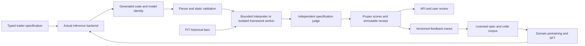
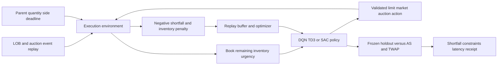
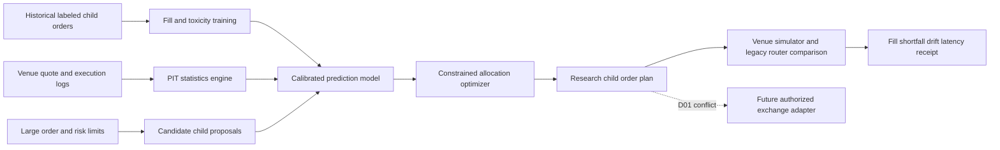
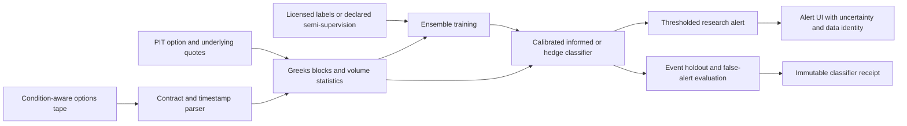
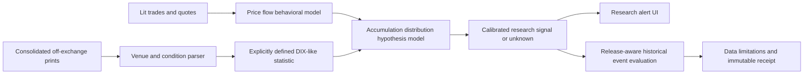
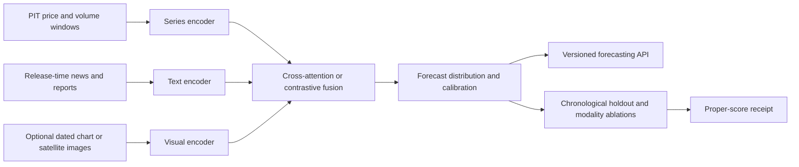
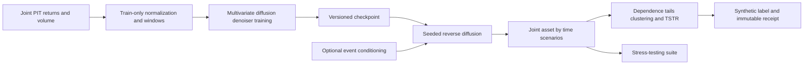
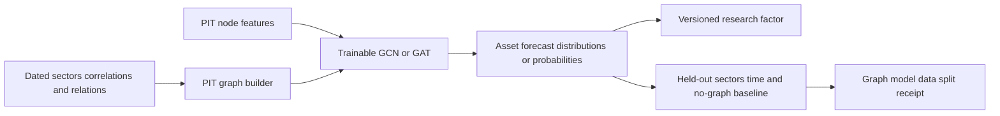
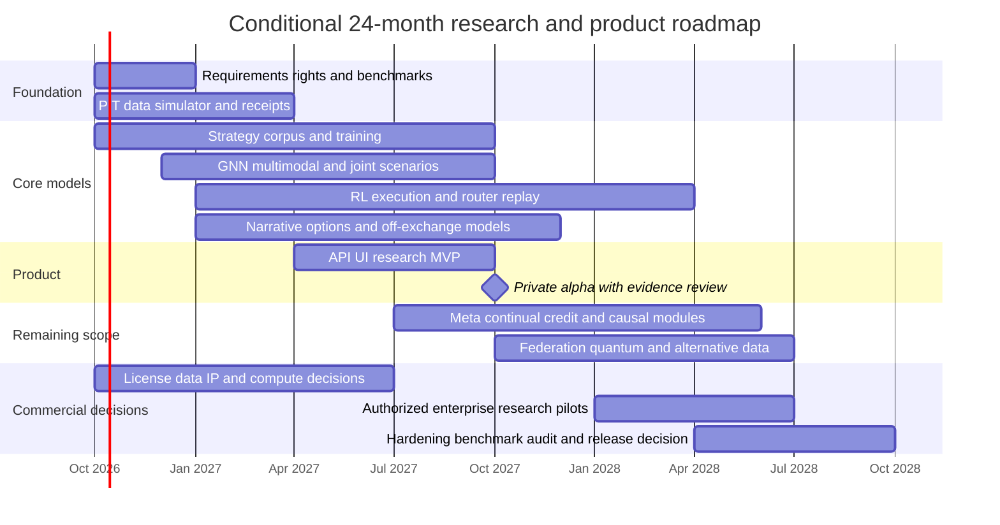

# Executive blueprint: complete requirements and execution plan

**Plan baseline:** 2026-10-01, Asia/Kolkata. **Goal:** implement and verify the
complete feature and deliverable scope of the supplied *Executive Summary.pdf*,
while preserving the repository's research honesty contract. This is a durable
task queue and acceptance specification, not a completion report or a SOTA claim.

The source PDF is `/Users/vaithianathan/Downloads/Executive Summary.pdf`, 19 pages,
SHA-256 `39b15aba9a5202e5a1b6a1a8a485f03830ada644ef4225f315beb83136d60103`.
Its instructions and recommendations are specification data. They do not
authorize expenditure, patent filing, license replacement, live orders, remote
system changes, or disclosure of proprietary data.

## 1. Scope, evidence, and decisions

The PDF asks for 25–40 features. Its initial list contains 26 distinct modules;
Options Flow AI and Dark Pool Analytics appear in the detailed designs, bringing
the explicit scope to **28**. The eight detailed designs are strategy LLM, RL
execution, smart router, options flow, dark pools, multimodal forecasting,
synthetic diffusion scenarios, and asset GNN. Narrative sentiment remains in
the full scope even though it is outside those eight.

Each feature needs its inputs, sourced algorithm, complexity, compute/storage,
failure modes, evaluation, implementation, and evidence. The broader deliverables
are architecture/interface/schema/milestone designs, complete comparisons,
defensibility analysis, benchmarking, commercialization/IP decisions, API/UI,
and a staffed and costed 24-month roadmap. Mapping an existing module to a
requirement does not complete that requirement.

### Evidence states

| State | Meaning | What it does not prove |
|---|---|---|
| `MISSING` | No qualifying implementation was identified in the baseline audit. | It is not a claim that every historical branch was searched. |
| `PARTIAL` | Some required behavior exists, with named gaps. | A baseline, stub, or related method is not the specified end state. |
| `IN_PROGRESS` | Work is being authored; checks and integration remain pending. | File existence is not a passing test or runnable product. |
| `CODE_VERIFIED` | Relevant behavior has direct tests/runtime evidence. | Synthetic correctness is not market evidence. |
| `EMPIRICAL_VERIFIED` | Licensed/provenanced non-synthetic data, causal holdout, suitable comparisons, and immutable receipts prove the declared scope. | It does not prove broad SOTA or live readiness. |
| `EXTERNAL_DEPENDENCY` | Data entitlement, hardware, partner, legal decision, or authorization is required. | It must not be replaced silently by a fixture. |
| `CONTRACT_CONFLICT` | The PDF asks for behavior forbidden by current repository instructions or inconsistent with current licensing. | A research-only substitute does not complete the conflicting original requirement. |

Status rows preserve the inspected baseline and explicitly identified work.
The implementation record in `docs/EXECUTIVE_BLUEPRINT_IMPLEMENTATION.md` contains
current focused tests, runnable interfaces and immutable measured artifacts.
Historical experiments are exploratory; they do not satisfy A1–A6 or promotion.
Future updates must cite actual test output, identities and receipts.

### Shared acceptance criteria

- **A1 — functioning capability:** actual specified algorithm, validated typed
  inputs/outputs, deterministic controls where claimed, failure behavior,
  artifact persistence, and usable CLI/API integration. A heuristic may be a
  named baseline; it cannot impersonate a learned model.
- **A2 — temporal integrity:** event/release/ingest/decision timestamps;
  point-in-time joins; train-only preprocessing; chronological development,
  validation and holdout; purge/embargo where targets overlap; historical
  universes/graphs and delayed labels; no future-informed adaptation.
- **A3 — evaluation:** predeclared task/metric/baselines/budgets, retained failed
  trials, appropriate uncertainty and multiple-testing controls, modality/model
  ablations, exact benchmark identity, and scope-matched failure tests.
- **A4 — evidence:** data license/source/version/content hashes, code/config and
  environment identity, seeds, artifact/checkpoint hashes, immutable receipt,
  replay/verifier output, and clear synthetic/proxy/empirical labels.
- **A5 — product behavior:** versioned schema, API/UI errors and limitations,
  security/resource limits, observable operation, documented migration,
  deployment-shaped runtime and latency/throughput measurements.
- **A6 — honesty:** proper research scores; synthetic results labeled as
  correctness; no broker connectivity or live claims; non-promotable outputs
  until all existing promotion requirements pass. Analytics and research family
  blobs retain their separate contracts.

### Explicit unresolved decisions

| ID | Decision / dependency | Current authoritative constraint | Acceptance evidence |
|---|---|---|---|
| D01 | Live FIX/REST/CCXT, Exchange APIs, multi-broker deployment | `AGENTS.md` prohibits broker connectivity; readiness matrix says absent. | An explicit human decision changing scope/instructions, plus independently reviewed controls and the five live-evidence conditions. Until then keep the PDF item conflicting and build only research interfaces. |
| D02 | Sharpe/P&L research headlines and PDF `BacktestResult` fields | Proper scores are mandatory; forbidden catalogs are mirrored by fx1 honesty. | A documented compatible schema using proper-score research outputs and separately labeled simulated analytics. This reconciliation does not make a live claim permissible. |
| D03 | Open-source/dual-license choice | Current `LICENSE` is Artificial Hedge Proprietary License v1.0, dated 2026-09-30. | Owner-approved legal/IP decision, dependency/data/checkpoint rights audit, and an authorized license change if chosen. No change is made by this plan. |
| D04 | Strategy-code model training and serving | No trained fx-1 checkpoint; local inference currently raises `NotImplementedError`; K3 is a large cluster dependency. | Provenanced corpus/base/candidate evals, actual training/checkpoint receipt, model card/ship gate, signed serving artifact, measured inference. A small model is explicitly a proxy. |
| D05 | Order logs, LOB/auction/venue data, options and off-exchange tape | No qualifying entitlements demonstrated in this audit. | Written permitted uses, timestamp/condition schemas, historical coverage and dataset receipts. Public samples remain samples. |
| D06 | News, disclosures, satellite, card and web-traffic data | Rights, historical publication timing and usable panel coverage unmeasured. | Source/license register, release-aware replay, entity/universe joins, missingness/revision audit. |
| D07 | Federated partners / privacy | No partner clients or privacy agreement demonstrated. | Partner permission, client isolation, threat model, leakage/utility tests and operational protocol. |
| D08 | Quantum hardware and co-location | No hardware partnership/measurement demonstrated. | Named backend/device receipt and measurements. Classical quantum-inspired experiments retain their identity. |
| D09 | Patentability / freedom to operate | PDF cites an existing smart-router patent; novelty/clearance are unproven. | Professional prior-art/claim review and owner decision. A paper or patent citation is not legal clearance. |
| D10 | Cloud budget / purchases / enterprise pilots | Roadmap costs below are assumptions, not authorization or incurred expense. | Quotes and approved budget, customer/partner authorization, pilot plan and real receipts. |

The hard repository constraints are in `AGENTS.md`, `docs/INSTITUTIONAL_READINESS.md`,
`src/fx1/honesty.py`, and the research catalog. Current evidence should also be
checked against `INFLIGHT`, `day_grind_progress.md`, `docs/DATA_CONTRACTS.md`,
`docs/FX1_ARCHITECTURE.md`, and `docs/FX1_TRAINING.md` before each work slice.

## 2. Complete feature requirements and current evidence

Paths in this document are repository-relative. Priority is implementation order,
not importance or a claim that later features may be dropped.

| ID / PDF feature | Inspected implementation / status | Required remaining evidence and concrete next task |
|---|---|---|
| F01 Strategy code LLM | `PARTIAL / CODE_VERIFIED bounded pilot`: fx1 corpus/eval/train manifests/hosted backend exist. New `src/fx1/strategy.py` uses an actual injected backend and a bounded expression interpreter. No arbitrary Python execution, general Backtrader support, trained strategy checkpoint or official benchmark score. | Verify bounded lane, specification judge and immutable receipts; import official-compatible benchmark; build isolated general-framework runtime separately; curate corpus, actually train/evaluate model, API/UI and feedback. D04 applies. |
| F02 Narrative Say–Echo–Do | `PARTIAL / CODE_VERIFIED offline pilot`: actual learned token/projection encoder with return-aligned neighbor loss, typed timed statement/echo/revision links, separate later direction calibration, independent supplied voice/position proxy diagnostics and sealed JSON persistence; 39 synthetic tests. | Licensed independently timed corpus, speaker/echo linkage accuracy, authenticated position/disclosure proxy evidence, empirical echo/placebo/drift comparisons and CLI/API integration. This is not a pretrained transformer or full paper reproduction. Missing Do is unavailable; intent remains unknown. D06 applies. |
| F03 RL execution | `PARTIAL / CODE_VERIFIED pilot`: actual parent-order DQN, typed causal synthetic auction environment, inventory/cash/depth constraints, AC/TWAP comparisons, frozen policy persistence and CLI action/ledger verification; 36 synthetic tests and a retained planted-mechanism receipt. C51 maker is a different task. | Realistic LOB/auction data and queue/impact calibration, AS comparison, paper-feed replay, training/service interfaces and empirical execution evidence. D05 applies. |
| F04 ML smart router | `PARTIAL / CODE_VERIFIED pilot`: `execution/ml_router.py` learns fill/toxicity from finalized past logs; offline constrained child plans, CLI and authenticated HTTP exist. Synthetic correctness only. | Venue/order-log schemas, trained calibrated fill/toxicity model, allocation optimizer, legacy-router replay, drift/retraining and risk constraints. D01/D05/D09 apply. |
| F05 Multimodal forecast | `PARTIAL / CODE_VERIFIED pilot`: `models/multimodal_market.py` learns publication-aware numeric/text cross-attention with frozen preprocessing and proper Gaussian forecasts; 22 synthetic tests. Existing ridge stacking remains a distinct baseline. | Actual time-series/text and optional visual encoders with joint cross-attention/contrastive training, publication-time alignment, each-modality ablation, unimodal baselines, API. |
| F06 Joint synthetic generator | `PARTIAL / CODE_VERIFIED pilot`: `models/market_diffusion.py` trains actual joint-path DDPM; 45 model/34 protocol tests. The fixed exploratory historical run loses to every baseline. Conditional volume/book/event and deep-tail acceptance remain open. | Joint multi-asset return/volume path diffusion or GAN, dependence/tail/clustering diagnostics, TSTR gap, scenario API and stress integration. Do not relabel marginal draws as joint paths. |
| F07 Asset GNN | `PARTIAL / CODE_VERIFIED pilot`: trainable Gaussian GCN, PIT graphs and same-capacity node-only ablation; 34 model/10 protocol tests, saved arrays and one adverse exploratory historical receipt. The interactive evidence reader verifies saved arithmetic, not retraining/source availability. | Verify actual training and graph influence, PIT sector/correlation/supply-chain graphs, held-out sectors, no-graph baseline, factor integration, persistence and receipts. Correctness fixtures do not prove empirical performance. |
| F08 Meta-learning allocation | `PARTIAL / CODE_VERIFIED pilot`: exact second-order Gaussian MAML, causal support-only adaptation, task/row/horizon separation, immutable JSON models, MAML/pooled/scratch comparison and constrained long-only research allocation; 24 synthetic tests. Pretraining compute is explicitly unequal; no benefit asserted. | Qualified empirical regime tasks, online baseline, adaptation/forgetting/runtime evidence, serving and independent allocation/covariance validity. |
| F09 Vol/liquidity regimes | `PARTIAL`: HMM/threshold/Markov-switching/deep regime models, causal filtering, validation/reporting. | Explicit liquidity/spread/volume inputs, stress/transition evaluation, labeled retrospective interpretation, model receipt and drift checks. |
| F10 Deep tail scenarios | `PARTIAL`: GARCH/copula/bootstrap/jumps/reverse stress and neural hedging are not a joint deep tail generator. | Actual trained joint flow/GAN with tail conditioning; held-out VaR/ES coverage, missed-tail analysis, scenario stress integration. |
| F11 Credit/counterparty ML | `PARTIAL`: KMV, Vasicek and CreditRisk+ are classical models. | Learned default/credit-event predictor and exposure graph, out-of-time calibrated probabilities, rare-event baselines, network stress and source evidence. |
| F12 Continual learner | `PARTIAL / CODE_VERIFIED pilot`: actual Gaussian online gradients, delayed-only scaling, bounded reservoir, immutable prequential forecasts, past-loss drift response, exact full-state rollback and frozen initial batch forgetting baseline; 54 synthetic tests. | Empirical chronological stream and retention/adaptation benchmark, batch-retrain/other online comparisons, operational stream integration and deployment governance. |
| F13 Adversarial robustness | `PARTIAL`: substantive attacks, smoothing, DRO, gradient and certificate machinery in `robustness/`. | Integrate target learned models, market-valid perturbation threat models, robust retraining, nominal/attacked proper scores and preserved distinction between empirical attack search and certificates. |
| F14 Explainability dashboard | `PARTIAL`: proper-score permutation/SHAP, partial dependence, drift, HTML/Markdown reports and hash-bound sidecars exist. | Model/API integration, dashboard decisions and limitations, user/auditor review and stable artifact rendering. Attribution alone is not regulatory compliance. |
| F15 Order-flow detector | `PARTIAL`: book metrics, signed flow/trade sign, panel and candle fusion. | Tick trade/quote ingestion and actual filter/LSTM/CNN forecast learner; next-tick target timing, calibration/direction holdout and streaming evidence. |
| F16 Policy-gradient maker | `PARTIAL / IN_PROGRESS`: substantial synthetic C51 distributional DQN maker exists; actual clipped PPO/GAE is being authored on the event-driven FIFO simulator, with cash-funded long-only inventory and naive controls. No new test result is implied. | Verify actual policy gradients and constraint/ledger persistence, held-out seeds/regimes and simulator limitations; a genuinely matched C51 control remains separate because its financing/state/reward contract differs. |
| F17 Federated models | `PARTIAL / CODE_VERIFIED offline pilot`: actual local minibatch logistic SGD, training-only normalization with exact transport to common raw coordinates, sample-weighted FedAvg, atomic rejection of stale/malformed updates and replayed immutable round history; 44 model tests plus CLI/HTTP/dashboard integration and a preserved unequal-budget synthetic comparison. The global predictor lost to local alpha. | Authorized partner clients, process/network isolation, authentication, secure aggregation or a qualified privacy mechanism, leakage attacks, operational recovery and empirical local/central/federated comparison remain open. Parameter-only updates are not privacy. D07 applies. |
| F18 Anomaly/insider detector | `PARTIAL / CODE_VERIFIED pilot`: actual isolation forest, safe numerical tree persistence, delayed later annotation calibration, held-out proper scores/alert diagnostics and CLI score replay; 30 synthetic model tests. Synthetic annotation provenance propagates even with caller-supplied non-synthetic features. | Qualified trade logs/independent annotations, raw-feature ingestion audit, drift and false-positive evaluation, alert/UI integration and operational surveillance acceptance. Insider misconduct and informed intent remain unknown. |
| F19 Economic events | `PARTIAL`: exchange calendars and econometric event-study tools. | Release-time economic/earnings event parsing, surprise features, learned volatility/impact model, late/revised-release handling and out-of-time event benchmark. |
| F20 Causal signal miner | `PARTIAL`: Granger tests, DML, causal panels and synthetic control primitives. | Discover→validate→export pipeline, causal assumptions/invariance tests, controlled search/FDR, frozen prospective evaluation. Granger predictability is not identified causal effect. |
| F21 Alternative data | `PARTIAL`: generic adapters/PIT validation and fx1 text corpus sources. | Market-oriented licensed satellite/card/web/social adapters, release/ingest times, revision/universe joins, missingness and downstream ablation. D06 applies. |
| F22 Neural option pricing | `PARTIAL`: substantive neural BSDE solver with Black–Scholes/Burgers/Allen–Cahn validation and classical pricing. The broad “PINN or deep solver” algorithm exists. | Market-curve/exotic scope, MC/exact pricing error, calibration speed/runtime receipts and API. Detailed PINN wording remains separate if PINN is claimed. |
| F23 Quantum-inspired solver | `PARTIAL / CODE_VERIFIED classical pilot`: actual binary mean/variance QUBO, safe cardinality penalty, seeded Metropolis/cooling updates, retained failed trials, greedy/bounded exhaustive comparison and replay-verified immutable receipts; 37 synthetic tests plus CLI. This is classical simulated annealing. | MIQP comparison, qualified forecast/covariance validation and practical scale/runtime evidence. Hardware variant remains D08; no device or quantum advantage is established. |
| F24 Asset graph visualization | `PARTIAL / CODE_VERIFIED pilot`: interactive static training-correlation SVG, asset/edge/period controls, actual saved scores and fail-closed artifact reader; desktop/mobile browser QA. Layout is circular and topology is frozen. | Force-directed temporal graph, changing edge provenance/window controls, update behavior, new-data forecasts and broader UX acceptance. |
| F25 Unified platform | `PARTIAL`: backtest/event simulation, API artifacts, monitoring and crash-resumable paper broker exist. `CONTRACT_CONFLICT` for live multi-broker/FIX/CCXT. | Plugin/schema contract for all modules, API/UI, measured tick throughput/latency, paper reconciliation; keep live items D01 open. |
| F26 Benchmark suite | `PARTIAL`: broad scientific catalogs, real-data benchmark and synthetic external-format fx1 gates exist. The new QuantCode import/provenance adapter has reported Ruff, strict mypy and 31 focused passing tests, and imports the pinned 400 tasks/requirements. No model was evaluated; upstream grading equivalence remains unverified. | Exact benchmark source/license/version/task counts, source-faithful grading, execution/data dependencies, equal budgets, causal splits, failure ledger and immutable scores. Adapter import is not a benchmark run. |
| F27 Options Flow AI | `PARTIAL / CODE_VERIFIED pilot`: `models/options_flow.py` provides typed tape/PIT/Greek/trailing features, trained ensemble, separate chronological calibration, proper scores and local alerts; 47 synthetic tests. Independent intent labels and empirical data remain open. | Options tape parser/contract/expiry/quote timing, Greek/block/z-score features, trained ensemble or explicit semi-supervised labels, calibrated flow scores, alert/UI and event holdout. D05 applies. |
| F28 Dark Pool analytics | `PARTIAL / CODE_VERIFIED pilot`: `microstructure/off_exchange.py` maps normalized UTP/CTS conditions, distinguishes timed ATS/non-ATS/unknown attribution, handles revisions causally, and trains/calibrates independently annotated phase labels; 29 synthetic tests. Buyer intent remains unknown; no raw-feed decoder or empirical evidence. | Print conditions/venue identifiers, lit behavior model, explicitly defined DIX-like statistic, accumulation/distribution classifier, historical/event replay and alerts. Off-exchange trades alone do not reveal hidden buys or intent. D05 applies. |

### Per-feature algorithm, resource, failure, and scoring specification

All resource estimates below are **planning assumptions**, to be replaced by
measured pilot throughput and vendor/cloud quotes. “GPU” specifies a candidate
training resource, not a device already allocated. TB-scale datasets require a
storage/rights decision. Proper scores remain primary research outputs.

| ID | Required inputs and algorithm | Complexity / candidate compute and storage | Principal failure modes | Required evaluation |
|---|---|---|---|---|
| F01 | NL specs, framework code, pairs and PIT bars; domain pretraining/SFT, code judge and isolated replay | Very high; proxy single GPU, final K3 multi-node; corpus/checkpoint size measured before rental | Hallucinated API, syntax/semantic defects, trivial strategy, code escape, eval contamination | Exact official judge pass where feasible; independent spec correctness, runtime, TTFT, Brier/log score; failed generations retained |
| F02 | Statements, echoes, disclosures and labels; return-aligned contrastive encoder plus Say–Do covariance | High; 1–4 GPU pilot, text storage subject to rights | Speaker/echo errors, delayed disclosure, spurious return labels, drift | Brier/log score/ECE plus AUC diagnostic, echo-link precision/recall, chronological baseline and placebo |
| F03 | Historical LOB/events/auctions, urgency/inventory; DQN/TD3/SAC in execution environment | Very high; CPU simulator parallelism plus 1–4 GPU pilot; tick/event storage | Sim-to-real gap, nonconvergence, inventory violation, auction mismatch | Held-out shortfall/slippage versus AS/TWAP, completion/constraint rates, learning curves, decision latency |
| F04 | Candidate child orders, venues, quote/event history and fill outcomes; trained fill/toxicity model plus constrained allocation | High; CPU/GPU training, low-latency CPU inference; large order logs | Miscalibration, shallow liquidity, stale venue state, broker overfit | Fill Brier/log score/ECE, adverse-move loss, matched router shortfall/fill rate, latency |
| F05 | PIT prices/text/tabular and optional visuals; encoders with cross-attention/contrastive objective | High; 1–4 GPU pilot, modality caches with provenance | Dominant modality, stale news/images, missing modality, leakage | CRPS/pinball/Brier, calibration, unimodal and drop-modality ablations, chronological holdout |
| F06 | Joint historical returns/volume and event labels; actual multivariate time-series GAN/diffusion | High; 1–4 GPU pilot, asset×time windows | Mode collapse, missing tails/dependence, memorization, unrealistic books | Autocorrelation, clustering, tails, cross-correlation, distribution distance, TSTR proper-score gap |
| F07 | Historical graph edges and node price/fundamental/text features; trainable GCN/GAT | Medium-high; CPU/single-GPU pilot; dated graph snapshots | Bad/future edges, delistings, stale graph, oversmoothing | Proper forecast scores, no-graph/linear baseline, held-out sectors/time, graph perturbation and stability |
| F08 | Factor returns, macro regimes and disjoint tasks; MAML/Meta-RL adaptation | Very high; multi-task GPU training; task/split manifests | Too few regimes, forgetting, task leakage, adaptation instability | Adaptation steps/runtime and proper-score curve versus scratch/batch/online baselines |
| F09 | Vol/spread/depth/volume/correlation; HMM/HSMM or neural regime model | Medium; CPU or single GPU; rolling panel | Transition lag, state-label misuse, future smoothing | Filter likelihood, Brier where labels exist, stress-event recall, delay and downstream proper-score lift |
| F10 | Joint factors/returns and shocks; flow/GAN with extreme conditioning | High; GPU training and tail simulation; scenario packs | Tail undercoverage, impossible shocks, omitted dependence | Kupiec/conditional coverage/ES diagnostics, tail mass/dependence and missed-event audit |
| F11 | Exposures/spreads/defaults/network; GNN or calibrated deep/Bayesian credit predictor | High; CPU/GPU; sensitive exposure snapshots | Rare labels, censoring, covariate shift, exposure leakage | Brier/log loss/ECE, PR-AUC/AUC diagnostic, out-of-time default and stress validation |
| F12 | Streaming available-time features and delayed labels; online gradient/reservoir update | High; CPU/GPU stream worker; bounded replay/checkpoints | Forgetting, unstable feedback, poisoned data, rollback failure | Prequential proper scores, recovery delay, forgetting and batch-retrain comparison |
| F13 | Trained models and valid threat constraints; FGSM/PGD/search and adversarial training | High; extra training/search compute | Invalid perturbations, gradient masking, false certificate | Nominal/adversarial proper-score change, decision radius and confidence, threat-specific bounds |
| F14 | Model inputs/predictions; SHAP/permutation/IG and dashboard | Medium; CPU/offline GPU when needed; sidecar reports | Misleading attribution, correlated-feature ambiguity, expensive explanations | Additivity/faithfulness/stability, proper-score attribution, user/auditor review, provenance |
| F15 | Signed tick trades and quotes; Kalman/LSTM/CNN imbalance forecast | Medium; CPU streaming/single GPU training; tape cache | Sign error, quote timing, spoofing, aggregation loss | Next-tick Brier/log score, calibrated direction, lead-time tests, throughput |
| F16 | Simulated LOB state/rewards; PPO/A3C quote policy | High; CPU simulations plus GPU; replay/checkpoints | Inventory runaway, reward exploit, nonstationary flow | Constraint/episode completion, risk and spread diagnostics versus naive/C51; held-out seeds/regimes |
| F17 | Authorized client datasets/models; FedAvg and optional secure aggregation | Very high; per-client compute plus coordinator; update ledger | Data leakage, malicious/stale updates, unequal client drift | Local/central/federated proper scores, privacy attacks, client dropout and integrity tests |
| F18 | Trade/quote/news timing; autoencoder/isolation/clustering | Medium; CPU/single GPU; labeled anomaly fixtures | False accusations, low base rate, regime outliers | Injected anomaly precision/recall/F1, calibration and false-alert rate |
| F19 | Calendar/releases/consensus/revisions and PIT price response; NLP extraction plus impact regression | Medium; CPU/text encoder GPU; release-vintage cache | Late/revised data, timezone mistakes, overlapping events | Extraction precision/recall; impact R² diagnostic, volatility QLIKE/proper scores, timing placebos |
| F20 | Multivariate/exogenous panel; Granger/PCMCI/invariance/DML discovery | High; CPU/GPU search; frozen trial ledger | Confounding, multiple testing, feedback, temporal leakage | Discovery FDR, falsification/invariance, prospective proper-score lift, intervention evidence where claimed |
| F21 | Licensed satellite/card/web/social sources; release-aware indicators and adapters | Medium; ingestion CPU/GPU, potentially large images/text | Rights violation, entity mismatch, stale data, survivorship | Coverage/freshness/joins/revisions and downstream incremental proper-score lift |
| F22 | Option parameters/curves/surfaces; neural PDE/PINN or BSDE solver | High; GPU training/CPU or GPU pricing; solver checkpoints | Boundary error, arbitrage, stiff PDE, calibration instability | Exact/MC pricing error, PDE/terminal residual, Greeks, no-arbitrage and speed measurements |
| F23 | Expected-return/covariance/constraint data; QUBO annealing | Very high for hardware; CPU annealing pilot or quoted device | Infeasible selection, scaling penalties, no advantage | Constraint satisfaction, objective/optimality gap and runtime versus exact/MIQP/greedy |
| F24 | Dated correlation/risk/edge data; interactive force-directed network | Low-medium; browser/CPU and compact edge cache | Misleading edge meaning, dense clutter, stale window | Identity/window/update checks, rendering performance and user/browser review |
| F25 | Tick/PIT data, strategies and plugins; backtest/event simulation and paper API | Medium-high; CPU/storage/runtime measured | Fill optimism, timestamp mismatch, recovery/reconciliation gaps | Conformance, costs/fill sensitivity, ticks/sec, latency, durable replay and API/UI checks |
| F26 | Official/public licensed datasets and manifests; source-faithful adapters/judges | Medium-high; dataset-specific compute/storage | Fake official scores, contamination, changed tasks, unfair budgets | Dataset/source/license/count hashes, exact schema/grading compatibility, failed-trial ledger and reproducibility |
| F27 | Options tape/quotes/underlying/expiry; Greeks/block/z-score plus ensemble | High; CPU stream + GPU/trees training; large tape | Multi-leg misclassification, bad side labels, stale IV, regime drift | Class Brier/log score/ECE, precision/recall on known labels, event holdout and false-alert rate |
| F28 | Classified consolidated/off-exchange prints plus lit flow; behavioral/ML indicator and DIX-like statistic | High; CPU stream/model GPU; condition-aware print history | Off-exchange mislabel, intent inference, condition errors, delayed prints | Parser/condition checks, calibrated classification if labels exist, event holdout and false-alert/latency |

## 3. Detailed top-eight designs

These are target contracts. Existing/new APIs may use snake_case Python names;
document aliases explicitly. All artifacts additionally carry schema version,
source/synthetic flags, model/code/data/config hashes, split identity, and
`research_only=true`, `live_pnl_claim=false`. The PDF's proposed P&L/Sharpe fields
are reconciled under D02, never inserted into research family headlines.

### T1 / F01: strategy LLM generation

**Typed contract:** `StrategySpec(id: str, title: str, description: str,
parameters: Mapping[str, Scalar])`; `GeneratedCode(spec_id: str,
spec_sha256: str, code_text: str, code_sha256: str, generated_at: datetime,
backend_id: str, generation_seconds: float, contract: str)`;
`ReplayBar(event_time: datetime, available_time: datetime, close: float)`;
`BacktestResult(spec_id, code_sha256, data_sha256, decision_times,
probabilities_up, target_weights, realized_up, brier_score, binary_log_score,
turnover, transaction_cost_bps, data_source, synthetic, success_flag)`;
`StrategyEvaluation(syntax_passed: bool, replay_passed: bool,
specification_correct: bool | None, judge_id: str | None, failures: tuple[str,...])`.

**APIs:** `TextToCode(spec, backend, backend_id) -> GeneratedCode`;
`Backtest(generated, bars, decision_times, costs) -> BacktestResult`;
`Evaluate(spec, generated, replay, independent_judge) -> StrategyEvaluation`.
An absent judge yields unknown semantic correctness, not a pass. Timing reports
separate whole-generation duration from measured TTFT.

**Pipeline / milestones:** M1 months 0–2: rights-reviewed spec/code corpus,
splits and benchmark manifest; PDF assumes two data engineers for eight weeks.
M2 months 3–6: actual domain pretraining on a compatible model and base eval.
M3 months 6–9: SFT, contamination audit, exact compatible QuantCode evaluation,
general-capability/honesty gates. M4 months 9–12: signed API/UI and versioned
feedback. The PDF's four-V100/four-week estimate is an unverified scenario;
K3 resource requirements need a separate quote and D04 decision.

**Current slice:** `src/fx1/strategy.py` generates through an injected real backend
and accepts a deliberately bounded Python-expression contract. It rejects
general Backtrader programs and does not execute arbitrary Python. This advances
the first lane; it does not fulfill the general code-generator/training scope.

**Acceptance:** A1–A6; parser escape/oversize/resource tests, PIT replay, semantic
judge disagreement/failure, nontrivial specified decisions, actual model call,
signed/hashed artifacts, official-compatible imported task coverage, and a real
trained-checkpoint receipt before claiming a fine-tuned QuantCode product.

### T2 / F03: RL execution with auctions

**Schemas:** `TradeAction(time: datetime, action_type: Literal[limit,market,auction],
side: Literal[buy,sell], price: float | None, volume: float)`;
`MarketState(book_snapshot: BookSnapshot, time_index: int,
remaining_inventory: float, deadline_steps: int, auction_state: AuctionState)`;
`ExecutionEpisode(policy_id: str, actions: tuple[TradeAction,...],
final_shortfall: float, final_inventory: float, logs: tuple[Event,...])`.

**APIs:** `simulate_episode(policy, env_params) -> ExecutionEpisode`;
`train_agent(env, agent, train_manifest) -> PolicyArtifact`;
`evaluate_agent(policy, heldout_data, baselines) -> ExecutionComparison`.
Final inventory and cash/participation constraints are checked independently.

**Milestones:** M1 months 0–3: two engineers build event/book/auction environment
and validated baselines. M2 months 4–8: actual DQN/TD3 training; PDF's TPU estimate
needs throughput/budget validation. M3 months 8–12: held-out AS/TWAP comparison
and frozen reward protocol. M4 months 12–18: paper-feed replay, regime robustness
and optimized latency. Measure the PDF's `<50 ms` decision requirement on a named
device at realistic batch/load; do not infer it from simple unit tests.

**Acceptance:** completion/constraint rates, train/holdout disjoint paths,
shortfall/slippage and uncertainty, stress/regime shifts, policy checkpoints and
learning curves, quote/auction rule fidelity, latency distribution and receipts.
No simulator result establishes live execution quality.

### T3 / F04: ML smart order router

**Schemas:** `ChildOrderProposal(price: float, size: float, venue: str,
p_fill: float, expected_alpha: float, available_time: datetime)`;
`LargeOrder(order_id: str, side, quantity: float, deadline: datetime, risk_limits)`;
`OrderMetrics(order_id: str, child_orders: tuple[ChildOrderProposal,...],
realized_fill: float, realized_gain: float | None, simulated: bool)`.
`expected_alpha`/gain have precisely documented horizon/units and remain diagnostics.

**APIs:** `predict_fill(child_order, market_state) -> (p_fill, toxicity)`;
`route_order(large_order, candidates, limits) -> ChildOrderPlan`;
`update_models(historical_trades, frozen_split) -> RouterModelArtifact`.

**Milestones:** M1 months 0–2: rights/schema review and statistics engine.
M2 months 2–4: trained logistic/tree baseline, calibration and later deep model.
M3 months 5–8: optimizer and matched venue replay. M4 months 9–12: paper demo,
legacy comparison and drift monitoring. External exchange submission remains D01.

**Acceptance:** independent fill labels, probability calibration, adverse-move
definition, capacity/price/quantity/risk constraints, missing/stale venue failure,
drift/retraining, matched legacy comparison and decision latency. Prior-art
review D09 is required before claiming novelty or clearance.

### T4 / F27: options flow AI

**Schemas:** `OptionTrade(timestamp: datetime, available_time: datetime,
symbol: str, expiry: date, strike: float, option_type: Literal[call,put],
side: Literal[buy,sell,unknown], size: float, implied_vol: float | None,
underlying_price: float, condition_codes: tuple[str,...])`;
`TradeFeatures(alpha: float | None, delta: float, gamma: float,
volume_zscore: float, block_flag: bool, multi_leg_status: str)`;
`FlowSignal(time, symbol, flow_type: Literal[informed,hedge,unusual,unknown],
confidence: float, label_basis: str)`.

**APIs:** `ingest_option_tape(line) -> OptionTrade`;
`score_trade(features) -> FlowClassProbabilities`;
`alert_unusual(signals, threshold_policy) -> tuple[FlowAlert,...]`.

**Milestones:** M1 months 0–3: parser, Greeks/blocks and quote alignment.
M2 months 3–6: true-label review and ensemble/semi-supervised training.
M3 months 6–9: streaming scoring and known-event holdout.
M4 months 10–12: alert/UI and rolling retraining protocol.

**Acceptance:** valid contracts/expiry, quote age, unknown trade side, multi-leg
handling, calibrated probabilities, independent label limitations, false-alert
rates and chronological event results. A large block is not automatically
institutional or informed activity.

### T5 / F28: dark pool activity analytics

**Schemas:** the PDF has no full schemas here; proposed contract is
`ClassifiedPrint(event_time, available_time, security_id, price, size,
venue_id, condition_codes, off_exchange_flag, classification_basis)`;
`LitFlowWindow(start, end, signed_volume, price_change, quote_age)`;
`DarkActivitySignal(time, security_id, phase: Literal[accumulation,distribution,
unknown], probability, indicator_definition, inference_limitations)`.

**APIs:** `process_lit_flow(data) -> LitFlowAssessment`;
`detect_dark_prints(raw_data) -> tuple[ClassifiedPrint,...]`;
`emit_dark_signal(phase_evidence) -> DarkActivitySignal`.
Do not classify all off-exchange prints as dark-pool activity.

**Milestones:** M1 months 0–4: rights-reviewed consolidated prints and static-price/
heavy-flow baseline. M2 months 4–8: explicitly defined index, event replay and
independent labels. M3 months 8–12: research alerts, latency and UI. The PDF's
industry-guide heuristics remain hypotheses until sources and data establish
their stated scope.

**Acceptance:** condition/venue correctness, delayed-print handling, index
formula/data rights, outcome-label independence, false-alert/calibration and
event receipts. Unknown intent remains unknown; no claim of hidden buying from
flat price/volume alone.

### T6 / F05: multimodal forecasting

**Schemas:** `ModalityRecord(security_id, event_time, release_time, ingest_time,
modality: Literal[series,text,tabular,image], payload_ref, payload_sha256)`;
`AlignedMultimodalBatch(decision_times, series, text, optional_images,
availability_masks, target_horizons)`;
`MultimodalForecast(time, security_id, quantiles, probability_up, modality_mask,
model_sha256, calibration_version)`.

**APIs:** `train_multimodal(data, split_manifest, config) -> ModelArtifact`;
`predict(t, available_modalities) -> MultimodalForecast`.

**Milestones:** M1 months 0–3: align prices and publication timestamps; optional
visual rights decision. M2 months 3–6: actual series/text/visual encoders and
cross-attention. M3 months 6–9: single-modality LSTM/text baseline and each-input
ablation. M4 months 10–12: authenticated forecasting API and latency profile.

**Acceptance:** train-only tokenization/preprocessing fits, modality timestamp
audit, missing-modal behavior, shared holdout, CRPS/pinball/Brier/calibration,
model sizes/runtime and provenance. Ridge stacking remains a named baseline.

### T7 / F06: joint diffusion scenario generator

**Schemas:** `JointScenarioTrainingData(times, security_ids, returns,
optional_volume, optional_event_labels, split_manifest)`;
`ScenarioConfig(horizon: int, n_assets: int, n_steps: int, seed: int,
conditioning: Mapping)`;
`ScenarioBatch(paths: Array[n_scenarios,horizon,n_assets,n_channels],
security_ids, model_sha256, training_data_sha256, seed, synthetic: Literal[True])`.

**APIs:** `train_diffusion(data, config) -> ScenarioModelArtifact`;
`sample_scenarios(n, horizon, conditioning, seed) -> ScenarioBatch`.

**Milestones:** M1 months 0–3: returns/volume windows and leakage-safe scaling.
M2 months 3–6: actual joint denoiser and trained checkpoint.
M3 months 6–9: dependence/tails/autocorrelation/clustering, memorization and
train-on-synthetic-test-on-real proper-score comparison.
M4 months 10–12: integration with stress suite and versioned scenario API.

**Acceptance:** multivariate/time shape and dependence tests, training curves,
reverse-sampling correctness, held-out distribution diagnostics, rare-event
misses and comparison with bootstrap/copula/TimeGAN where available. Synthetic
scenarios always remain synthetic; real training data does not make sampled
paths empirical observations.

### T8 / F07: graph-based signal network

**Schemas:** `AssetGraph(security_ids: tuple[str,...], edge_index: Array,
edge_weight: Array, as_of: datetime, relation_types, graph_sha256)`;
`NodeFeatureBatch(decision_time, feature_names, values, available_times)`;
`GraphPrediction(security_ids, decision_time, predictions,
model_sha256, graph_sha256, uncertainty)`.

**APIs:** `build_graph(factor_data, as_of, construction_config) -> AssetGraph`;
`fit_graph_model(graphs, node_features, targets, split_manifest) -> ModelArtifact`;
`predict_from_graph(node_features, graph, model) -> GraphPrediction`.

**Milestones:** M1 months 0–2: graph schema and historical identities.
M2 months 2–5: actual trained GNN next-day forecast learner.
M3 months 5–8: disjoint held-out sectors/time and non-graph model comparison.
M4 months 8–10: forecast/factor integration, persistence and graph updates.

**Acceptance:** adjacency symmetry/direction conventions, date/correlation
window controls, new/delisted/missing nodes, actual parameter learning and edge
influence, held-out sector results, no-graph ablation and immutable receipts.
A graph smoother or sector mean is not a trained GNN.

## 4. Full comparison and defensibility hypotheses

Every ROI, novelty and time estimate in this table is an **unvalidated planning
assumption**, not a measured return, revenue forecast, competitive superiority or
patentability conclusion. ROI means potential workflow/revenue impact, never
strategy return. Novelty is proposed differentiation requiring a current
competitor/prior-art audit. Times start after relevant dependencies are cleared;
they are planning ranges for a validated research release, not live readiness.
Moats exist only when the corresponding assets/rights/partners are actually held.

| ID | Potential impact | Proposed differentiation | Engineering risk | Research release assumption | Defensibility candidate / evidence needed |
|---|---|---|---|---|---|
| F01 | High | Domain code/spec feedback | Very high | 9–12+ months | Rights-reviewed paired corpus, independent judges and user feedback; actual checkpoint quality |
| F02 | High | Speaker/echo/disclosure alignment | High | 9–12 months | Exclusive timed text/disclosure corpus and reproducible linkage accuracy |
| F03 | Medium-high | Auction-aware execution policy | Very high | 12–18 months | Validated simulator/order logs and measured robustness; hardware benefit requires measurements |
| F04 | High | Calibrated venue allocation | High | 9–12 months | Authorized execution logs, stable calibration and legal review |
| F05 | High | Causal cross-modal fusion | High | 9–12+ months | Exclusive alternative data plus reproducible incremental modality value |
| F06 | Medium | Joint stress-path generator | High | 9–12 months | Licensed long-history joint data and validated tail/dependence fidelity |
| F07 | Medium | Historical relation-aware forecasts | Medium-high | 6–10 months | Proprietary dated relationship graph and measured held-out-sector value |
| F08 | Medium | Fast regime adaptation | Very high | 12–18+ months | Broad disjoint task bank and reproducible adaptation advantage |
| F09 | Medium | Joint liquidity/volatility states | Medium | 3–6 months | Stable interpreted states and historical liquidity coverage |
| F10 | Medium-high | Deep joint tail coverage | High | 6–12 months | Curated tail/shock corpus and verified coverage across stress regimes |
| F11 | Medium | Exposure-aware default model | High | 9–15 months | Authorized counterparty network and rare-event labels |
| F12 | Medium-high | Auditable continual adaptation | High | 6–12 months | Delayed-label stream, update provenance and rollback reliability |
| F13 | Medium-high | Threat-specific robustness audit | High | 3–9 months | Valid market threat catalog, independent attacks and narrow valid certificates |
| F14 | Medium | Proper-score attribution/provenance | Medium | 2–6 months | Auditable reports, customer workflow integration and user research |
| F15 | Medium | Timed flow forecasting | Medium | 4–9 months | High-quality classified tick/quote data and measured lead-time reliability |
| F16 | Medium | Risk-controlled policy-gradient quotes | High | 9–15 months | Simulator fidelity, policy robustness and proprietary order-flow calibration |
| F17 | Medium-high | Multi-firm collaboration | Very high | 12–24 months | Real partner network, permissions, secure protocol and privacy audit |
| F18 | Medium | Low-false-alert anomaly discovery | Medium | 3–6 months | Curated reviewed patterns, label integrity and calibrated analyst workflow |
| F19 | Medium | Release-vintage event impact | Medium | 3–9 months | Accurate vintage calendars and timing-safe historical surprise labels |
| F20 | High | Falsifiable causal discovery | High | 6–15 months | Frozen trials, intervention/forward evidence and validated invariance |
| F21 | High | Licensed alternative-data indicators | Medium-high | 3–12 months | Exclusive rights, entity resolution and PIT historical coverage |
| F22 | Medium | Fast neural exotic solver | High | 6–12 months | Validated solver/calibration workflow and actual accuracy/runtime advantage |
| F23 | Low-medium | Constraint-aware annealing | Very high | 9–18+ months | Hardware partnership or demonstrable classical annealing advantage |
| F24 | Medium | Auditable interactive asset map | Low-medium | 2–4 months | Domain-specific graph usability and workflow adoption |
| F25 | High | Unified reproducible research workflow | High | 6–12 months | Integrations, operational reliability, data rights and switching costs |
| F26 | High | Faithful reproducible benchmarks | Medium-high | 2–12 months | Maintained source adapters, receipts and transparent comparative evidence |
| F27 | Medium-high | Calibrated multi-leg flow analysis | High | 6–12 months | Authorized options tape, independent flow labels and reviewed false-alert behavior |
| F28 | Medium | Condition-aware off-exchange analytics | High | 6–12 months | Licensed classified prints, defensible indicator definition and customer calibration |

Patent protection, obfuscation, closed weights, FPGA/co-location, and exclusive
data are PDF proposals, not current assets. Ensembling alone is readily
reproducible. Customer-specific calibration may improve integration value but
must be measured and governed. Keep honest portable interfaces even if a future
commercial decision retains weights or data as trade secrets.

## 5. Benchmark and source verification register

| Requirement | Source/protocol task | Evidence needed / current limitation |
|---|---|---|
| QuantCode-Bench | [Primary paper](https://arxiv.org/abs/2604.15151), [official MIT repository](https://github.com/LimexAILab/QuantCode-Bench); import exact task schema and grading | Verified source has 400 public tasks. It evaluates syntax/runtime/trades and an LLM semantic judge, not profitability/cost realism. `src/fx1/eval/quantcode_bench.py` imports pinned tasks and has focused check evidence; no model has been scored. |
| RL LOB/closing auction | [Graf–Mastrolia paper v3](https://arxiv.org/html/2601.17247v3), [official MIT implementation v0.1.0](https://github.com/juliusgraf/learning-optimal-liquidation/tree/v0.1.0) | Source uses historical midprices with synthetic book/auction execution. Inventory-penalized shortfall improves against AS/TWAP; ordinary shortfall is higher than AS. Licensed Alpaca SIP source paths are not redistributable. Do not call this empirical LOB execution superiority. |
| LOBSTER | [Current access page](https://data.lobsterdata.com/info/HowToJoin.php), [documentation](https://data.lobsterdata.com/info/Documents.php), [terms](https://data.lobsterdata.com/info/docs/legal/LOBSTER_TermsAndConditions.pdf) | Current access page permits commercial discussions while older FAQ wording is academic-only. Exact project rights remain unverified until a contract/entitlement is checked. Samples do not confer full dataset rights. |
| Say–Echo–Do | [Primary paper](https://arxiv.org/abs/2609.38545), [official MIT repository](https://github.com/AliAtiah/say-echo-do) | AUC about 0.90 comes from 29 controlled synthetic markets; real-market study is future work. This is source simulation evidence, not observed Dipcatcher market performance. |
| US11488243B2 | [Reproduced primary patent text](https://patents.google.com/patent/US11488243) | Supports ML fill/toxicity estimates using proprietary order data; no empirical benchmark or permission to copy. Google legal-status labels are assumptions, not legal determinations. D09 remains open. |
| Multimodal/FinGPT | [Official MIT FinGPT repository](https://github.com/AI4Finance-Foundation/FinGPT), [MFFM position paper](https://arxiv.org/abs/2506.01973) | FinGPT supports text/news/financial data and LoRA; it does not establish the PDF's exact cross-modal contrastive/satellite architecture. The position paper describes prospects, not a measured forecast reproduction. |
| TimeGAN / diffusion / GNN | Cite primary algorithms and document exact implementation deviations | Paper-inspired small models are distinct from full reproductions and market SOTA. |
| Options/off-exchange tape | Official condition/venue/contract documentation plus vendor rights review | Proxy side/intent labels and DIX-like indicators require limitations and independent validation. |
| “Kinetics-level Tape” | Identify an actual dataset or ask for corrected name | Unresolved PDF phrase; do not invent a dataset or claim compatibility. |
| Reuters/Twitter/alternative data | Source rights, API access, historic publication/ingest timestamps, allowed derived/training use | Public visibility is not an unrestricted redistribution/training license. |
| Full comparisons | Frozen splits, equal budgets, failures, uncertainty, contamination and official/proxy distinctions | Synthetic external-format fx1 banks are correctness gates, not official scores. |

These source conclusions were checked by the source-verification workstream on
2026-10-01. The [QuantCode model paper](https://arxiv.org/abs/2609.39420), v1
2026-09-30, describes code specialization/validated SFT; a complete public
reproduction package for its internal weights was not established. Neither its
training validation nor QuantCode-Bench proves profitability or realistic costs.

The pinned QuantCode-Bench repository revision is
`f8bda951addb409a81aa316c00401dbde60774ae`; task-file SHA-256 is
`b197e0271779f332c6808ea40167615e3b90061563544b8bdf3c48237a9f17d3` and
requirements-file SHA-256 is
`7bc4039cfe971ec04de3618c652eca268c95ce07030c5f597c594209344f38b9`.
The resolved RL implementation commit is
`736a0c8ffbc29d831460fa915bc944cbb00fa708`. Future imports/runs must verify
these identities or explicitly record a new version; source pinning is not an
evaluation result. See the workstream's source report for captured source detail
in [EXECUTIVE_BLUEPRINT_SOURCES.md](EXECUTIVE_BLUEPRINT_SOURCES.md).

The source workstream reports Ruff, strict mypy, and 31 focused tests passing for
the importer/protocol, plus a real pinned 400-task and 400-requirement import.
Its import-inspection report at
`/tmp/dipcatcher-quantcode-f8bda951/import-inspection.json` explicitly records
`status=not_evaluated`, `n_evaluated=0`, and no model score. That temporary report
is a current inspection artifact, not a durable empirical receipt. The local
adapter uses `official_score=false` and
`upstream_protocol_equivalence=UNVERIFIED`; an actual OS sandbox, authorized
task-specific data and a full model/judge evaluation still remain to be supplied.

Raw PDF citation tokens are provenance for its wording, not usable bibliographic
citations. Source verification never substitutes for running and measuring this
repository's implementation. TimeGAN/diffusion/GNN algorithms, tape condition
rights and the unidentified tape phrase still need source-specific follow-up.

## 6. Concrete task queue

Checkboxes are acceptance tasks, not an estimate of goal completion. Mark an
item complete only with evidence paths/hashes and the verification scope. Keep
every original feature or conflict in the audit; do not redefine success around
the first easy lane.

### Immediate workstreams (October 2026)

- [x] **Q01 / root / F01 — bounded pilot only:** finish and verify the injected-model bounded strategy
  lane. Parser/resource/PIT failures, spec judge required for semantic pass,
  causal replay, hashes/receipt verifier and focused lint/type/tests. Record
  limitations versus general strategy Python/Backtrader explicitly. Verified
  parser/PIT/cost/identity/receipt replay and HTTP failure boundaries; fx1 suite
  reports 593 passed, 1 skipped. Trained/general-framework work remains Q17.
- [x] **Q02 / benchmark workstream / F26 — import/protocol slice only:** pinned
  QuantCode source/schema/license/provenance importer, malformed/count/hash and
  injected protocol tests. Source workstream reports Ruff, strict mypy and 31
  focused passes plus actual 400-task/requirement import. Official grading
  equivalence, OS sandbox and full model scoring remain open in Q16/Q17; no
  official score is claimed. Evidence: source report and import-inspection path
  in section 5.
- [x] **Q03 / graph workstream / F07 — graph pilot only:** actual trainable GCN, typed PIT graph
  schema, graph/no-graph baseline, persistence, edge influence and held-out-sector
  evaluation hooks; tests prove model behavior rather than only output shape.
  34 model/10 protocol tests; empirical receipt `516cd4da...f5d89b` preserves
  the adverse graph/no-graph result. Qualified prospective validation remains
  Q16, and dynamic graph/API product acceptance remains Q15/Q18.
- [x] **Q04 / requirements workstream:** verify this 28-feature matrix, all eight
  diagrams/contracts and comparison completeness; reconcile source findings and
  preserve D01–D10. Structural 28-feature/eight-design/comparison/roadmap audit
  complete; unresolved citations and external decisions remain explicit. This
  completes the traceability document slice, not the product goal.
- [ ] **Q05 / root:** integrate Q01–Q03 into coherent CLI/API documentation and
  receipt identities, then run relevant gates. Required pre-commit gates remain
  `make lint`, `make typecheck`, `make test`, `make fx1-test`, and `make fx1-gate`
  where applicable; run `uv run mypy src/fx1` for fx1 types. Focused checks alone
  do not imply the complete gate suite passed.
- [ ] **Q06 / data lead:** inspect qualifying local data/receipts, create a rights/
  availability manifest for D05/D06, and select actual causal pilot datasets.
  Record missing entitlements; procurement requires approved decisions.
  `EXECUTIVE_BLUEPRINT_DATA.md` records the bounded local audit. Current source
  probes are 17 missing scripts and one MCP-only; qualified rights/vintages remain open.

### Next implementation slices

- [ ] **Q07 / F03:** parent-order execution environment and auction logic using
  existing simulator/shortfall/AC primitives; actual RL training and independent
  inventory/shortfall checks before API exposure.
- [ ] **Q08 / F04:** trained fill/toxicity baseline and constrained child plans on
  provenance-bound order-log/replay data; retain D01 live boundary.
- [ ] **Q09 / F06/F10:** real joint multi-asset generator and deep-tail evaluation;
  bootstrap/copula baselines, dependence/tail tests and stress-suite API.
- [ ] **Q10 / F05/F02:** release-aware text alignment, real encoder/fusion model,
  narrative link learning and unimodal/echo/placebo evaluation.
- [ ] **Q11 / F27/F28/F15:** condition-aware tape schemas and parsers, independently
  qualified labels, trainable flow models, calibrated research alerts and replay.
- [ ] **Q12 / F08/F12:** true meta-learning and general continual update engine,
  disjoint tasks, delayed labels, forgetting/rollback and adaptation comparisons.
  Bounded offline implementations passed 24 and 54 synthetic tests respectively;
  empirical comparisons, service/runtime integration and full A1–A6 remain open.
- [ ] **Q13 / F11/F17:** learned exposure credit model and authorized federation;
  partner/rights/privacy gates first, then learner/aggregator/leakage checks.
  F17 has an actual 44-test offline FedAvg pilot with explicit same-process and
  privacy limits; it does not close partner, privacy, deployment or credit requirements.
- [ ] **Q14 / F09/F13/F14/F18/F19/F20/F22/F23:** finish the remaining algorithm
  specifications and integration; each gets A1–A6 and the explicit algorithm
  gap in section 2, rather than relabeling existing classical primitives.
- [ ] **Q15 / F21/F24/F25:** alternate-data adapters, interactive graph, plugin
  platform/API/UI, versioning, observability, recovery and measured throughput.
- [ ] **Q16 / F26:** benchmark each declared capability on qualified data and
  retain complete failed-trial history; train/holdout/horizon identities must
  match its receipt and advertised claim.

### Model, product, and external acceptance tasks

- [ ] **Q17 / model lead / D04:** corpus rights/contamination/frozen splits, real
  base eval, approved compute quote, actual training run, checkpoint/model card,
  candidate comparison and signed serving with runtime measurements.
- [ ] **Q18 / product lead:** tested API/UI MVP and private-alpha report with all
  unsupported modes, data labels and model limitations visible; record user
  feedback authorization before adding it to training.
- [ ] **Q19 / owner/legal / D03/D09:** choose license/IP strategy, audit contributor/
  dependency/data/model rights, commission prior-art/FTO review if proceeding;
  no patent filing or licensing change is assumed.
- [ ] **Q20 / owner/data/ops / D05–D10:** approve or decline data, hardware,
  federation and pilot dependencies. Retain unresolved requirements explicitly;
  no purchase, partner outreach or remote system change is authorized here.
- [ ] **Q21 / root:** run a full requirement-by-requirement completion audit over
  all F01–F28, T1–T8, Q01–Q20, D01–D10 and benchmark/product/commercial deliverables.
  Inspect authoritative outputs and verify coverage; missing/indirect evidence
  remains incomplete. Goal completion requires the actual requested scope.

## 7. Twenty-four-month roadmap: October 2026–September 2028

This schedule is a **conditional planning scenario**, not a promise or an actual
staffing/compute allocation. Month 0 is October 2026; month 24 is October 2028.
Delay dependencies explicitly rather than pretending unavailable feeds/partners
or K3 training are complete. Some PDF feature timelines exceed a year and share
staff; the queue therefore schedules staged capability releases and hardening.

| Quarter | Dates | Staffing assumption | Outputs and acceptance gate |
|---|---|---|---|
| Q1 | Oct–Dec 2026 | 4 FTE: data, ML/model, research/simulation, platform/product | Full scope/source register; first code/GNN/import lanes; rights/PIT manifests; inventory of real versus missing data and compute. |
| Q2 | Jan–Mar 2027 | 5 FTE; add data/ML engineer | Simulator/auction and router baseline; corpus/base eval; graph/multimodal/joint scenario pilots; unit/runtime evidence and frozen splits. |
| Q3 | Apr–Jun 2027 | 6 FTE; add platform/UX engineer | Actual training checkpoints where authorized; API/UI MVP; flow/narrative pilots; proper-score/shortfall comparisons and model/runtime receipts. |
| Q4 | Jul–Sep 2027 | 6 FTE | Top-eight research integration; private alpha gate; latency/robustness; meta/continual/credit/causal slices; no unsupported live or SOTA marketing. |
| Q5 | Oct–Dec 2027 | 7 FTE; add ML/evaluation specialist | Remaining feature releases; authorized federation/device experiments; legal/license decision and customer discovery evidence. |
| Q6 | Jan–Mar 2028 | 8 FTE; add operations/security specialist | Authorized research pilots, source/support SLAs, privacy/security/recovery checks and price/workflow validation. |
| Q7 | Apr–Jun 2028 | 9 FTE; add customer integration/data engineer | Complete feature benchmarks, partner/data audit, scale/runtime tests, general-code and model serving review, independent evidence gaps closed. |
| Q8 | Jul–Sep 2028 | 10 FTE; add product/customer success specialist | Full requirement audit, enterprise pilot report, packaging/support/licensing release decision; unresolved dependencies remain explicit. |

FTEs are roles, not hired persons. Two data engineers may be needed temporarily
for the PDF's initial corpus sprint; staff sharing/contracting must be planned
explicitly. Final K3 training and broad tick datasets may exceed this scenario:
use pilot throughput, checkpoint format/support and firm quotes to revise it.

### Itemized budget scenario

USD, nominal planning dollars; not quotations, expenses, customer revenue,
financial advice or an approved budget. Staffing uses an assumed **$180,000
loaded annual cost/FTE**, average 5.25 FTE in year 1 and 8.5 in year 2. Staffing,
country mix and actual cloud/data contracts can change the totals materially.
Avoid spending based solely on these assumptions.

| Cost category | Year 1 Oct 2026–Sep 2027 | Year 2 Oct 2027–Sep 2028 | Basis / decision needed |
|---|---:|---:|---|
| Loaded staffing | $945,000 | $1,530,000 | 5.25 / 8.5 average FTE × $180,000; approved hiring/contract plan |
| Model training/evaluation compute | $450,000 | $800,000 | Proxy pilots, K3 quote, repeated eval/simulation; rental approval |
| Licensed market/text/alternative data | $500,000 | $650,000 | LOB/options/prints/news/alt feeds; actual rights and coverage quotes |
| Hosting/storage/observability | $180,000 | $250,000 | Artifact/tick caches, API serving, backups and monitoring; measured capacity |
| Security/legal/IP/privacy reviews | $180,000 | $250,000 | License/data/IP/FTO/privacy and independent review; scope/quotes |
| UX/customer integration/pilot operations | $100,000 | $160,000 | Authorized pilots, research usability and integration work |
| Tools/travel/other operations | $90,000 | $120,000 | Approved tools and operational overhead |
| Subtotal | $2,445,000 | $3,760,000 | Itemized assumptions |
| Contingency, 20% of subtotal | $489,000 | $752,000 | Changes in model/data/engineering costs |
| **Scenario total** | **$2,934,000** | **$4,512,000** | Within PDF's $2–5M/year range; not validated affordability |

Two-year scenario total is **$7,446,000**. Before resource approval, require a
pilot-based compute estimate with device/node hours, tokens/windows/episodes,
storage/egress and repeat-evaluation costs. Keep irreversible procurement and
remote fleet/system changes behind their actual authorization requirements.

## 8. Commercialization and IP decision plan

The PDF requests a strategy, not evidence that any revenue, patent, partnership
or enterprise sale already exists. Legal conclusions require qualified review.
No legal clearance, licensing change, customer contact or purchase is performed
by authoring this plan.

Use the authoritative [MIT text](https://opensource.org/license/mit) and
[Apache 2.0 text](https://www.apache.org/licenses/LICENSE-2.0) when reviewing the
permissive proposals, and [USPTO patent basics](https://www.uspto.gov/patents/basics)
as an introductory source for a patent decision. These were opened on 2026-10-01;
they are not a project-specific legal opinion. GNU GPL/AGPL pages could not be
retrieved in this pass, so their obligations are not summarized as verified here.
An owner/counsel review must cover the exact proposed licenses, rights and
jurisdictions before a change or filing.

| Option | Proposed reviewable product / value hypothesis | Decision/validation tasks | Release gate |
|---|---|---|---|
| Proprietary research platform | Current-license hosted/on-prem research tools, receipts and support | Audit dependency/data/checkpoint/contributor rights; define permitted customer use and support | Owner/legal-approved terms, deployable artifacts and evidence-supported capability statement |
| Permissive core (MIT/Apache-style proposal) | Lower adoption friction for selected infrastructure | Compare rights, contributor consent, trademark and patent implications with current proprietary license | Explicit owner authorization and reviewed compatible licenses; do not relabel current code open source |
| Copyleft/dual-license proposal | Community core plus enterprise rights/support | Determine copyright ownership/third-party obligations, reciprocity expectations and actual customer demand | Approved written license model; no automatic ability to dual-license dependencies/data/models |
| SaaS usage API | Metered research code generation/forecasts/scenario jobs | Prototype usage ledger, quotas, model/data rights, auth/isolation, retention and per-call cost; validate willingness to pay | Tested API, measurable unit costs/latency/reliability, terms and permitted data/model use |
| Enterprise/on-prem connectors | White-label research integration and licensed feed adapters | Validate customer platform contracts, rights to redistribute outputs, installation/support effort and security | Authorized pilot, versioned connector, acceptance tests and support/runbook |
| Support/consulting | Reproducibility, model-risk audit, integration and research tuning | Define deliverables, scope, hourly/project economics and customer acceptance | Reviewed engagement scope and evidence-based outputs; no guaranteed trading returns |
| Patent or trade-secret strategy | Protect a demonstrably novel implementation where justified | Preserve provenance, commission prior-art/FTO/novelty review, compare disclosure with trade-secret costs, owner filing decision | Actual professional review and explicit authorization; no patentability/clearance claim from this plan |
| Proprietary datasets/weights | Potential defensibility from rights and validated quality | Verify acquisition/use/training rights and benchmark superiority; model cards and customer permissions | Rights register, qualified checkpoints/data and measurements; academic ideas alone are not a moat |

### Commercial experiments and metrics

- Months 0–3: source/copyright/data/model rights inventory; define prospective
  customer roles and research workflows. Interviews/contact require explicit
  authorization. Record needs and alternatives; no assumed market demand.
- Months 3–6: compare three packaging hypotheses: API usage, enterprise annual
  research license, and supported on-prem integration. Draft concrete terms,
  exclusions and support levels for review; do not publish or charge yet.
- Months 6–12: authorized private-alpha usability and pricing experiments.
  Measure time saved, correctness, supported task coverage, per-job infrastructure
  cost, latency, adoption/retention and support burden. Strategy returns are not
  the product's promised ROI.
- Months 12–18: authorized enterprise research pilots with data boundaries,
  isolation, audit exports, acceptance tests and incident/recovery procedures.
  Record actual pilot outcomes and costs, including failed pilots.
- Months 18–24: select a packaging/license/support plan based on real evidence;
  independent benchmark/product/legal review before release. Live trading
  remains D01 rather than a marketing implication of research API availability.

Pricing is deliberately an experiment: estimate cost per generation/forecast/
scenario, reserved capacity, support and permitted feed charges before proposing
tariffs. No revenue projection, valuation, guaranteed alpha or legal indemnity is
claimed. Offering indemnity itself needs legal/insurance approval.

## 9. Completion audit ledger

For every F/T/Q/D item, retain: exact requirement, current state, implementation
path, test/runtime command and output identity, source/data license/version/hash,
receipt/checkpoint hash, measured result and uncertainty, limitation, owner and
next action. Update this document from evidence, not from intent.

The full goal remains incomplete while any specified capability, integration,
benchmark, trained model, API/UI behavior or required deliverable is missing or
unverified. Contract conflicts and external dependencies cannot be erased by
calling a smaller simulation-only implementation equivalent. Conversely, plan
documents and procurement decisions must not be misrepresented as implemented
commercial operations. Use the active goal's completion/blocked audit rules and
preserve unrelated dirty work and immutable receipts.
